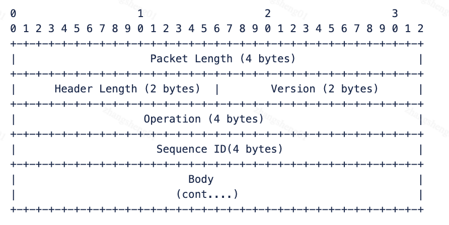

如今，市面上已经有不少开源项目可以用于连接 B 站直播 WebSocket 获取信息流。

但在实际使用中，常常发现它们并不能完全满足个性化需求。

为了更好地适配自己的业务场景，我决定自己动手实现一套连接方案。

因此，我整理了整个实现过程的一些关键步骤和注意事项，希望能够对有相似需求的朋友们有所帮助

# 接入前准备

## 获取直播间真实 ID

网页版 直播间 URL 携带的房间号可能是短号，并不保证一定为真实地址，因此建议调用该接口以确保房间号无误

---

> 请求方式：**GET**

> 请求地址：https://api.live.bilibili.com/room/v1/Room/get_info

| 参数名  | 类型 | 内容      |
| :------ | :--- | :-------- |
| room_id | int  | 直播间 ID |

> 请求响应示例与字段说明

<details>
<summary>展开查看</summary>

```bash
curl -G 'https://api.live.bilibili.com/room/v1/Room/get_info' \
--data-urlencode 'room_id=27668995'
```

```json
{
  "code": 0,
  "msg": "ok",
  "message": "ok",
  "data": {
    "uid": 3493124609411229, // 主播id
    "room_id": 27668995, // 真实房间id
    "short_id": 0, // 直播间短号，0为无短号
    "attention": 13353, // 关注数量
    "online": 4173, // 观看人数
    "is_portrait": false, // 是否是竖屏
    "description": "一只屑狐狸，不专业的CV，新晋歌杂，不缺席你的每一天...直播时间： 晚22:00-02:00，下午3:00-7:00闪现打游戏", // 描述
    "live_status": 1, // 直播间状态：0-未开播，1-直播中，2-轮播中
    "area_id": 371, // 分区id
    "parent_area_id": 9, // 父分区id
    "parent_area_name": "虚拟主播", // 父分区名称
    "old_area_id": 6, // 旧版分区id
    "background": "", // 背景图片链接
    "title": "不给糖就捣蛋", // 标题
    "user_cover": "https://i0.hdslb.com/bfs/live/new_room_cover/22426f0ead9804fabd06ad1c4305e2641a4e6d11.jpg", // 封面
    "keyframe": "https://i0.hdslb.com/bfs/live-key-frame/keyframe11011431000027668995752wsi.jpg", // 关键帧
    "is_strict_room": false, // 待观测
    "live_time": "2024-11-01 14:25:09", // 开播时间
    "tags": "御姐,屑狐狸,狐仙,憨憨,温柔", // 标签
    "is_anchor": 0, // 待观测
    "room_silent_type": "", // 禁言状态
    "room_silent_level": 0, // 禁言等级
    "room_silent_second": 0, // 禁言等级（单位秒）
    "area_name": "虚拟日常", // 分区名称
    "pendants": "", // 待观测
    "area_pendants": "", // 待观测
    "hot_words": [
      "2333333",
      "喂，妖妖零吗",
      "红红火火恍恍惚惚",
      "FFFFFFFFFF",
      "Yooooooo",
      "啪啪啪啪啪",
      "666666666",
      "老司机带带我",
      "你为什么这么熟练啊",
      "gg",
      "prprpr",
      "向大佬低头",
      "请大家注意弹幕礼仪哦！",
      "还有这种操作！",
      "囍",
      "打call",
      "你气不气？",
      "队友呢？"
    ], // 热词
    "hot_words_status": 0, // 热词状态
    "verify": "", // 待观测
    "new_pendants": {
      // 头像框
      "frame": {
        // 头像框信息
        "name": "大乱斗乱斗之王", // 名称
        "value": "https://i0.hdslb.com/bfs/live/fc28a2a4123154012e0ce3da1273de5f17e81b24.png", // 头像框图片URL
        "position": 0, // 位置
        "desc": "", // 描述
        "area": 0, // 分区
        "area_old": 0, // 旧分区
        "bg_color": "", // 背景色
        "bg_pic": "", // 背景图
        "use_old_area": false // 是否旧分区号
      },
      "badge": {
        // 大V才会有的信息
        "name": "v_person", // 认证类型：v_person=个人认证(黄)，v_company=企业认证(蓝)
        "position": 3, // 位置，可能是个枚举
        "value": "", // 待观测
        "desc": "bilibili 知名UP主、直播高能主播" // 描述
      },
      "mobile_frame": {
        // 头像框信息，手机版，可能为null
        "name": "大乱斗乱斗之王", // 名称
        "value": "https://i0.hdslb.com/bfs/live/fc28a2a4123154012e0ce3da1273de5f17e81b24.png", // 头像框图片URL
        "position": 0, // 位置
        "desc": "", // 描述
        "area": 0, // 分区
        "area_old": 0, // 旧分区
        "bg_color": "", // 背景色
        "bg_pic": "", // 背景图
        "use_old_area": false // 是否旧分区号
      },
      "mobile_badge": {
        // 大V才会有的信息，手机版，可能为null
        "name": "v_person", // 认证类型：v_person=个人认证(黄)，v_company=企业认证(蓝)
        "position": 3, // 位置，可能是个枚举
        "value": "", // 待观测
        "desc": "bilibili 知名UP主、直播高能主播" // 描述
      }
    },
    "up_session": "557568462506308099", // 待观测
    "pk_status": 0, // pk状态
    "pk_id": 0, // pk id
    "battle_id": 0, // 待观测
    "allow_change_area_time": 0, // 待观测
    "allow_upload_cover_time": 0, // 待观测
    "studio_info": {
      // 待观测
      "status": 0, // 待观测
      "master_list": []
    }
  }
}
```

</details>

## 获取信息流认证秘钥

该接口可以获取到对应直播间信息流的链接地址，以及建立链接需要认证的 token 信息

**注意：** B 站更新了隐私政策, 连接建立 5 分钟左右, 若该连接认证时传入信息来自未登录用户, 会提示 **为保护用户隐私，未注册登陆用户将无法查看他人昵称**, 随后所有发送弹幕的用户 id 都为 **0**, 用户名部分也使用 <b>\*</b> 保护，因此调用本接口时需要传递 ** cookie **

**注意：** **ws** 与 **wss** 连接地址带有路径 **/sub**, 如 **wss://tx-sh-live-comet-08.chat.bilibili.com:443/sub**

---

> 请求方式：**GET**

> 请求地址：https://api.live.bilibili.com/xlive/web-room/v1/index/getDanmuInfo

| 参数名 | 类型 | 内容          |
| :----- | :--- | :------------ |
| id     | int  | 直播间真实 id |

> 请求响应示例与字段说明

<details>
<summary>展开查看</summary>

```bash
curl -G 'https://api.live.bilibili.com/xlive/web-room/v1/index/getDanmuInfo' \
--data-urlencode 'id=30118851'
```

```json
{
  "code": 0, // 0：成功，65530：token错误（登录错误），1：错误，60009：分区不存在，其他错误仍需观察
  "message": "0", // 错误信息
  "ttl": 1, // 默认为1
  "data": {
    // 信息本体
    "group": "live", // 不重要，默认live
    "business_id": 0, // 不重要，默认 0
    "refresh_row_factor": 0.125, // 不重要，默认0.125
    "refresh_rate": 100, // 不重要，默认100
    "max_delay": 5000, // 不重要，默认5000
    "token": "TrF6FaSlmxVBM4eBYGoaWPuZ-xVL-bhK80waLbGRfpj6JiLkjgaxLcu5whFM6iEBrQFw8wJwdraBJwkctMzMrkyP7kmWkRAmFUa_Z1aiXVDhyMwsiQe81KHMGC82tuyWF9iHNstIX-M0IhU=", // 认证密钥
    "host_list": [
      // 信息流服务器节点列表
      {
        "host": "tx-sh-live-comet-08.chat.bilibili.com", // 服务器域名
        "port": 2243, // tcp端口
        "wss_port": 443, // wss 端口
        "ws_port": 2244 // ws端口
      },
      {
        "host": "tx-bj-live-comet-08.chat.bilibili.com",
        "port": 2243,
        "wss_port": 443,
        "ws_port": 2244
      },
      {
        "host": "broadcastlv.chat.bilibili.com",
        "port": 2243,
        "wss_port": 443,
        "ws_port": 2244
      }
    ]
  }
}
```

</details>

# 信息流接入

数据包为 MQ（Message Queue，消息队列）使用 Websocket 或 TCP 连接作为通道，具体格式为 **弹幕协议** + **正文数据**

操作流程：

连接信息流服务器节点 -> 发送认证包 -> 接收认证包回应 -> 接收普通包&（每 30 秒发送心跳包 -> 接收心跳回应）



- **Packet Length**：整个 Packet 的长度，包含 Header
- **Header Length**：Header 的长度，固定为 16
- **Version**：协议版本
- **Operation**：操作码
- **Sequence ID**：保留字段，可以忽略
- **Body**：消息体，客户端解析 Body 之前请先解析 Version 字段

> Version 说明：
> 0 - 普通包正文不使用压缩
> 1 - 心跳及认证包正文不使用压缩
> 2 - 普通包(zlib 压缩)
> 3 - 普通包(brotli 压缩)

> Operation 说明：
> 2 - 客户端发送的心跳包(30 秒发送一次)
> 3 - 服务器收到心跳包的回复
> 5 - 服务器推送的弹幕消息包
> 7 - 客户端发送的鉴权包(客户端发送的第一个包)
> 8 - 服务器收到鉴权包后的回复

> 注意：B 站最近加强了风控，建议在建立连接时携带好用户的**cookie**以避免风控限流

## 认证包构建

> 注意: 认证包需要在握手成功 5 秒内发送, 否则强制断开连接

认证包头部信息基于上述协议格式不再赘述，仅说明 **Body** 如何构建

| 字段     | 类型   | 说明                                        |
| :------- | :----- | :------------------------------------------ |
| uid      | int    | 用户 uid                                    |
| roomid   | int    | 主播房间 id                                 |
| protover | int    | 协议版本，决定了后续数据包的 **Version**    |
| buvid    | string | 用户**buvid3**，可在**cookie**中获得        |
| platform | string | 平台，传**web**即可                         |
| type     | int    | 不确定用途，目前 B 站网页版传 2，照着传即可 |
| key      | string | **获取信息流认证秘钥**接口提供的**token**   |

> protover 说明：
> 2 - 后续正文以 zlib 方式返回
> 3 - 后续正文以 brotli 方式返回

示例：

```
00000000: 0000 0152 0010 0001 0000 0007 0000 0001  ...R............
00000001: 7b22 7569 6422 3a34 3332 3530 3531 2c22  {"uid":4325051,"
00000002: 726f 6f6d 6964 223a 3331 3432 3735 3432  roomid":31427542
00000003: 2c22 7072 6f74 6f76 6572 223a 332c 2262  ,"protover":3,"b
00000004: 7576 6964 223a 2232 4445 3846 4141 312d  uvid":"2DE8FAA1-
00000005: 3642 4643 2d45 3741 412d 3031 3041 2d31  6BFC-E7AA-010A-1
00000006: 3039 4544 3039 3443 4245 3537 3935 3139  09ED094CBE579519
00000007: 696e 666f 6322 2c22 706c 6174 666f 726d  infoc","platform
00000008: 223a 2277 6562 222c 2274 7970 6522 3a32  ":"web","type":2
00000009: 2c22 6b65 7922 3a22 375f 6573 4f70 564e  ,"key":"7_esOpVN
0000000a: 697a 5570 4732 7069 3169 7741 2d79 3651  izUpG2pi1iwA-y6Q
0000000b: 4545 4550 734a 7872 666a 6c4c 5f73 4e50  EEEPsJxrfjlL_sNP
0000000c: 6b77 4f55 385a 7255 4150 334a 7951 746e  kwOU8ZrUAP3JyQtn
0000000d: 4154 6748 474c 645f 514a 616b 794b 4d54  ATgHGLd_QJakyKMT
0000000e: 4b75 717a 3856 5174 6474 5479 5f75 476c  Kuqz8VQtdtTy_uGl
0000000f: 5541 3958 6d75 334f 507a 6944 5170 3952  UA9Xmu3OPziDQp9R
00000010: 5832 6f57 4366 5356 3345 7778 3554 4532  X2oWCfSV3Ewx5TE2
00000011: 6c6a 4552 616e 684f 3757 7230 695f 3641  ljERanhO7Wr0i_6A
00000012: 584f 3862 6d38 634f 5757 5649 4a31 7966  XO8bm8cOWWVIJ1yf
00000013: 5535 4c63 7638 484b 3864 564e 4954 6e74  U5Lcv8HK8dVNITnt
00000014: 7144 4669 7339 5471 586d 544f 344e 413d  qDFis9TqXmTO4NA=
00000015: 227d                                     "}

```

## 命令列表

- **SEND_GIFT**：赠送礼物
- **DANMU_MSG**：弹幕信息
- **GUARD_BUY**：开通舰长
- **GUARD_LOTTERY_START**：千舰推送
- **USER_TOAST_MSG**：上舰抽奖消息推送
- **SUPER_CHAT_MESSAGE**：醒目留言
- **ENTRY_EFFECT**：舰长进入直播间（进入直播间特效）
- **INTERACT_WORD**：直播间互动
- **PK_BATTLE_PRE_NEW**：PK 即将开始

<!-- - [ROOM_BLOCK_MSG:禁言消息](#有用的命令)
- [ROOM_REAL_TIME_MESSAGE_UPDATE:直播间粉丝数更新](#有用的命令)
- [NOTICE_MSG:广播小电视](#有用的命令)
- [ANCHOR_LOT_START:天选开始](#有用的命令)
- [ANCHOR_LOT_END:天选结束](#有用的命令)
- [ANCHOR_LOT_AWARD:本房间天选时刻获奖信息推送](#有用的命令)
- [LIVE:直播开启](#有用的命令)
- [CUT_OFF:直播被切断](#有用的命令)
- [ROOM_LOCK:直播被封](#有用的命令)
- [PK_BATTLE_PRE_NEW:PK即将开始](#有用的命令) -->

## 命令说明

### 赠送礼物:SEND_GIFT

<details>
<summary><b>点击查看字段说明</b></summary>

| 字段                                                  | 字段类型 | 字段说明                                                             |
| :---------------------------------------------------- | :------- | :------------------------------------------------------------------- |
| cmd                                                   | string   | 固定命令                                                             |
| data                                                  | array    | 数据信息                                                             |
| data.action                                           | string   | 行为，一般都是投喂                                                   |
| data.bag_gift                                         | array    | 从背包中赠送礼物时会出现                                             |
| data.bag_gift.price_for_show                          | int      | 礼品单价（电池）                                                     |
| data.bag_gift.show_price                              | int      | 赠送数量                                                             |
| data.batch_combo_id                                   | string   | 连击 ID                                                              |
| data.batch_combo_send                                 | array    | 连击信息                                                             |
| data.batch_combo_send.action                          | string   | 行为，一般都是投喂                                                   |
| data.batch_combo_send.batch_combo_id                  | string   | 连击 ID                                                              |
| data.batch_combo_send.batch_combo_num                 | int      | 当前连击数                                                           |
| data.batch_combo_send.blind_gift                      | array    | 相关礼物信息                                                         |
| data.batch_combo_send.blind_gift.blind_gift_config_id | int      | 赠送盲盒时存在数据，疑似是盲盒的配置                                 |
| data.batch_combo_send.blind_gift.from                 | int      | 不确定用途，观测到 `blind_gift_config_id` 存在时为 0，其余情况无数据 |
| data.batch_combo_send.blind_gift.gift_action          | string   | 赠送盲盒时为爆出，其余无数据                                         |
| data.batch_combo_send.blind_gift.gift_tip_price       | int      | 赠送盲盒时为爆出的礼物价格，其余无数据                               |
| data.batch_combo_send.blind_gift.original_gift_id     | int      | 赠送盲盒时为盲盒的 gift_id，其余无数据                               |
| data.batch_combo_send.blind_gift.original_gift_name   | string   | 赠送盲盒时为盲盒的名称，其余无数据                                   |
| data.batch_combo_send.blind_gift.original_gift_price  | int      | 赠送盲盒时为盲盒的价格，其余无数据                                   |
| data.batch_combo_send.gift_id                         | int      | 礼物 id，如果是盲盒则为盲盒爆出的礼物 id                             |
| data.batch_combo_send.gift_name                       | string   | 礼物名称，如果是盲盒则为盲盒爆出的礼物名称                           |
| data.batch_combo_send.gift_num                        | int      | 赠送数量                                                             |
| data.batch_combo_send.send_master                     | string   | 不清楚用途                                                           |
| data.batch_combo_send.uid                             | string   | 赠送人 uid                                                           |
| data.batch_combo_send.uname                           | string   | 赠送人名称                                                           |
| data.beatId                                           | int      | 暂不确定用途，观测到多是空或者 0                                     |
| data.biz_source                                       | string   | 暂不确定用途，观测到多是 `Live` 跟 `live`                            |
| data.blind_gift                                       | array    | 相关礼物信息                                                         |
| data.blind_gift.blind_gift_config_id                  | int      | 赠送盲盒时存在数据，疑似是盲盒的配置                                 |
| data.blind_gift.from                                  | int      | 不确定用途，观测到 `blind_gift_config_id` 存在时为 0，其余情况无数据 |
| data.blind_gift.gift_action                           | string   | 赠送盲盒时为爆出，其余无数据                                         |
| data.blind_gift.gift_tip_price                        | int      | 赠送盲盒时为爆出的礼物价格，其余无数据                               |
| data.blind_gift.original_gift_id                      | int      | 赠送盲盒时为盲盒的 gift_id                                           |
| data.blind_gift.original_gift_name                    | string   | 赠送盲盒时为盲盒的名称，其余无数据                                   |
| data.blind_gift.original_gift_price                   | int      | 赠送盲盒时为盲盒的价格，其余无数据                                   |
| data.broadcast_id                                     | int      | 广播 ID，疑似赠送大礼物触发广播时与其绑定                            |
| data.coin_type                                        | string   | 硬币类型，目前观测到非付费礼物为`silver`，付费礼物为`gold`           |
| data.combo_resources_id                               | int      | 待观测，通常是 0 或 1                                                |
| data.combo_send                                       | array    | 连击信息                                                             |
| data.combo_send.action                                | string   | 行为，一般都是投喂                                                   |
| data.combo_send.combo_id                              | string   | 连击 ID                                                              |
| data.combo_send.combo_num                             | int      | 当前连击数                                                           |
| data.combo_send.gift_id                               | int      | 礼物 id （盲盒为实际爆出礼物）                                       |
| data.combo_send.gift_name                             | string   | 礼物名称（盲盒为实际爆出礼物）                                       |
| data.combo_send.gift_num                              | int      | 数量                                                                 |
| data.combo_send.send_master                           | string   | 未观测到有效数据                                                     |
| data.combo_send.uid                                   | int      | 赠送人 uid                                                           |
| data.combo_send.uname                                 | string   | 赠送人名称                                                           |
| data.combo_stay_time                                  | int      | 连击有效间隔时间                                                     |
| data.combo_total_coin                                 | int      | 连击总费用                                                           |
| data.crit_prob                                        | int      | 待观测，全是 0                                                       |
| data.demarcation                                      | int      | 待观测，数据一般是 1，2，3，应该是分类，看起来数字越大越贵           |
| data.discount_price                                   | int      | 折扣价格，比如不要钱的粉丝团灯牌                                     |
| data.dmscore                                          | int      | 某种评分？待观测                                                     |
| data.draw                                             | int      | 待观测                                                               |
| data.effect                                           | int      | 待观测                                                               |
| data.effect_block                                     | int      | 待观测                                                               |
| data.face                                             | string   | 用户头像 URL                                                         |
| data.face_effect_id                                   | int      | 待观测                                                               |
| data.face_effect_type                                 | int      | 待观测                                                               |
| data.face_effect_v2                                   | array    | 待观测                                                               |
| data.face_effect_v2.id                                | int      | 待观测                                                               |
| data.face_effect_v2.type                              | int      | 待观测                                                               |
| data.float_sc_resource_id                             | int      | 待观测                                                               |
| data.giftId                                           | int      | 礼物 ID                                                              |
| data.giftName                                         | string   | 礼物名称                                                             |
| data.giftType                                         | int      | 礼物类型，枚举，目前发现值 5 疑似免费礼物或背包礼物，其他含义待观测  |
| data.gift_info                                        | array    | 礼物详细信息                                                         |
| data.gift_info.effect_id                              | int      | 某种 ID，目前看好像只有盲盒礼物有，其余为 0                          |
| data.gift_info.gif                                    | string   | 礼物 GIF 图                                                          |
| data.gift_info.has_imaged_gift                        | int      | 某种枚举，effect_id 非 0 时为 1，其余为 0                            |
| data.gift_info.img_basic                              | string   | 礼物 PNG 图                                                          |
| data.gift_info.webp                                   | string   | 礼物 webp 图                                                         |
| data.gift_tag                                         | array    | 礼物标签？                                                           |
| data.gift_tag.0                                       | int      | 标签相关，待观测                                                     |
| data.gold                                             | int      | 待观测                                                               |
| data.group_medal                                      | int      | 套票相关？不确定，待观测                                             |
| data.guard_level                                      | int      | 牌子的大航海类型，0=普通用户，1=总督，2=提督，3=舰长                 |
| data.is_first                                         | bool     | 待观测，应该是标记本场直播是否是第一次赠送                           |
| data.is_join_receiver                                 | bool     | 待观测                                                               |
| data.is_naming                                        | bool     | 待观测                                                               |
| data.is_special_batch                                 | int      | 待观测                                                               |
| data.magnification                                    | int      | 待观测                                                               |
| data.medal_info                                       | array    | 牌子信息                                                             |
| data.medal_info.anchor_roomid                         | int      | 房间号，目前疑似并未使用                                             |
| data.medal_info.anchor_uname                          | string   | 主播名称，目前疑似并未使用                                           |
| data.medal_info.guard_level                           | int      | 牌子的大航海类型，0=普通用户，1=总督，2=提督，3=舰长                 |
| data.medal_info.icon_id                               | int      | 应该是某 ID 相关，待观测，目前全是 0                                 |
| data.medal_info.is_lighted                            | int      | 牌子是否点亮 ，1=是，0=否                                            |
| data.medal_info.medal_color                           | int      | 牌子颜色（十进制数据，需要自己转十六进制颜色代码）                   |
| data.medal_info.medal_color_border                    | int      | 牌子边框颜色（十进制数据，需要自己转十六进制颜色代码）               |
| data.medal_info.medal_color_end                       | int      | 牌子右侧颜色（渐变）（十进制数据，需要自己转十六进制颜色代码）       |
| data.medal_info.medal_color_start                     | int      | 牌子左侧颜色（渐变）（十进制数据，需要自己转十六进制颜色代码）       |
| data.medal_info.medal_level                           | int      | 牌子等级                                                             |
| data.medal_info.medal_name                            | string   | 牌子名称                                                             |
| data.medal_info.special                               | -        | 估计是用来区分特殊牌子的，待观测                                     |
| data.medal_info.target_id                             | int      | 牌子所属主播 uid                                                     |
| data.name_color                                       | string   | 用户名颜色                                                           |
| data.num                                              | int      | 赠送数量                                                             |
| data.original_gift_name                               | string   | 待观测                                                               |
| data.price                                            | int      | 礼物价格                                                             |
| data.rcost                                            | int      | 待观测                                                               |
| data.receive_user_info                                | array    | 收礼人信息（主播）                                                   |
| data.receive_user_info.uid                            | int      | 主播 uid                                                             |
| data.receive_user_info.uname                          | string   | 主播名称                                                             |
| data.receiver_uinfo                                   | array    | 收礼人信息（主播）（估计是新版本）                                   |
| data.receiver_uinfo.base                              | array    | 收礼人（主播）基本信息                                               |
| data.receiver_uinfo.base.face                         | string   | 头像                                                                 |
| data.receiver_uinfo.base.is_mystery                   | bool     | 不确定含义，待观测                                                   |
| data.receiver_uinfo.base.name                         | string   | 名称                                                                 |
| data.receiver_uinfo.base.name_color                   | int      | 待观测，估计是名字颜色十进制数字                                     |
| data.receiver_uinfo.base.name_color_str               | string   | 待观测，估计是名字颜色十六进制代码                                   |
| data.receiver_uinfo.base.official_info                | array    | 待观测，估计是官方相关                                               |
| data.receiver_uinfo.base.official_info.desc           | string   | ？说明？                                                             |
| data.receiver_uinfo.base.official_info.role           | int      | ？角色？                                                             |
| data.receiver_uinfo.base.official_info.title          | string   | ？官方 title？                                                       |
| data.receiver_uinfo.base.official_info.type           | int      | ？类型                                                               |
| data.receiver_uinfo.base.origin_info                  | array    | 待观测，目前看到的都是主播个人信息                                   |
| data.receiver_uinfo.base.origin_info.face             | string   | 头像                                                                 |
| data.receiver_uinfo.base.origin_info.name             | string   | 名称                                                                 |
| data.receiver_uinfo.base.risk_ctrl_info               | array    | 待观测，目前看到的都是主播个人信息                                   |
| data.receiver_uinfo.base.risk_ctrl_info.face          | string   | 头像                                                                 |
| data.receiver_uinfo.base.risk_ctrl_info.name          | string   | 名称                                                                 |
| data.receiver_uinfo.guard                             | -        | 待观测，当前未观测到数据                                             |
| data.receiver_uinfo.guard_leader                      | -        | 待观测，当前未观测到数据                                             |
| data.receiver_uinfo.medal                             | -        | 待观测，当前未观测到数据                                             |
| data.receiver_uinfo.title                             | -        | 待观测，当前未观测到数据                                             |
| data.receiver_uinfo.uhead_frame                       | -        | 待观测，当前未观测到数据                                             |
| data.receiver_uinfo.uid                               | int      | uid                                                                  |
| data.receiver_uinfo.wealth                            | -        | 待观测，当前未观测到数据                                             |
| data.remain                                           | int      | 待观测                                                               |
| data.rnd                                              | string   | 待观测                                                               |
| data.send_master                                      | string   | 待观测                                                               |
| data.sender_uinfo                                     | array    | 送礼人信息                                                           |
| data.sender_uinfo.base                                | array    | 送礼人（用户）基本信息                                               |
| data.sender_uinfo.base.face                           | string   | 头像                                                                 |
| data.sender_uinfo.base.is_mystery                     | bool     | 不确定含义，待观测                                                   |
| data.sender_uinfo.base.name                           | string   | 名称                                                                 |
| data.sender_uinfo.base.name_color                     | int      | 待观测，估计是名字颜色十进制数字                                     |
| data.sender_uinfo.base.name_color_str                 | string   | 待观测，估计是名字颜色十六进制代码                                   |
| data.sender_uinfo.base.official_info                  | array    | 待观测，估计是官方相关                                               |
| data.sender_uinfo.base.official_info.desc             | string   | ？说明？                                                             |
| data.sender_uinfo.base.official_info.role             | int      | ？角色？                                                             |
| data.sender_uinfo.base.official_info.title            | string   | ？官方 title？                                                       |
| data.sender_uinfo.base.official_info.type             | int      | ？类型                                                               |
| data.sender_uinfo.base.origin_info                    | array    | 待观测，目前看到的都是送礼人个人信息                                 |
| data.sender_uinfo.base.origin_info.face               | string   | 头像                                                                 |
| data.sender_uinfo.base.origin_info.name               | string   | 名称                                                                 |
| data.sender_uinfo.base.risk_ctrl_info                 | array    | 待观测，目前看到的都是送礼人个人信息                                 |
| data.sender_uinfo.base.risk_ctrl_info.face            | string   | 头像                                                                 |
| data.sender_uinfo.base.risk_ctrl_info.name            | string   | 名称                                                                 |
| data.sender_uinfo.guard                               | -        | 待观测，目前未观察到数据                                             |
| data.sender_uinfo.guard_leader                        | -        | 待观测，目前未观察到数据                                             |
| data.sender_uinfo.medal                               | array    | 牌子信息                                                             |
| data.sender_uinfo.medal.color                         | int      | 牌子颜色（十进制数据，需要自己转十六进制颜色代码）                   |
| data.sender_uinfo.medal.color_border                  | int      | 牌子边框颜色（十进制数据，需要自己转十六进制颜色代码）               |
| data.sender_uinfo.medal.color_end                     | int      | 牌子右侧颜色（渐变）（十进制数据，需要自己转十六进制颜色代码）       |
| data.sender_uinfo.medal.color_start                   | int      | 牌子左侧颜色（渐变）（十进制数据，需要自己转十六进制颜色代码）       |
| data.sender_uinfo.medal.guard_icon                    | string   | 大航海图标                                                           |
| data.sender_uinfo.medal.guard_level                   | int      | 大航海类型，0=普通用户，1=总督，2=提督，3=舰长                       |
| data.sender_uinfo.medal.honor_icon                    | -        | 待观测，目前无数据                                                   |
| data.sender_uinfo.medal.id                            | int      | 待观测，目前都是 0                                                   |
| data.sender_uinfo.medal.is_light                      | int      | 牌子是否点亮 ，1=是，0=否                                            |
| data.sender_uinfo.medal.level                         | int      | 牌子等级                                                             |
| data.sender_uinfo.medal.name                          | string   | 牌子名称                                                             |
| data.sender_uinfo.medal.ruid                          | int      | 牌子所属主播 uid                                                     |
| data.sender_uinfo.medal.score                         | int      | 某种评分？待观测                                                     |
| data.sender_uinfo.medal.typ                           | int      | 待观测，目前都是 0                                                   |
| data.sender_uinfo.medal.user_receive_count            | int      | 待观测，目前都是 0                                                   |
| data.sender_uinfo.medal.v2_medal_color_border         | string   | v2 版本牌子边框颜色                                                  |
| data.sender_uinfo.medal.v2_medal_color_end            | string   | v2 版本牌子右侧颜色（渐变）                                          |
| data.sender_uinfo.medal.v2_medal_color_level          | int      | v2 版本牌子等级颜色                                                  |
| data.sender_uinfo.medal.v2_medal_color_start          | string   | v2 版本牌子左侧颜色（渐变）                                          |
| data.sender_uinfo.medal.v2_medal_color_text           | string   | v2 版本牌子内容颜色                                                  |
| data.sender_uinfo.title                               | -        | 待观测，目前无数据                                                   |
| data.sender_uinfo.uhead_frame                         | -        | 待观测，目前无数据                                                   |
| data.sender_uinfo.uid                                 | int      | uid                                                                  |
| data.sender_uinfo.wealth                              | int      | 待观测，目前都是 0                                                   |
| data.silver                                           | int      | 待观测，目前都是 0                                                   |
| data.super                                            | int      | 待观测，目前都是 0                                                   |
| data.super_batch_gift_num                             | int      | 待观测，与赠送数量相关                                               |
| data.super_gift_num                                   | int      | 待观测，与赠送数量相关                                               |
| data.svga_block                                       | int      | 待观测，目前都是 0                                                   |
| data.switch                                           | bool     | 待观测，目前都是 TRUE                                                |
| data.tag_image                                        | -        | 待观测，目前无数据                                                   |
| data.tid                                              | string   | 待观测                                                               |
| data.timestamp                                        | int      | 礼物赠送时间（秒级时间戳）                                           |
| data.top_list                                         | -        | 待观测，目前无数据                                                   |
| data.total_coin                                       | int      | 礼物总价，连击时累加                                                 |
| data.uid                                              | int      | 赠送人 uid                                                           |
| data.uname                                            | string   | 赠送人名称                                                           |
| data.wealth_level                                     | int      | 荣耀等级                                                             |
| msg_id                                                | string   | 待观测，感觉跟消息绑定了                                             |
| p_is_ack                                              | bool     | 无数据或者 TRUE，仍需观测                                            |
| p_msg_type                                            | int      | 无数据或者 1，仍需观测                                               |
| send_time                                             | int      | 毫秒级时间戳，有时会没数据，待观测                                   |

</details>

<details>
<summary><b>点击查看数据示例</b></summary>

```json
{
  "cmd": "SEND_GIFT", // 固定命令
  "data": {
    // 数据信息
    "action": "投喂", // 行为，一般都是投喂
    "bag_gift": {
      // 从背包中赠送礼物时会出现
      "price_for_show": 500, // 礼品单价(电池*100)
      "show_price": 1 // 赠送数量
    },
    "batch_combo_id": "30d6eb24-88c5-49bf-9023-baa91ec084a7", // 连击ID
    "batch_combo_send": {
      // 连击信息
      "action": "投喂", // 行为，一般都是投喂
      "batch_combo_id": "30d6eb24-88c5-49bf-9023-baa91ec084a7", // 连击ID
      "batch_combo_num": 1, // 当前连击数
      "blind_gift": {
        // 相关礼物信息
        "blind_gift_config_id": 51, // 赠送盲盒时存在数据，疑似是盲盒的配置
        "from": 0, // 不确定用途，观测到 blind_gift_config_id 存在时为0，其余情况无数据
        "gift_action": "爆出", // 赠送盲盒时为爆出，其余无数据
        "gift_tip_price": 16000, // 赠送盲盒时为爆出的礼物价格，其余无数据
        "original_gift_id": 32251, // 赠送盲盒时为盲盒的 gift_id，其余无数据
        "original_gift_name": "心动盲盒", // 赠送盲盒时为盲盒的名称，其余无数据
        "original_gift_price": 15000 // 赠送盲盒时为盲盒的价格，其余无数据
      },
      "gift_id": 32128, // 礼物id，如果是盲盒则为盲盒爆出的礼物id
      "gift_name": "爱心抱枕", // 礼物名称，如果是盲盒则为盲盒爆出的礼物名称
      "gift_num": 1, // 赠送数量
      "send_master": null, // 不清楚用途
      "uid": 3494362281412802, // 赠送人uid
      "uname": "舒葵交错" // 赠送人名称
    },
    "beatId": "", // 暂不确定用途，观测到多是空或者0
    "biz_source": "live", // 暂不确定用途，观测到多是 Live 跟 live
    "blind_gift": {
      // 相关礼物信息
      "blind_gift_config_id": 51, // 赠送盲盒时存在数据，疑似是盲盒的配置
      "from": 0, // 不确定用途，观测到 blind_gift_config_id 存在时为0，其余情况无数据
      "gift_action": "爆出", // 赠送盲盒时为爆出，其余无数据
      "gift_tip_price": 16000, // 赠送盲盒时为爆出的礼物价格，其余无数据
      "original_gift_id": 32251, // 赠送盲盒时为盲盒的 gift_id
      "original_gift_name": "心动盲盒", // 赠送盲盒时为盲盒的名称，其余无数据
      "original_gift_price": 15000 // 赠送盲盒时为盲盒的价格，其余无数据
    },
    "broadcast_id": 0, // 广播ID，疑似赠送大礼物触发广播时与其绑定
    "coin_type": "gold", // 硬币类型，目前观测到非付费礼物为silver，付费礼物为gold
    "combo_resources_id": 1, // 待观测，通常是 0 或 1
    "combo_send": {
      // 连击信息
      "action": "投喂", // 行为，一般都是投喂
      "combo_id": "c210a464-9620-425e-b9e3-73db191ed1c5", // 连击ID
      "combo_num": 1, // 当前连击数
      "gift_id": 32128, // 礼物id （盲盒为实际爆出礼物）
      "gift_name": "爱心抱枕", // 礼物名称（盲盒为实际爆出礼物）
      "gift_num": 1, // 数量
      "send_master": null, // 未观测到有效数据
      "uid": 3494362281412802, // 赠送人uid
      "uname": "舒葵交错" // 赠送人名称
    },
    "combo_stay_time": 5, // 连击有效间隔时间
    "combo_total_coin": 16000, // 连击总费用
    "crit_prob": 0, // 待观测，全是0
    "demarcation": 2, // 待观测，数据一般是1，2，3，应该是分类，看起来数字越大越贵
    "discount_price": 16000, // 折扣价格，比如不要钱的粉丝团灯牌
    "dmscore": 952, // 某种评分？待观测
    "draw": 0, // 待观测
    "effect": 0, // 待观测
    "effect_block": 0, // 待观测
    "face": "https://i2.hdslb.com/bfs/face/5d620fea3b4586311884155153a7091b79d0777d.jpg", // 用户头像URL
    "face_effect_id": 0, // 待观测
    "face_effect_type": 0, // 待观测
    "face_effect_v2": {
      // 待观测
      "id": 0, // 待观测
      "type": 0 // 待观测
    },
    "float_sc_resource_id": 0, // 待观测
    "giftId": 32128, // 礼物ID
    "giftName": "爱心抱枕", // 礼物名称
    "giftType": 0, // 礼物类型，枚举，目前发现值 5 疑似免费礼物或背包礼物，其他含义待观测
    "gift_info": {
      // 礼物详细信息
      "effect_id": 0, // 某种ID，目前看好像只有盲盒礼物有，其余为0
      "gif": "https://i0.hdslb.com/bfs/live/ae80d80ea758ff08fb4e2c4226ab7b5011b728a6.gif", // 礼物GIF图
      "has_imaged_gift": 0, // 某种枚举，effect_id非0时为1，其余为0
      "img_basic": "https://s1.hdslb.com/bfs/live/824714c830966d7bec381e35ef808b1f478e21ee.png", // 礼物PNG图
      "webp": "https://i0.hdslb.com/bfs/live/32c8ee42566501822d8ecc68b33cd2c64937266a.webp" // 礼物webp图
    },
    "gift_tag": [
      // 礼物标签？
      1101 // 标签相关，待观测
    ],
    "gold": 0, // 待观测
    "group_medal": null, // 套票相关？不确定，待观测
    "guard_level": 3, // 牌子的大航海类型，0=普通用户，1=总督，2=提督，3=舰长
    "is_first": true, // 待观测，应该是标记本场直播是否是第一次赠送
    "is_join_receiver": false, // 待观测
    "is_naming": false, // 待观测
    "is_special_batch": 0, // 待观测
    "magnification": 1, // 待观测
    "medal_info": {
      // 牌子信息
      "anchor_roomid": 0, // 房间号，目前疑似并未使用
      "anchor_uname": "", // 主播名称，目前疑似并未使用
      "guard_level": 3, // 牌子的大航海类型，0=普通用户，1=总督，2=提督，3=舰长
      "icon_id": 0, // 应该是某ID相关，待观测，目前全是0
      "is_lighted": 1, // 牌子是否点亮 ，1=是，0=否
      "medal_color": 398668, // 牌子颜色（十进制数据，需要自己转十六进制颜色代码）
      "medal_color_border": 6809855, // 牌子边框颜色（十进制数据，需要自己转十六进制颜色代码）
      "medal_color_end": 6850801, // 牌子右侧颜色（渐变）（十进制数据，需要自己转十六进制颜色代码）
      "medal_color_start": 398668, // 牌子左侧颜色（渐变）（十进制数据，需要自己转十六进制颜色代码）
      "medal_level": 25, // 牌子等级
      "medal_name": "娴丢人", // 牌子名称
      "special": "", // 估计是用来区分特殊牌子的，待观测
      "target_id": 3493262186776769 // 牌子所属主播uid
    },
    "name_color": "#00D1F1", // 用户名颜色
    "num": 1, // 赠送数量
    "original_gift_name": "", // 待观测
    "price": 16000, // 礼物价格
    "rcost": 11936982, // 待观测
    "receive_user_info": {
      // 收礼人信息（主播）
      "uid": 3494365156608185, // 主播uid
      "uname": "温以泠" // 主播名称
    },
    "receiver_uinfo": {
      // 收礼人信息（主播）（估计是新版本）
      "base": {
        // 收礼人（主播）基本信息
        "face": "https://i2.hdslb.com/bfs/face/00e03b4b528b6a475d2987f44002c61c4a75d77c.jpg", // 头像
        "is_mystery": false, // 不确定含义，待观测
        "name": "温以泠", // 名称
        "name_color": 0, // 待观测，估计是名字颜色十进制数字
        "name_color_str": "", // 待观测，估计是名字颜色十六进制代码
        "official_info": {
          // 待观测，估计是官方相关
          "desc": "", // ？说明？
          "role": 0, // ？角色？
          "title": "", // ？官方title？
          "type": -1 // ？类型？
        },
        "origin_info": {
          // 待观测，目前看到的都是主播个人信息
          "face": "https://i2.hdslb.com/bfs/face/00e03b4b528b6a475d2987f44002c61c4a75d77c.jpg", // 头像
          "name": "温以泠" // 名称
        },
        "risk_ctrl_info": {
          // 待观测，目前看到的都是主播个人信息
          "face": "https://i2.hdslb.com/bfs/face/00e03b4b528b6a475d2987f44002c61c4a75d77c.jpg", // 头像
          "name": "温以泠" // 名称
        }
      },
      "guard": null, // 待观测，当前未观测到数据
      "guard_leader": null, // 待观测，当前未观测到数据
      "medal": null, // 待观测，当前未观测到数据
      "title": null, // 待观测，当前未观测到数据
      "uhead_frame": null, // 待观测，当前未观测到数据
      "uid": 3494365156608185, // 主播uid
      "wealth": null // 待观测，当前未观测到数据
    },
    "remain": 0, // 待观测
    "rnd": "4568350171557109760", // 待观测
    "send_master": null, // 待观测
    "sender_uinfo": {
      // 送礼人信息
      "base": {
        // 送礼人（用户）基本信息
        "face": "https://i2.hdslb.com/bfs/face/5d620fea3b4586311884155153a7091b79d0777d.jpg", // 头像
        "is_mystery": false, // 不确定含义，待观测
        "name": "舒葵交错", // 名称
        "name_color": 0, // 待观测，估计是名字颜色十进制数字
        "name_color_str": "", // 待观测，估计是名字颜色十六进制代码
        "official_info": {
          // 待观测，估计是官方相关
          "desc": "", // ？说明？
          "role": 0, // ？角色？
          "title": "", // ？官方title？
          "type": -1 // ？类型？
        },
        "origin_info": {
          // 待观测，目前看到的都是送礼人个人信息
          "face": "https://i2.hdslb.com/bfs/face/5d620fea3b4586311884155153a7091b79d0777d.jpg", // 头像
          "name": "舒葵交错" // 名称
        },
        "risk_ctrl_info": {
          // 待观测，目前看到的都是送礼人个人信息
          "face": "https://i2.hdslb.com/bfs/face/5d620fea3b4586311884155153a7091b79d0777d.jpg", // 头像
          "name": "舒葵交错" // 名称
        }
      },
      "guard": null, // 待观测，目前未观察到数据
      "guard_leader": null, // 待观测，目前未观察到数据
      "medal": {
        // 牌子信息
        "color": 398668, // 牌子颜色（十进制数据，需要自己转十六进制颜色代码）
        "color_border": 6809855, // 牌子边框颜色（十进制数据，需要自己转十六进制颜色代码）
        "color_end": 6850801, // 牌子右侧颜色（渐变）（十进制数据，需要自己转十六进制颜色代码）
        "color_start": 398668, // 牌子左侧颜色（渐变）（十进制数据，需要自己转十六进制颜色代码）
        "guard_icon": "https://i0.hdslb.com/bfs/live/143f5ec3003b4080d1b5f817a9efdca46d631945.png", // 大航海图标
        "guard_level": 3, // 大航海类型，0=普通用户，1=总督，2=提督，3=舰长
        "honor_icon": "", // 待观测，目前无数据
        "id": 0, // 待观测，目前都是0
        "is_light": 1, // 牌子是否点亮 ，1=是，0=否
        "level": 27, // 牌子等级
        "name": "泠妻", // 牌子名称
        "ruid": 3494365156608185, // 牌子所属主播uid
        "score": 50093206, // 某种评分？待观测
        "typ": 0, // 待观测，目前都是0
        "user_receive_count": 0, // 待观测，目前都是0
        "v2_medal_color_border": "#58A1F8FF", // v2版本牌子边框颜色
        "v2_medal_color_end": "#4775EFCC", // v2版本牌子右侧颜色（渐变）
        "v2_medal_color_level": "#000B7099", // v2版本牌子等级颜色
        "v2_medal_color_start": "#4775EFCC", // v2版本牌子左侧颜色（渐变）
        "v2_medal_color_text": "#FFFFFFFF" // v2版本牌子内容颜色
      },
      "title": null, // 待观测，目前无数据
      "uhead_frame": null, // 待观测，目前无数据
      "uid": 3494362281412802, // 赠送人uid
      "wealth": null // 待观测，目前都是0
    },
    "silver": 0, // 待观测，目前都是0
    "super": 0, // 待观测，目前都是0
    "super_batch_gift_num": 1, // 待观测，与赠送数量相关
    "super_gift_num": 1, // 待观测，与赠送数量相关
    "svga_block": 0, // 待观测，目前都是0
    "switch": true, // 待观测，目前都是true
    "tag_image": "", // 待观测，目前无数据
    "tid": "4568350171557109760", // 待观测
    "timestamp": 1730123987, // 礼物赠送时间（秒级时间戳）
    "top_list": null, // 待观测，目前无数据
    "total_coin": 15000, // 礼物总价，连击时累加
    "uid": 3494362281412802, // 赠送人uid
    "uname": "舒葵交错", // 赠送人名称
    "wealth_level": 35 // 荣耀等级
  },
  "msg_id": "21794708686651904:1000:1000", // 待观测，感觉跟消息绑定了
  "p_is_ack": true, // 无数据或者TRUE，仍需观测
  "p_msg_type": 1, // 无数据或者1，仍需观测
  "send_time": 1730123987816 // 毫秒级时间戳，有时会没数据，待观测
}
```

</details>

### 弹幕信息:DANMU_MSG

<details>
<summary><b>点击查看字段说明</b></summary>

| 字段                                        | 字段类型        | 字段说明                                                          |
| :------------------------------------------ | :-------------- | :---------------------------------------------------------------- |
| cmd                                         | string          | 命令                                                              |
| dm_v2                                       | -               | 待观察                                                            |
| info                                        | array           | 数据信息                                                          |
| info.0                                      | array           | 弹幕信息                                                          |
| info.0.0                                    | int             | 待观测，目前全是 0                                                |
| info.0.1                                    | int             | 弹幕的 mode 字段                                                  |
| info.0.2                                    | int             | 弹幕的 fontsize 字段                                              |
| info.0.3                                    | int             | 弹幕颜色（十进制数据，需要自己转十六进制颜色代码）                |
| info.0.4                                    | int             | 发送时的 UNIX 毫秒时间戳                                          |
| info.0.5                                    | int             | 待观测                                                            |
| info.0.6                                    | int             | 待观测，目前全是 0                                                |
| info.0.7                                    | string          | 一个十六进制数，待观测，可能是颜色                                |
| info.0.8                                    | int             | 待观测，目前全是 0                                                |
| info.0.9                                    | int             | 待观测，目前全是 0                                                |
| info.0.10                                   | int             | 待观测，疑似某种类型                                              |
| info.0.11                                   | string          | 待观测，通常为空字符串，`info.0.10 == 5` 返回一组十六进制颜色代码 |
| info.0.12                                   | int             | 消息中是否携带表情，1=是，0=否                                    |
| info.0.13                                   | string 或 array | 表情信息，info.0.12 == 1 时为 array，其余时候为字符串             |
| info.0.13.bulge_display                     | int             | 某种枚举，待观测                                                  |
| info.0.13.emoticon_unique                   | string          | 表情符号，类似表情 ID 性质                                        |
| info.0.13.height                            | int             | 表情高度                                                          |
| info.0.13.in_player_area                    | int             | 某种枚举，待观测                                                  |
| info.0.13.is_dynamic                        | int             | 是否是动态表情，0=否，1=是                                        |
| info.0.13.url                               | string          | 表情 URL 图片地址                                                 |
| info.0.13.width                             | int             | 表情宽度                                                          |
| info.0.14                                   | string          | 字符串表示的 JSON Object,目前未观测到数据                         |
| info.0.15                                   | array           | 弹幕补充信息，大部分数据都可以在里面获取                          |
| info.0.15.extra                             | string          | 补充信息，json 字符串，需要自行转换为对象                         |
| info.0.15.extra.send_from_me                | bool            | 是否是自己发送                                                    |
| info.0.15.extra.mode                        | int             | 弹幕模式 (等同于 info[0][1])                                      |
| info.0.15.extra.color                       | int             | 弹幕颜色 (等同于 info[0][3])                                      |
| info.0.15.extra.dm_type                     | int             | 某种枚举，待观测                                                  |
| info.0.15.extra.font_size                   | int             | 字体大小（等同于 info[0][2]）                                     |
| info.0.15.extra.player_mode                 | int             | 某种枚举，待观测                                                  |
| info.0.15.extra.show_player_type            | int             | 某种枚举，待观测                                                  |
| info.0.15.extra.content                     | string          | 弹幕文本信息（等同于 info[1]）                                    |
| info.0.15.extra.user_hash                   | string          | 待观测                                                            |
| info.0.15.extra.emoticon_unique             | string          | 待观测                                                            |
| info.0.15.extra.bulge_display               | int             | 待观测                                                            |
| info.0.15.extra.recommend_score             | int             | 待观测                                                            |
| info.0.15.extra.main_state_dm_color         | string          | 待观测                                                            |
| info.0.15.extra.objective_state_dm_color    | string          | 待观测                                                            |
| info.0.15.extra.direction                   | int             | 待观测                                                            |
| info.0.15.extra.pk_direction                | int             | 待观测                                                            |
| info.0.15.extra.quartet_direction           | int             | 待观测                                                            |
| info.0.15.extra.anniversary_crowd           | int             | 待观测                                                            |
| info.0.15.extra.yeah_space_type             | string          | 待观测                                                            |
| info.0.15.extra.yeah_space_url              | string          | 待观测                                                            |
| info.0.15.extra.jump_to_url                 | string          | 待观测                                                            |
| info.0.15.extra.space_type                  | string          | 待观测                                                            |
| info.0.15.extra.space_url                   | string          | 待观测                                                            |
| info.0.15.extra.animation                   | array           | 待观测，目前未观测到数据                                          |
| info.0.15.extra.emots                       | array           | 文本中使用过的表情信息，对象类型，key 为表情，例如：[藏狐]        |
| info.0.15.extra.emots.[藏狐].count          | int             | 文本中出现的数量                                                  |
| info.0.15.extra.emots.[藏狐].descript       | string          | 描述                                                              |
| info.0.15.extra.emots.[藏狐].emoji          | string          | 描述                                                              |
| info.0.15.extra.emots.[藏狐].emoticon_id    | int             | 待观测                                                            |
| info.0.15.extra.emots.[藏狐].emoji          | string          | 待观测                                                            |
| info.0.15.extra.emots.[藏狐].height         | int             | 图片高度                                                          |
| info.0.15.extra.emots.[藏狐].url            | string          | 图片 url                                                          |
| info.0.15.extra.emots.[藏狐].width          | int             | 图片宽度                                                          |
| info.0.15.extra.is_audited                  | bool            | 待观测                                                            |
| info.0.15.extra.id_str                      | string          | 待观测                                                            |
| info.0.15.extra.icon                        | -               | 待观测                                                            |
| info.0.15.extra.show_reply                  | bool            | 是否允许回复                                                      |
| info.0.15.extra.reply_mid                   | int             | 回复消息发送人 uid                                                |
| info.0.15.extra.reply_uname                 | string          | 回复消息发送人名称                                                |
| info.0.15.extra.reply_uname_color           | string          | 回复消息发送人名字颜色                                            |
| info.0.15.extra.reply_is_mystery            | bool            | 待观测                                                            |
| info.0.15.extra.reply_type_enum             | int             | 待观测，某种枚举                                                  |
| info.0.15.extra.hit_combo                   | int             | 待观测，疑似是一些重内容连续发送的连击数                          |
| info.0.15.extra.esports_jump_url            | string          | 待观测                                                            |
| info.0.15.mode                              | int             | 某种枚举，待观测                                                  |
| info.0.15.show_player_type                  | int             | 某种枚举，待观测                                                  |
| info.0.15.user                              | array           | 弹幕发送人信息                                                    |
| info.0.15.user.base                         | array           | 发送人基本信息                                                    |
| info.0.15.user.base.face                    | string          | 头像                                                              |
| info.0.15.user.base.is_mystery              | bool            | 不确定含义，待观测                                                |
| info.0.15.user.base.name                    | string          | 名称                                                              |
| info.0.15.user.base.name_color              | int             | 待观测，估计是名字颜色十进制数字                                  |
| info.0.15.user.base.name_color_str          | string          | 待观测，估计是名字颜色十六进制代码                                |
| info.0.15.user.base.official_info           | array           | 待观测，估计是官方相关                                            |
| info.0.15.user.base.official_info.desc      | string          | ？说明？                                                          |
| info.0.15.user.base.official_info.role      | int             | ？角色？                                                          |
| info.0.15.user.base.official_info.title     | string          | ？官方 title？                                                    |
| info.0.15.user.base.official_info.type      | int             | ？类型                                                            |
| info.0.15.user.base.origin_info             | array           | 待观测，目前看到的都是发送人个人信息                              |
| info.0.15.user.base.origin_info.face        | string          | 头像                                                              |
| info.0.15.user.base.origin_info.name        | string          | 名称                                                              |
| info.0.15.user.base.risk_ctrl_info          | array           | 待观测，目前看到的都是发送人个人信息                              |
| info.0.15.user.base.risk_ctrl_info.face     | string          | 头像                                                              |
| info.0.15.user.base.risk_ctrl_info.name     | string          | 名称                                                              |
| info.0.15.user.guard                        | -               | 待观测，怀疑可能跟超管有关                                        |
| info.0.15.user.guard_leader                 | array           | 待观测，怀疑可能跟超管有关                                        |
| info.0.15.user.guard_leader.is_guard_leader | bool            | 待观测，怀疑可能跟超管有关                                        |
| info.0.15.user.medal                        | array           | 牌子信息                                                          |
| info.0.15.user.medal.color                  | int             | 牌子颜色（十进制数据，需要自己转十六进制颜色代码）                |
| info.0.15.user.medal.color_border           | int             | 牌子边框颜色（十进制数据，需要自己转十六进制颜色代码）            |
| info.0.15.user.medal.color_end              | int             | 牌子右侧颜色（渐变）（十进制数据，需要自己转十六进制颜色代码）    |
| info.0.15.user.medal.color_start            | int             | 牌子左侧颜色（渐变）（十进制数据，需要自己转十六进制颜色代码）    |
| info.0.15.user.medal.guard_icon             | string          | 大航海图标                                                        |
| info.0.15.user.medal.guard_level            | int             | 大航海类型，0=普通用户，1=总督，2=提督，3=舰长                    |
| info.0.15.user.medal.honor_icon             | -               | 待观测，目前无数据                                                |
| info.0.15.user.medal.id                     | int             | 待观测，目前都是 0                                                |
| info.0.15.user.medal.is_light               | int             | 牌子是否点亮 ，1=是，0=否                                         |
| info.0.15.user.medal.level                  | int             | 牌子等级                                                          |
| info.0.15.user.medal.name                   | string          | 牌子名称                                                          |
| info.0.15.user.medal.ruid                   | int             | 牌子所属主播 uid                                                  |
| info.0.15.user.medal.score                  | int             | 某种评分？待观测                                                  |
| info.0.15.user.medal.typ                    | int             | 待观测，目前都是 0                                                |
| info.0.15.user.medal.user_receive_count     | int             | 待观测，目前都是 0                                                |
| info.0.15.user.medal.v2_medal_color_border  | string          | v2 版本牌子边框颜色                                               |
| info.0.15.user.medal.v2_medal_color_end     | string          | v2 版本牌子右侧颜色（渐变）                                       |
| info.0.15.user.medal.v2_medal_color_level   | int             | v2 版本牌子等级颜色                                               |
| info.0.15.user.medal.v2_medal_color_start   | string          | v2 版本牌子左侧颜色（渐变）                                       |
| info.0.15.user.medal.v2_medal_color_text    | string          | v2 版本牌子内容颜色                                               |
| info.0.15.user.title                        | array           | 待观测                                                            |
| info.0.15.user.title.title_css_id           | string          | 待观测                                                            |
| info.0.15.user.title.old_title_css_id       | string          | 待观测                                                            |
| info.0.15.user.uhead_frame                  | -               | 待观测，目前无数据                                                |
| info.0.15.user.uid                          | int             | uid                                                               |
| info.0.15.user.wealth                       | int             | 待观测，目前都是 0                                                |
| info.0.16                                   | array           | 疑似活动信息，待观测                                              |
| info.0.16.activity_identity                 | string          | 待观测                                                            |
| info.0.16.activity_source                   | int             | 待观测                                                            |
| info.0.16.not_show                          | int             | 待观测                                                            |
| info.0.17                                   | int             | 待观测                                                            |
| info.1                                      | string          | 弹幕信息                                                          |
| info.2                                      | array           | 用户信息                                                          |
| info.2.0                                    | int             | 用户 uid                                                          |
| info.2.1                                    | string          | 用户名称                                                          |
| info.2.2                                    | int             | 待观测                                                            |
| info.2.3                                    | int             | 待观测                                                            |
| info.2.4                                    | int             | 待观测                                                            |
| info.2.5                                    | int             | 待观测                                                            |
| info.2.6                                    | int             | 待观测                                                            |
| info.2.7                                    | string          | 待观测，某种颜色信息，有时为空                                    |
| info.3                                      | array           | 牌子信息                                                          |
| info.3.0                                    | int             | 牌子等级                                                          |
| info.3.1                                    | string          | 牌子名称                                                          |
| info.3.2                                    | string          | 牌子所属主播名称                                                  |
| info.3.3                                    | int             | 牌子所属直播间房间号                                              |
| info.3.4                                    | int             | 牌子颜色（十进制数据，需要自己转十六进制颜色代码）                |
| info.3.5                                    | string          | 待观测，一直是空                                                  |
| info.3.6                                    | int             | 待观测，一直是 0                                                  |
| info.3.7                                    | int             | 牌子边框颜色（十进制数据，需要自己转十六进制颜色代码）            |
| info.3.8                                    | int             | 牌子左侧颜色（渐变）（十进制数据，需要自己转十六进制颜色代码）    |
| info.3.9                                    | int             | 牌子右侧颜色（渐变）（十进制数据，需要自己转十六进制颜色代码）    |
| info.3.10                                   | int             | 大航海类型，0=普通用户，1=总督，2=提督，3=舰长                    |
| info.3.11                                   | int             | 牌子是否点亮 ，1=是，0=否                                         |
| info.3.12                                   | int             | 牌子所属主播 uid                                                  |
| info.4                                      | array           | 疑似什么等级信息                                                  |
| info.4.0                                    | int             | 疑似什么等级                                                      |
| info.4.0                                    | int             | 待观测，目前都是 0                                                |
| info.4.0                                    | int             | 颜色（十进制数据，需要自己转十六进制颜色代码）                    |
| info.4.0                                    | string          | 待观测，疑似当前什么等级经验值                                    |
| info.4.0                                    | int             | 待观测，某种枚举                                                  |
| info.5                                      | array           | 待观测                                                            |
| info.5.0                                    | string          | 待观测，大部分为空串，少部分存在数据，不确定用途                  |
| info.5.1                                    | string          | 待观测，大部分为空串，少部分存在数据，不确定用途                  |
| info.6                                      | int             | 待观测，一直都是 0                                                |
| info.7                                      | int             | 疑似大航海类型                                                    |
| info.8                                      | -               | 待观测，一直都是空                                                |
| info.9                                      | array           | 发送时间戳                                                        |
| info.9.ct                                   | string          | 待观测，某十六进制数据                                            |
| info.9.ts                                   | int             | 秒级时间戳，应该是发送时间                                        |
| info.10                                     | int             | 待观测，一直都是 0                                                |
| info.11                                     | int             | 待观测，一直都是 0                                                |
| info.12                                     | -               | 待观测，一直都是空                                                |
| info.13                                     | -               | 待观测，一直都是空                                                |
| info.14                                     | int             | 待观测，一直都是 0                                                |
| info.15                                     | int             | 待观测                                                            |
| info.16                                     | array           | 待观测，疑似某种等级信息                                          |
| info.16.0                                   | int             | 待观测，疑似某种等级信息                                          |

</details>

<details>
<summary><b>点击查看数据示例</b></summary>

```json
{
  "cmd": "DANMU_MSG", // 命令
  "dm_v2": "", // 待观察
  "info": [
    // 数据信息
    [
      // 弹幕信息
      0, // 待观测，目前全是0
      4, // 弹幕的 mode 字段
      25, // 弹幕的 fontsize 字段
      14893055, // 弹幕颜色（十进制数据，需要自己转十六进制颜色代码）
      1730214752940, // 发送时的 UNIX 毫秒时间戳
      1730214703, // 待观测
      0, // 待观测，目前全是0
      "d136d2ff", // 一个十六进制数，待观测，可能是颜色
      0, // 待观测，目前全是0
      0, // 待观测，目前全是0
      2, // 待观测，疑似某种类型
      "#19897EFF,#403F388E,#33897EFF", // 待观测，通常为空字符串，info.0.10 == 5 返回一组十六进制颜色代码
      1, // 消息中是否携带表情，1=是，0=否
      {
        // 表情信息，info.0.12 == 1 时为array，其余时候为字符串
        "bulge_display": 1, // 某种枚举，待观测
        "emoticon_unique": "room_30118851_73109", // 表情符号，类似表情ID性质
        "height": 162, // 表情高度
        "in_player_area": 1, // 某种枚举，待观测
        "is_dynamic": 0, // 是否是动态表情，0=否，1=是
        "url": "http://i0.hdslb.com/bfs/live/c45b116a620ba68ce4a6d0ce7bcfc629a4cbbf98.png", // 表情URL图片地址
        "width": 162 // 表情宽度
      },
      "{}", // 字符串表示的 JSON Object,目前未观测到数据
      {
        // 弹幕补充信息，大部分数据都可以在里面获取
        "extra": {
          // 补充信息，json字符串，需要自行转换为对象
          "send_from_me": false, // 是否是自己发送
          "mode": 0, // 弹幕模式 (等同于info[0][1])
          "color": 14893055, // 弹幕颜色 (等同于info[0][3])
          "dm_type": 1, // 某种枚举，待观测
          "font_size": 25, // 	字体大小（等同于info[0][2]）
          "player_mode": 4, // 某种枚举，待观测
          "show_player_type": 0, // 某种枚举，待观测
          "content": "[墨镜]这个表情", // 弹幕文本信息（等同于info[1]）
          "user_hash": "3510031103", // 待观测
          "emoticon_unique": "room_30118851_73109", // 待观测
          "bulge_display": 1, // 待观测
          "recommend_score": 0, // 待观测
          "main_state_dm_color": "", // 待观测
          "objective_state_dm_color": "", // 待观测
          "direction": 0, // 待观测
          "pk_direction": 0, // 待观测
          "quartet_direction": 0, // 待观测
          "anniversary_crowd": 0, // 待观测
          "yeah_space_type": "", // 待观测
          "yeah_space_url": "", // 待观测
          "jump_to_url": "", // 待观测
          "space_type": "", // 待观测
          "space_url": "", // 待观测
          "animation": {}, // 待观测，目前未观测到数据
          "emots": {
            // 文本中使用过的表情信息，对象类型，key为表情，例如：[墨镜]
            "[墨镜]": {
              // 某个表情，key为对应的文本
              "count": 1, // 文本中出现的数量
              "descript": "[墨镜]", // 描述
              "emoji": "[墨镜]", // 描述
              "emoticon_id": 273, // 待观测
              "emoticon_unique": "emoji_273", // 待观测
              "height": 20, // 图片高度
              "url": "http://i0.hdslb.com/bfs/live/5e01c237642c8b662a69e21b8e0fbe6e7dbc2aa1.png", // 图片url
              "width": 20 // 图片宽度
            }
          },
          "is_audited": false, // 待观测
          "id_str": "0b0b20c622a374dc3e1e327bb76720fb63", // 待观测
          "icon": null, // 待观测
          "show_reply": true, // 是否允许回复
          "reply_mid": 0, // 回复消息发送人uid
          "reply_uname": "", // 回复消息发送人名称
          "reply_uname_color": "", // 回复消息发送人名字颜色
          "reply_is_mystery": false, // 待观测
          "reply_type_enum": 0, // 待观测，某种枚举
          "hit_combo": 0, // 待观测，疑似是一些重内容连续发送的连击数
          "esports_jump_url": "" // 待观测
        },
        "mode": 0, // 某种枚举，待观测
        "show_player_type": 0, // 某种枚举，待观测
        "user": {
          // 弹幕发送人信息
          "base": {
            // 发送人基本信息
            "face": "https://i1.hdslb.com/bfs/face/1bddafc0564fd84e6da7f262c6c37deb6605d623.jpg", // 头像
            "is_mystery": false, // 不确定含义，待观测
            "name": "岚烟y", // 名称
            "name_color": 0, // 待观测，估计是名字颜色十进制数字
            "name_color_str": "", // 待观测，估计是名字颜色十六进制代码
            "official_info": {
              // 待观测，估计是官方相关
              "desc": "", // ？说明？
              "role": 0, // ？角色？
              "title": "", // ？官方title？
              "type": -1 // ？类型
            },
            "origin_info": {
              // 待观测，目前看到的都是发送人个人信息
              "face": "https://i1.hdslb.com/bfs/face/1bddafc0564fd84e6da7f262c6c37deb6605d623.jpg", // 头像
              "name": "岚烟y" // 名称
            },
            "risk_ctrl_info": {
              // 待观测，目前看到的都是发送人个人信息
              "face": "https://i1.hdslb.com/bfs/face/1bddafc0564fd84e6da7f262c6c37deb6605d623.jpg", // 头像
              "name": "岚烟y" // 名称
            }
          },
          "guard": null, // 待观测，怀疑可能跟超管有关
          "guard_leader": {
            // 待观测，怀疑可能跟超管有关
            "is_guard_leader": false // 待观测，怀疑可能跟超管有关
          },
          "medal": {
            // 牌子信息
            "color": 398668, // 牌子颜色（十进制数据，需要自己转十六进制颜色代码）
            "color_border": 16771156, // 牌子边框颜色（十进制数据，需要自己转十六进制颜色代码）
            "color_end": 6850801, // 牌子右侧颜色（渐变）（十进制数据，需要自己转十六进制颜色代码）
            "color_start": 398668, // 牌子左侧颜色（渐变）（十进制数据，需要自己转十六进制颜色代码）
            "guard_icon": "https://i0.hdslb.com/bfs/live/98a201c14a64e860a758f089144dcf3f42e7038c.png", // 大航海图标
            "guard_level": 2, // 大航海类型，0=普通用户，1=总督，2=提督，3=舰长
            "honor_icon": "", // 待观测，目前无数据
            "id": 1130856, // 待观测，目前都是0
            "is_light": 1, // 牌子是否点亮 ，1=是，0=否
            "level": 26, // 牌子等级
            "name": "泠妻", // 牌子名称
            "ruid": 3494365156608185, // 牌子所属主播uid
            "score": 50046632, // 某种评分？待观测
            "typ": 0, // 待观测，目前都是0
            "user_receive_count": 0, // 待观测，目前都是0
            "v2_medal_color_border": "#58A1F8FF", // v2版本牌子边框颜色
            "v2_medal_color_end": "#4775EFCC", // v2版本牌子右侧颜色（渐变）
            "v2_medal_color_level": "#000B7099", // v2版本牌子等级颜色
            "v2_medal_color_start": "#4775EFCC", // v2版本牌子左侧颜色（渐变）
            "v2_medal_color_text": "#FFFFFFFF" // v2版本牌子内容颜色
          },
          "title": {
            // 待观测
            "old_title_css_id": "", // 待观测
            "title_css_id": "" // 待观测
          },
          "uhead_frame": null, // 待观测，目前无数据
          "uid": 400970605, // uid
          "wealth": null // 待观测
        }
      },
      {
        // 疑似活动信息，待观测
        "activity_identity": "", // 待观测
        "activity_source": 0, // 待观测
        "not_show": 0 // 待观测
      },
      42 // 待观测
    ],
    "[墨镜]这个表情", // 弹幕信息
    [
      // 用户信息
      400970605, // 用户uid
      "岚烟y", // 用户名称
      1, // 待观测
      0, // 待观测
      0, // 待观测
      10000, // 待观测
      1, // 待观测
      "#E17AFF" // 待观测，某种颜色信息，有时为空
    ],
    [
      // 牌子信息
      26, // 牌子等级
      "泠妻", // 牌子名称
      "温以泠", // 牌子所属主播名称
      30118851, // 牌子所属直播间房间号
      398668, // 牌子颜色（十进制数据，需要自己转十六进制颜色代码）
      "", // 待观测，一直是空
      0, // 待观测，一直是0
      16771156, // 牌子边框颜色（十进制数据，需要自己转十六进制颜色代码）
      398668, // 牌子左侧颜色（渐变）（十进制数据，需要自己转十六进制颜色代码）
      6850801, // 牌子右侧颜色（渐变）（十进制数据，需要自己转十六进制颜色代码）
      2, // 大航海类型，0=普通用户，1=总督，2=提督，3=舰长
      1, // 牌子是否点亮 ，1=是，0=否
      3494365156608185 // 牌子所属主播uid
    ],
    [
      // 疑似什么等级信息
      15, // 疑似什么等级
      0, // 待观测，目前都是0
      6406234, // 颜色（十进制数据，需要自己转十六进制颜色代码）
      ">50000", // 待观测，疑似当前什么等级经验值
      0 // 待观测，某种枚举
    ],
    [
      // 待观测
      "", // 待观测，大部分为空串，少部分存在数据，不确定用途
      "" // 待观测，大部分为空串，少部分存在数据，不确定用途
    ],
    0, // 待观测，一直都是0
    2, // 疑似大航海类型
    null, // 待观测，一直都是空
    {
      // 发送时间戳
      "ct": "F2A502B4", // 待观测，某十六进制数据
      "ts": 1730214752 // 秒级时间戳，应该是发送时间
    },
    0, // 待观测，一直都是0
    0, // 待观测，一直都是0
    null, // 待观测，一直都是空
    null, // 待观测，一直都是空
    0, // 待观测，一直都是0
    594, // 待观测
    [
      // 待观测，疑似某种等级信息
      28 // 待观测，疑似某种等级信息
    ],
    null // 待观测
  ]
}
```

</details>

### 开通大航海:GUARD_BUY

<details>
<summary><b>点击查看字段说明</b></summary>

| 字段             | 字段类型 | 字段说明                         |
| :--------------- | :------- | :------------------------------- |
| cmd              | string   | 固定命令                         |
| data             | array    | 数据信息                         |
| data.uid         | int      | 用户 uid                         |
| data.username    | string   | 用户名                           |
| data.guard_level | int      | 开通类型，1=总督，2=提督，3=舰长 |
| data.num         | int      | 开通数量                         |
| data.price       | int      | 价值（电池\*100）                |
| data.gift_id     | int      | 礼物 ID                          |
| data.gift_name   | int      | 礼物名称                         |
| data.start_time  | int      | 上舰时间                         |
| data.end_time    | int      | 上舰时间                         |

</details>

<details>
<summary><b>点击查看数据示例</b></summary>

```json
{
  "cmd": "GUARD_BUY", // 固定命令
  "data": {
    // 数据信息
    "uid": 24967532, // 用户uid
    "username": "骸骸家的三哥哥", // 用户名
    "guard_level": 3, // 开通类型，1=总督，2=提督，3=舰长
    "num": 1, // 开通数量
    "price": 198000, // 价值（电池*100）
    "gift_id": 10003, // 礼物ID
    "gift_name": "舰长", // 礼物名称
    "start_time": 1730438935, // 上舰时间
    "end_time": 1730438935 // 上舰时间
  }
}
```

</details>

### 千舰推送:GUARD_LOTTERY_START

<details>
<summary><b>点击查看字段说明</b></summary>

| 字段     | 字段类型 | 字段说明              |
| :------- | :------- | :-------------------- |
| cmd      | string   | 固定命令              |
| data     | array    | 数据信息              |
| data.add | array    | 新增千舰主播 uid 数组 |
| data.del | array    | 退出千舰主播 uid 数组 |

</details>

<details>
<summary><b>点击查看数据示例</b></summary>

```json
{
  "cmd": "GUARD_HONOR_THOUSAND", // 固定命令
  "data": {
    // 数据信息
    "add": [
      // 新增千舰
      13164144, // 主播的uid
      433351 // 主播的uid
    ],
    "del": [
      // 退出千舰
      3537115310721781, // 主播的uid
      3493273152784750 // 主播的uid
    ]
  }
}
```

</details>

### 上舰抽奖消息推送:USER_TOAST_MSG

<details>
<summary><b>点击查看字段说明</b></summary>

| 字段                      | 字段类型 | 字段说明                                           |
| :------------------------ | :------- | :------------------------------------------------- |
| cmd                       | string   | 固定命令                                           |
| data                      | array    | 数据信息                                           |
| data.anchor_show          | bool     | 待观测，疑似是否在直播间展示，通常为 true          |
| data.color                | string   | 某种颜色值                                         |
| data.dmscore              | int      | 待观测                                             |
| data.effect_id            | int      | 待观测                                             |
| data.end_time             | int      | 结束时间（秒级时间戳），与开始时间相同             |
| data.face_effect_id       | int      | 待观测                                             |
| data.gift_id              | int      | 礼物 ID                                            |
| data.group_name           | int      | 待观测                                             |
| data.group_op_type        | int      | 待观测                                             |
| data.group_role_name      | int      | 待观测                                             |
| data.guard_level          | int      | 开通大航海类型，0=普通用户，1=总督，2=提督，3=舰长 |
| data.is_group             | int      | 待观测                                             |
| data.is_show              | int      | 待观测                                             |
| data.num                  | int      | 开通数量                                           |
| data.op_type              | int      | 待观测                                             |
| data.payflow_id           | string   | 待观测                                             |
| data.price                | int      | 大航海价格（电池\*100）                            |
| data.role_name            | string   | 身份名称                                           |
| data.room_effect_id       | int      | 待观测                                             |
| data.room_gift_effect_id  | int      | 待观测                                             |
| data.room_group_effect_id | int      | 待观测                                             |
| data.source               | int      | 待观测                                             |
| data.start_time           | int      | 开始时间（秒级时间戳），与开始时间相同             |
| data.svga_block           | int      | 待观测                                             |
| data.target_guard_count   | int      | 待观测                                             |
| data.toast_msg            | string   | 在直播间中发送的文字内容                           |
| data.uid                  | int      | 开通用户 uid                                       |
| data.unit                 | string   | 开通单位                                           |
| data.user_show            | bool     | 跟显示相关？待观测                                 |
| data.username             | string   | 开通用户名称                                       |

</details>

<details>
<summary><b>点击查看数据示例</b></summary>

```json
{
  "cmd": "USER_TOAST_MSG", // 固定命令
  "data": {
    // 数据信息
    "anchor_show": true, // 待观测，疑似是否在直播间展示，通常为true
    "color": "#00D1F1", // 某种颜色值
    "dmscore": 306, // 待观测
    "effect_id": 397, // 待观测
    "end_time": 1730361519, // 结束时间（秒级时间戳），与开始时间相同
    "face_effect_id": 44, // 待观测
    "gift_id": 10003, // 礼物ID
    "group_name": "", // 待观测
    "group_op_type": 0, // 待观测
    "group_role_name": "", // 待观测
    "guard_level": 3, // 开通大航海类型，0=普通用户，1=总督，2=提督，3=舰长
    "is_group": 0, // 待观测
    "is_show": 0, // 待观测
    "num": 1, // 开通数量
    "op_type": 2, // 待观测
    "payflow_id": "2410311558284912114936330", // 待观测
    "price": 168000, // 大航海价格（电池*100）
    "role_name": "舰长", // 身份名称
    "room_effect_id": 590, // 待观测
    "room_gift_effect_id": 0, // 待观测
    "room_group_effect_id": 1337, // 待观测
    "source": 0, // 待观测
    "start_time": 1730361519, // 开始时间（秒级时间戳），与开始时间相同
    "svga_block": 0, // 待观测
    "target_guard_count": 64, // 待观测
    "toast_msg": "<%尘世七仙%> 在主播温以泠的直播间续费了舰长，今天是TA陪伴主播的第325天", // 在直播间中发送的文字内容
    "uid": 1517971493, // 开通用户uid
    "unit": "月", // 开通单位
    "user_show": true, // 跟显示相关？待观测
    "username": "尘世七仙" // 开通用户名称
  },
  "msg_id": "21919243995990016:1000:1000",
  "p_is_ack": true,
  "p_msg_type": 1,
  "send_time": 1730361520068
}
```

</details>

### 醒目留言:SUPER_CHAT_MESSAGE

<details>
<summary><b>点击查看字段说明</b></summary>

| 字段                                   | 字段类型 | 字段说明                                                       |
| :------------------------------------- | :------- | :------------------------------------------------------------- |
| cmd                                    | string   | 固定命令                                                       |
| data                                   | array    | 数据信息                                                       |
| data.background_bottom_color           | string   | 底部正文区域背景色                                             |
| data.background_color                  | string   | 底部正文文字颜色                                               |
| data.background_color_end              | string   | 牌子右侧颜色（渐变）                                           |
| data.background_color_start            | string   | 牌子左侧颜色（渐变）                                           |
| data.background_icon                   | string   | ？背景图标？                                                   |
| data.background_image                  | string   | ？背景图片？                                                   |
| data.background_price_color            | string   | ？价格背景颜色？                                               |
| data.color_point                       | int      | 待观测                                                         |
| data.dmscore                           | int      | 待观测                                                         |
| data.end_time                          | int      | 醒目留言结束时间（秒级时间戳）                                 |
| data.gift                              | array    | 礼物信息                                                       |
| data.gift.gift_id                      | int      | 礼物 ID                                                        |
| data.gift.gift_name                    | string   | 礼物名称                                                       |
| data.gift.num                          | int      | 赠送数量                                                       |
| data.group_medal                       | array    | 待观测，疑似套票                                               |
| data.group_medal.is_lighted            | int      | 疑似套票是否点亮，1=是，0=否                                   |
| data.group_medal.medal_id              | int      | 疑似套票 id                                                    |
| data.group_medal.name                  | string   | 疑似套票名称                                                   |
| data.id                                | int      | 疑似醒目留言 ID                                                |
| data.is_mystery                        | bool     | 待观测                                                         |
| data.is_ranked                         | int      | 待观测                                                         |
| data.is_send_audit                     | int      | 待观测                                                         |
| data.medal_info                        | array    | 牌子信息                                                       |
| data.medal_info.anchor_roomid          | int      | 房间号                                                         |
| data.medal_info.anchor_uname           | string   | 主播名称                                                       |
| data.medal_info.guard_level            | int      | 牌子的大航海类型，0=普通用户，1=总督，2=提督，3=舰长           |
| data.medal_info.icon_id                | int      | 应该是某 ID 相关，待观测，目前全是 0                           |
| data.medal_info.is_lighted             | int      | 牌子是否点亮 ，1=是，0=否                                      |
| data.medal_info.medal_color            | string   | 牌子颜色（十六进制颜色代码）                                   |
| data.medal_info.medal_color_border     | int      | 牌子边框颜色（十进制数据，需要自己转十六进制颜色代码）         |
| data.medal_info.medal_color_end        | int      | 牌子右侧颜色（渐变）（十进制数据，需要自己转十六进制颜色代码） |
| data.medal_info.medal_color_start      | int      | 牌子左侧颜色（渐变）（十进制数据，需要自己转十六进制颜色代码） |
| data.medal_info.medal_level            | int      | 牌子等级                                                       |
| data.medal_info.medal_name             | string   | 牌子名称                                                       |
| data.medal_info.special                | -        | 估计是用来区分特殊牌子的，待观测                               |
| data.medal_info.target_id              | int      | 牌子所属主播 uid                                               |
| data.message                           | string   | 醒目留言内容                                                   |
| data.message_font_color                | string   | 醒目留言颜色                                                   |
| data.message_trans                     | string   | 日语信息                                                       |
| data.price                             | int      | 单价？电池/10                                                  |
| data.rate                              | int      | 待观测，会不会是用来计算价格的？比如 price * rate = 电池*100   |
| data.start_time                        | int      | 醒目留言开始时间（秒级时间戳）                                 |
| data.time                              | int      | 醒目留言持续时间                                               |
| data.token                             | string   | 待观测                                                         |
| data.trans_mark                        | int      | 待观测                                                         |
| data.ts                                | int      | 醒目留言开始时间（秒级时间戳）                                 |
| data.uid                               | int      | 发送用户 uid                                                   |
| data.uinfo                             | array    | 发送用户信息                                                   |
| data.uinfo.base                        | array    | 收礼人（主播）基本信息                                         |
| data.uinfo.base.face                   | string   | 头像                                                           |
| data.uinfo.base.is_mystery             | bool     | 不确定含义，待观测                                             |
| data.uinfo.base.name                   | string   | 名称                                                           |
| data.uinfo.base.name_color             | int      | 待观测，估计是名字颜色十进制数字                               |
| data.uinfo.base.name_color_str         | string   | 待观测，估计是名字颜色十六进制代码                             |
| data.uinfo.base.official_info          | array    | 待观测，估计是官方相关                                         |
| data.uinfo.base.official_info.desc     | string   | ？说明？                                                       |
| data.uinfo.base.official_info.role     | int      | ？角色？                                                       |
| data.uinfo.base.official_info.title    | string   | ？官方 title？                                                 |
| data.uinfo.base.official_info.type     | int      | ？类型                                                         |
| data.uinfo.base.origin_info            | array    | 待观测，目前看到的都是主播个人信息                             |
| data.uinfo.base.origin_info.face       | string   | 头像                                                           |
| data.uinfo.base.origin_info.name       | string   | 名称                                                           |
| data.uinfo.base.risk_ctrl_info         | array    | 待观测，目前看到的都是主播个人信息                             |
| data.uinfo.base.risk_ctrl_info.face    | string   | 头像                                                           |
| data.uinfo.base.risk_ctrl_info.name    | string   | 名称                                                           |
| data.uinfo.guard                       | array    | 大航海应该是，如果不是大航海就是 null                          |
| data.uinfo.guard.expired_str           | string   | 到期时间？                                                     |
| data.uinfo.guard.level                 | int      | 大航海类型，0=普通用户，1=总督，2=提督，3=舰长                 |
| data.uinfo.guard_leader                | -        | 待观测，当前未观测到数据                                       |
| data.uinfo.medal                       | array    | 牌子信息                                                       |
| data.uinfo.medal.color                 | int      | 牌子颜色（十进制数据，需要自己转十六进制颜色代码）             |
| data.uinfo.medal.color_border          | int      | 牌子边框颜色（十进制数据，需要自己转十六进制颜色代码）         |
| data.uinfo.medal.color_end             | int      | 牌子右侧颜色（渐变）（十进制数据，需要自己转十六进制颜色代码） |
| data.uinfo.medal.color_start           | int      | 牌子左侧颜色（渐变）（十进制数据，需要自己转十六进制颜色代码） |
| data.uinfo.medal.guard_icon            | string   | 大航海图标                                                     |
| data.uinfo.medal.guard_level           | int      | 大航海类型，0=普通用户，1=总督，2=提督，3=舰长                 |
| data.uinfo.medal.honor_icon            | -        | 待观测，目前无数据                                             |
| data.uinfo.medal.id                    | int      | 待观测，目前都是 0                                             |
| data.uinfo.medal.is_light              | int      | 牌子是否点亮 ，1=是，0=否                                      |
| data.uinfo.medal.level                 | int      | 牌子等级                                                       |
| data.uinfo.medal.name                  | string   | 牌子名称                                                       |
| data.uinfo.medal.ruid                  | int      | 牌子所属主播 uid                                               |
| data.uinfo.medal.score                 | int      | 某种评分？待观测                                               |
| data.uinfo.medal.typ                   | int      | 待观测，目前都是 0                                             |
| data.uinfo.medal.user_receive_count    | int      | 待观测，目前都是 0                                             |
| data.uinfo.medal.v2_medal_color_border | string   | v2 版本牌子边框颜色                                            |
| data.uinfo.medal.v2_medal_color_end    | string   | v2 版本牌子右侧颜色（渐变）                                    |
| data.uinfo.medal.v2_medal_color_level  | int      | v2 版本牌子等级颜色                                            |
| data.uinfo.medal.v2_medal_color_start  | string   | v2 版本牌子左侧颜色（渐变）                                    |
| data.uinfo.medal.v2_medal_color_text   | string   | v2 版本牌子内容颜色                                            |
| data.uinfo.title                       | array    | 待观测，当前未观测到数据                                       |
| data.uinfo.title.old_title_css_id      | string   | 待观测，当前未观测到数据                                       |
| data.uinfo.title.title_css_id          | string   | 待观测，当前未观测到数据                                       |
| data.uinfo.uhead_frame                 | -        | 待观测，当前未观测到数据                                       |
| data.uinfo.uid                         | int      | uid                                                            |
| data.uinfo.wealth                      | -        | 待观测，当前未观测到数据                                       |
| data.user_info                         | array    | 也是用户信息                                                   |
| data.user_info.face                    | string   | 用户头像                                                       |
| data.user_info.face_frame              | string   | 用户头像框                                                     |
| data.user_info.guard_level             | int      | 大航海类型，0=普通用户，1=总督，2=提督，3=舰长                 |
| data.user_info.is_main_vip             | int      | 待观测，看起来是是否是某种，1=是，0=否                         |
| data.user_info.is_svip                 | int      | 待观测，看起来是是否是某种，1=是，0=否                         |
| data.user_info.is_vip                  | int      | 待观测，看起来是是否是某种，1=是，0=否                         |
| data.user_info.level_color             | string   | 用户等级颜色                                                   |
| data.user_info.manager                 | int      | 待观测                                                         |
| data.user_info.name_color              | string   | 用户名字颜色                                                   |
| data.user_info.title                   | string   | 待观测，当前未观测到数据                                       |
| data.user_info.uname                   | string   | 用户名                                                         |
| data.user_info.user_level              | int      | 用户等级                                                       |

</details>

<details>
<summary><b>点击查看数据示例</b></summary>

```json
{
  "cmd": "SUPER_CHAT_MESSAGE", // 固定命令
  "data": {
    // 数据信息
    "background_bottom_color": "#2A60B2", // 底部正文区域背景色
    "background_color": "#EDF5FF", // 底部正文文字颜色
    "background_color_end": "#405D85", // 牌子右侧颜色（渐变）
    "background_color_start": "#3171D2", // 牌子左侧颜色（渐变）
    "background_icon": "", // ？背景图标？
    "background_image": "", // ？背景图片？
    "background_price_color": "#7497CD", // ？价格背景颜色？
    "color_point": 0.7, // 待观测
    "dmscore": 952, // 待观测
    "end_time": 1730468880, // 醒目留言结束时间（秒级时间戳）
    "gift": {
      // 礼物信息
      "gift_id": 12000, // 礼物ID
      "gift_name": "醒目留言", // 礼物名称
      "num": 1 // 赠送数量
    },
    "group_medal": {
      // 待观测，疑似套票
      "is_lighted": 0, // 疑似套票是否点亮，1=是，0=否
      "medal_id": 0, // 疑似套票id
      "name": "" // 疑似套票名称
    },
    "id": 10857495, // 疑似醒目留言ID
    "is_mystery": false, // 待观测
    "is_ranked": 0, // 待观测
    "is_send_audit": 0, // 待观测
    "medal_info": {
      // 牌子信息
      "anchor_roomid": 22384516, // 房间号
      "anchor_uname": "呜米", // 主播名称
      "guard_level": 3, // 牌子的大航海类型，0=普通用户，1=总督，2=提督，3=舰长
      "icon_id": 0, // 应该是某ID相关，待观测，目前全是0
      "is_lighted": 1, // 牌子是否点亮 ，1=是，0=否
      "medal_color": "#2d0855", // 牌子颜色（十六进制颜色代码）
      "medal_color_border": 6809855, // 牌子边框颜色（十进制数据，需要自己转十六进制颜色代码）
      "medal_color_end": 10329087, // 牌子右侧颜色（渐变）（十进制数据，需要自己转十六进制颜色代码）
      "medal_color_start": 2951253, // 牌子左侧颜色（渐变）（十进制数据，需要自己转十六进制颜色代码）
      "medal_level": 29, // 牌子等级
      "medal_name": "小米星", // 牌子名称
      "special": "", // 估计是用来区分特殊牌子的，待观测
      "target_id": 617459493 // 牌子所属主播uid
    },
    "message": "说实话2.0这个皮套当时吸引我留下来的很大原因（小声）后面成功转型为歌粉", // 醒目留言内容
    "message_font_color": "#A3F6FF", // 醒目留言颜色
    "message_trans": "", // 日语信息
    "price": 30, // 单价？电池/10
    "rate": 1000, // 待观测，会不会是用来计算价格的？比如 price * rate = 电池*100
    "start_time": 1730468820, // 醒目留言开始时间（秒级时间戳）
    "time": 60, // 醒目留言持续时间
    "token": "5D8E7A9D", // 待观测
    "trans_mark": 0, // 待观测
    "ts": 1730468820, // 醒目留言开始时间（秒级时间戳）
    "uid": 15589465, // 发送用户uid
    "uinfo": {
      // 发送用户信息
      "base": {
        // 基本信息
        "face": "https://i1.hdslb.com/bfs/face/fad0fa8d7cb85f82fde486fc49b8766e00d7272b.jpg", // 头像URL
        "is_mystery": false, // 不确定含义，待观测
        "name": "唯心的狐狸", // 名称
        "name_color": 0, // 待观测，估计是名字颜色十进制数字
        "name_color_str": "#00D1F1", // 待观测，估计是名字颜色十六进制代码
        "official_info": {
          // 待观测，估计是官方相关
          "desc": "", // ？说明？
          "role": 0, // ？角色？
          "title": "", // ？官方title？
          "type": -1 // ？类型？
        },
        "origin_info": {
          // 待观测，目前看到的都是用户个人信息
          "face": "https://i1.hdslb.com/bfs/face/fad0fa8d7cb85f82fde486fc49b8766e00d7272b.jpg", // 头像URL
          "name": "唯心的狐狸" // 名称
        },
        "risk_ctrl_info": {
          // 待观测，目前看到的都是用户个人信息
          "face": "https://i1.hdslb.com/bfs/face/fad0fa8d7cb85f82fde486fc49b8766e00d7272b.jpg", // 头像URL
          "name": "唯心的狐狸" // 名称
        }
      },
      "guard": {
        // 大航海应该是，如果不是大航海就是null
        "expired_str": "2025-11-14 23:59:59", // 到期时间
        "level": 3 // 大航海类型，0=普通用户，1=总督，2=提督，3=舰长
      },
      "guard_leader": null, // 房管的领导？
      "medal": {
        // 牌子信息
        "color": 2951253, // 牌子颜色（十进制数据，需要自己转十六进制颜色代码）
        "color_border": 6809855, // 牌子边框颜色（十进制数据，需要自己转十六进制颜色代码）
        "color_end": 10329087, // 牌子右侧颜色（渐变）（十进制数据，需要自己转十六进制颜色代码）
        "color_start": 2951253, // 牌子左侧颜色（渐变）（十进制数据，需要自己转十六进制颜色代码）
        "guard_icon": "https://i0.hdslb.com/bfs/live/143f5ec3003b4080d1b5f817a9efdca46d631945.png", // 大航海图标URL
        "guard_level": 3, // 大航海类型，0=普通用户，1=总督，2=提督，3=舰长
        "honor_icon": "", // 待观测，目前无数据
        "id": 0, // 待观测，目前都是0
        "is_light": 1, // 牌子是否点亮 ，1=是，0=否
        "level": 29, // 牌子等级
        "name": "小米星", // 牌子名称
        "ruid": 617459493, // 牌子所属主播uid
        "score": 50505386, // 某种评分？待观测
        "typ": 0, // 待观测，目前都是0
        "user_receive_count": 0, // 待观测，目前都是0
        "v2_medal_color_border": "#D47AFFFF", // v2版本牌子边框颜色
        "v2_medal_color_end": "#9660E5CC", // v2版本牌子右侧颜色（渐变）
        "v2_medal_color_level": "#6C00A099", // v2版本牌子等级颜色
        "v2_medal_color_start": "#9660E5CC", // v2版本牌子左侧颜色（渐变）
        "v2_medal_color_text": "#FFFFFFFF" // v2版本牌子内容颜色
      },
      "title": {
        // 待观测，当前未观测到数据
        "old_title_css_id": "", // 待观测，当前未观测到数据
        "title_css_id": "" // 待观测，当前未观测到数据
      },
      "uhead_frame": null, // 待观测，当前未观测到数据
      "uid": 15589465, // 用户uid
      "wealth": null // 待观测，当前未观测到数据
    },
    "user_info": {
      // 也是用户信息
      "face": "https://i1.hdslb.com/bfs/face/fad0fa8d7cb85f82fde486fc49b8766e00d7272b.jpg", // 用户头像
      "face_frame": "https://i0.hdslb.com/bfs/live/80f732943cc3367029df65e267960d56736a82ee.png", // 用户头像框
      "guard_level": 3, // 大航海类型，0=普通用户，1=总督，2=提督，3=舰长
      "is_main_vip": 1, // 待观测，看起来是是否是某种，1=是，0=否
      "is_svip": 0, // 待观测，看起来是是否是某种，1=是，0=否
      "is_vip": 0, // 待观测，看起来是是否是某种，1=是，0=否
      "level_color": "#5896de", // 用户等级颜色
      "manager": 0, // 待观测
      "name_color": "#00D1F1", // 用户名字颜色
      "title": "", // 待观测，当前未观测到数据
      "uname": "唯心的狐狸", // 用户名
      "user_level": 24 // 用户等级
    }
  },
  "is_report": true,
  "msg_id": "21975500356352512:1000:1000",
  "p_is_ack": true,
  "p_msg_type": 1,
  "send_time": 1730468820560
}
```

</details>

### 舰长进入直播间:ENTRY_EFFECT

<details>
<summary><b>点击查看字段说明</b></summary>

| 字段                                   | 字段类型 | 字段说明                                                       |
| :------------------------------------- | :------- | :------------------------------------------------------------- |
| cmd                                    | string   | 固定命令                                                       |
| data                                   | array    | 数据信息                                                       |
| data.basemap_url                       | string   | 欢迎进入时的背景图                                             |
| data.business                          | int      | 待观测，像是区分了欢迎背景图的类型                             |
| data.copy_color                        | string   | 文字颜色                                                       |
| data.copy_writing                      | string   | 网页中出现的欢迎文案                                           |
| data.copy_writing_v2                   | string   | 网页中出现的欢迎文案                                           |
| data.effect_silent_time                | int      | 待观测                                                         |
| data.effective_time                    | int      | 有效时间，单位应该是秒                                         |
| data.effective_time_new                | int      | 待观测                                                         |
| data.face                              | string   | 用户头像                                                       |
| data.full_cartoon_id                   | int      | 待观测                                                         |
| data.highlight_color                   | string   | 文字突出颜色                                                   |
| data.icon_list                         | array    | 待观测                                                         |
| data.icon_list.0                       | -        | 待观测                                                         |
| data.id                                | int      | id                                                             |
| data.identities                        | int      | 待观测                                                         |
| data.is_mystery                        | bool     | 待观测                                                         |
| data.max_delay_time                    | int      | 疑似最长停留时间？                                             |
| data.mobile_dynamic_url_webp           | int      | 待观测                                                         |
| data.mock_effect                       | int      | 待观测                                                         |
| data.new_style                         | int      | 待观测                                                         |
| data.priority                          | int      | 优先级，应该是数字越大越靠前                                   |
| data.priority_level                    | xxxxx    | xxxxx                                                          |
| data.privilege_type                    | int      | 特权类型，0=普通用户，1=总督，2=提督，3=舰长                   |
| data.show_avatar                       | int      | 是否显示头像，0=否，1=是                                       |
| data.target_id                         | int      | 主播 uid                                                       |
| data.trigger_time                      | int      | 待观测                                                         |
| data.uid                               | int      | 用户 uid                                                       |
| data.uinfo                             | array    | 用户信息                                                       |
| data.uinfo.base                        | array    | 基本信息                                                       |
| data.uinfo.base.face                   | string   | 头像                                                           |
| data.uinfo.base.is_mystery             | bool     | 待观测                                                         |
| data.uinfo.base.name                   | string   | 名称                                                           |
| data.uinfo.base.name_color             | int      | 待观测                                                         |
| data.uinfo.base.name_color_str         | string   | 名字颜色？                                                     |
| data.uinfo.base.official_info          | -        | 待观测                                                         |
| data.uinfo.base.origin_info            | -        | 待观测                                                         |
| data.uinfo.base.risk_ctrl_info         | -        | 待观测                                                         |
| data.uinfo.guard                       | array    | 大航海信息                                                     |
| data.uinfo.guard.expired_str           | string   | 到期日期                                                       |
| data.uinfo.guard.level                 | int      | 大航海类型，0=普通用户，1=总督，2=提督，3=舰长                 |
| data.uinfo.guard_leader                | -        | 待观测                                                         |
| data.uinfo.medal                       | array    | 牌子信息                                                       |
| data.uinfo.medal.color                 | int      | 牌子颜色（十进制数据，需要自己转十六进制颜色代码）             |
| data.uinfo.medal.color_border          | int      | 牌子边框颜色（十进制数据，需要自己转十六进制颜色代码）         |
| data.uinfo.medal.color_end             | int      | 牌子右侧颜色（渐变）（十进制数据，需要自己转十六进制颜色代码） |
| data.uinfo.medal.color_start           | int      | 牌子左侧颜色（渐变）（十进制数据，需要自己转十六进制颜色代码） |
| data.uinfo.medal.guard_icon            | string   | 大航海图标 URL                                                 |
| data.uinfo.medal.guard_level           | int      | 大航海类型，0=普通用户，1=总督，2=提督，3=舰长                 |
| data.uinfo.medal.honor_icon            | string   | 待观测，目前无数据                                             |
| data.uinfo.medal.id                    | int      | 待观测                                                         |
| data.uinfo.medal.is_light              | int      | 牌子是否点亮 ，1=是，0=否                                      |
| data.uinfo.medal.level                 | int      | 牌子等级                                                       |
| data.uinfo.medal.name                  | int      | 牌子名称                                                       |
| data.uinfo.medal.ruid                  | int      | 主播 uid                                                       |
| data.uinfo.medal.score                 | int      | 某种评分？待观测                                               |
| data.uinfo.medal.typ                   | int      | 待观测，目前都是 0                                             |
| data.uinfo.medal.user_receive_count    | int      | 待观测，目前都是 0                                             |
| data.uinfo.medal.v2_medal_color_border | string   | v2 版本牌子边框颜色                                            |
| data.uinfo.medal.v2_medal_color_end    | string   | v2 版本牌子右侧颜色（渐变）                                    |
| data.uinfo.medal.v2_medal_color_level  | string   | v2 版本牌子等级颜色                                            |
| data.uinfo.medal.v2_medal_color_start  | string   | v2 版本牌子左侧颜色（渐变）                                    |
| data.uinfo.medal.v2_medal_color_text   | string   | v2 版本牌子内容颜色                                            |
| data.uinfo.title                       | -        | 待观测                                                         |
| data.uinfo.uhead_frame                 | array    | 待观测                                                         |
| data.uinfo.uhead_frame.frame_img       | string   | 待观测                                                         |
| data.uinfo.uhead_frame.id              | int      | 待观测                                                         |
| data.uinfo.uid                         | int      | 用户 uid                                                       |
| data.uinfo.wealth                      | array    | 荣耀等级                                                       |
| data.uinfo.wealth.dm_icon_key          | int      | 荣耀等级                                                       |
| data.uinfo.wealth.level                | string   | 待观测                                                         |
| data.wealth_style_info                 | array    | 荣耀等级图片                                                   |
| data.wealth_style_info.url             | string   | 荣耀等级图片 URL                                               |
| data.wealthy_info                      | array    | 荣耀等级信息                                                   |
| data.wealthy_info.cur_score            | int      | 待观测                                                         |
| data.wealthy_info.dm_icon_key          | int      | 待观测                                                         |
| data.wealthy_info.level                | int      | 荣耀等级                                                       |
| data.wealthy_info.level_total_score    | int      | 待观测                                                         |
| data.wealthy_info.status               | int      | 待观测                                                         |
| data.wealthy_info.uid                  | int      | 待观测                                                         |
| data.wealthy_info.upgrade_need_score   | int      | 待观测                                                         |
| data.web_basemap_url                   | string   | web 版欢迎进入时的背景图                                       |
| data.web_close_time                    | int      | 待观测                                                         |
| data.web_dynamic_url_apng              | int      | 待观测                                                         |
| data.web_dynamic_url_webp              | int      | 待观测                                                         |
| data.web_effect_close                  | int      | 待观测                                                         |
| data.web_effective_time                | int      | web 版有效时间，单位应该是秒                                   |

</details>

<details>
<summary><b>点击查看数据示例</b></summary>

```json
{
  "cmd": "ENTRY_EFFECT",
  "data": {
    "id": 381, // id
    "uid": 28726406, // 用户uid
    "target_id": 617459493, // 主播uid
    "mock_effect": 0, // 待观测
    "face": "https://i2.hdslb.com/bfs/face/cbbe6b3ebf859640afd9fd67897ea6089dea8b51.webp", // 用户头像
    "privilege_type": 3, // 特权类型，0=普通用户，1=总督，2=提督，3=舰长
    "copy_writing": "<%ユリが一番好き%> 来了", // 网页中出现的欢迎文案
    "copy_color": "#F7F7F7", // 文字颜色
    "highlight_color": "#FFFFFF", // 文字突出颜色
    "priority": 1, // 优先级，应该是数字越大越靠前
    "basemap_url": "https://i0.hdslb.com/bfs/live/mlive/aee950e6aacddd0b125506f0a47d7fc1695d3ece.png", // 欢迎进入时的背景图
    "show_avatar": 0, // 是否显示头像，0=否，1=是
    "effective_time": 4, // 有效时间，单位应该是秒
    "web_basemap_url": "https://i0.hdslb.com/bfs/live/mlive/aee950e6aacddd0b125506f0a47d7fc1695d3ece.png", // web版欢迎进入时的背景图
    "web_effective_time": 4, // web版有效时间，单位应该是秒
    "web_effect_close": 1, // 待观测
    "web_close_time": 900, // 待观测
    "business": 6, // 待观测，像是区分了欢迎背景图的类型
    "copy_writing_v2": "<%ユリが一番好…%> 来了", // 网页中出现的欢迎文案
    "icon_list": [
      // 待观测
    ],
    "max_delay_time": 7, // 疑似最长停留时间？
    "trigger_time": 1730559246176328524, // 待观测
    "identities": 1, // 待观测
    "effect_silent_time": 0, // 待观测
    "effective_time_new": 0, // 待观测
    "web_dynamic_url_webp": "", // 待观测
    "web_dynamic_url_apng": "", // 待观测
    "mobile_dynamic_url_webp": "", // 待观测
    "wealthy_info": {
      // 荣耀等级信息
      "uid": 0, // 待观测
      "level": 28, // 荣耀等级
      "level_total_score": 0, // 待观测
      "cur_score": 0, // 待观测
      "upgrade_need_score": 0, // 待观测
      "status": 0, // 待观测
      "dm_icon_key": "" // 待观测
    },
    "new_style": 1, // 待观测
    "is_mystery": false, // 待观测
    "uinfo": {
      // 用户信息
      "uid": 28726406, // 用户uid
      "base": {
        // 基本信息
        "name": "ユリが一番好き", // 名称
        "face": "https://i2.hdslb.com/bfs/face/cbbe6b3ebf859640afd9fd67897ea6089dea8b51.webp", // 头像
        "name_color": 0, // 待观测
        "is_mystery": false, // 待观测
        "risk_ctrl_info": null, // 待观测
        "origin_info": null, // 待观测
        "official_info": null, // 待观测
        "name_color_str": "#00D1F1" // 名字颜色？
      },
      "medal": {
        // 牌子信息
        "name": "小米星", // 牌子名称
        "level": 25, // 牌子等级
        "color_start": 398668, // 牌子左侧颜色（渐变）（十进制数据，需要自己转十六进制颜色代码）
        "color_end": 6850801, // 牌子右侧颜色（渐变）（十进制数据，需要自己转十六进制颜色代码）
        "color_border": 6809855, // 牌子边框颜色（十进制数据，需要自己转十六进制颜色代码）
        "color": 398668, // 牌子颜色（十进制数据，需要自己转十六进制颜色代码）
        "id": 310969, // 待观测
        "typ": 0, // 待观测，目前都是0
        "is_light": 1, // 牌子是否点亮 ，1=是，0=否
        "ruid": 617459493, // 主播uid
        "guard_level": 3, // 大航海类型，0=普通用户，1=总督，2=提督，3=舰长
        "score": 50027800, // 某种评分？待观测
        "guard_icon": "https://i0.hdslb.com/bfs/live/143f5ec3003b4080d1b5f817a9efdca46d631945.png", // 大航海图标URL
        "honor_icon": "", // 待观测，目前无数据
        "v2_medal_color_start": "#4775EFCC", // v2版本牌子左侧颜色（渐变）
        "v2_medal_color_end": "#4775EFCC", // v2版本牌子右侧颜色（渐变）
        "v2_medal_color_border": "#58A1F8FF", // v2版本牌子边框颜色
        "v2_medal_color_text": "#FFFFFFFF", // v2版本牌子内容颜色
        "v2_medal_color_level": "#000B7099", // v2版本牌子等级颜色
        "user_receive_count": 0 // 待观测，目前都是0
      },
      "wealth": {
        // 荣耀等级
        "level": 28, // 荣耀等级
        "dm_icon_key": "" // 待观测
      },
      "title": null, // 待观测
      "guard": {
        // 大航海信息
        "level": 3, // 大航海类型，0=普通用户，1=总督，2=提督，3=舰长
        "expired_str": "2024-11-17 23:59:59" // 到期日期
      },
      "uhead_frame": null, // 待观测
      "guard_leader": null // 待观测
    },
    "full_cartoon_id": 0, // 待观测
    "priority_level": 0, // 待观测
    "wealth_style_info": {
      // 荣耀等级图片
      "url": "https://i0.hdslb.com/bfs/live/62fe89aef112353cfd97016b4b2cc653438642ac.png" // 荣耀等级图片URL
    }
  }
}
```

</details>

### 直播间互动:INTERACT_WORD

<details>
<summary><b>点击查看字段说明</b></summary>

| 字段                                   | 字段类型 | 字段说明                                                       |
| :------------------------------------- | :------- | :------------------------------------------------------------- |
| cmd                                    | string   | 固定命令                                                       |
| data                                   | array    | 数据信息                                                       |
| data.contribution                      | array    | ？贡献？                                                       |
| data.contribution.grade                | int      | 待观测，看起来都是 0                                           |
| data.contribution_v2                   | array    | ？贡献 V2 版本？                                               |
| data.contribution_v2.grade             | int      | 待观测，看起来都是 0                                           |
| data.contribution_v2.rank_type         | string   | 待观测，看起来都是空字符串                                     |
| data.contribution_v2.text              | string   | 待观测，看起来都是空字符串                                     |
| data.core_user_type                    | int      | 某种用户类型，等待观测                                         |
| data.dmscore                           | int      | 待观测                                                         |
| data.fans_medal                        | array    | 牌子信息                                                       |
| data.fans_medal.anchor_roomid          | int      | 牌子主播房间号                                                 |
| data.fans_medal.guard_level            | int      | 大航海类型                                                     |
| data.fans_medal.icon_id                | int      | 待观测，某种 ID                                                |
| data.fans_medal.is_lighted             | int      | 是否点亮，1=是，0=否                                           |
| data.fans_medal.medal_color            | int      | 牌子颜色（十进制数据，需要自己转十六进制颜色代码）             |
| data.fans_medal.medal_color_border     | int      | 牌子边框颜色（十进制数据，需要自己转十六进制颜色代码）         |
| data.fans_medal.medal_color_end        | int      | 牌子右侧颜色（渐变）（十进制数据，需要自己转十六进制颜色代码） |
| data.fans_medal.medal_color_start      | int      | 牌子左侧颜色（渐变）（十进制数据，需要自己转十六进制颜色代码） |
| data.fans_medal.medal_level            | int      | 牌子等级                                                       |
| data.fans_medal.medal_name             | string   | 牌子名称                                                       |
| data.fans_medal.score                  | int      | 待观测，某种分数                                               |
| data.fans_medal.special                | string   | 待观测                                                         |
| data.fans_medal.target_id              | int      | 牌子主播 id                                                    |
| data.group_medal                       | array    | 套票信息                                                       |
| data.group_medal.is_lighted            | int      | 是否点亮                                                       |
| data.group_medal.medal_id              | int      | 套票 id                                                        |
| data.group_medal.name                  | string   | 套票名称                                                       |
| data.identities                        | array    | 待观测，？某种身份？                                           |
| data.is_mystery                        | bool     | 待观测，疑似是否是未登陆用户                                   |
| data.is_spread                         | int      | 是否是推广用户，1=是，0=否                                     |
| data.msg_type                          | int      | 消息类型，1=进入直播间，2=关注，3=分享直播间                   |
| data.privilege_type                    | int      | 大航海类型，0=普通用户，1=总督，2=提督，3=舰长                 |
| data.relation_tail                     | array    | 尾部说明                                                       |
| data.relation_tail.tail_guide_text     | string   | 指导文本                                                       |
| data.relation_tail.tail_icon           | string   | 指导图标                                                       |
| data.relation_tail.tail_type           | int      | 内容类型                                                       |
| data.roomid                            | int      | 直播间房间号                                                   |
| data.score                             | int      | 待观测                                                         |
| data.spread_desc                       | string   | 推广来源                                                       |
| data.spread_info                       | string   | 展示推广来源文字颜色                                           |
| data.tail_icon                         | int      | 待观测                                                         |
| data.tail_text                         | string   | 待观测                                                         |
| data.timestamp                         | int      | 互动时间（秒级时间戳）                                         |
| data.trigger_time                      | int      | 待观测                                                         |
| data.uid                               | int      | 用户 uid                                                       |
| data.uinfo                             | array    | 用户信息                                                       |
| data.uinfo.base                        | array    | 基本信息                                                       |
| data.uinfo.base.face                   | string   | 用户头像                                                       |
| data.uinfo.base.is_mystery             | bool     | 待观测，疑似是否是未登陆用户                                   |
| data.uinfo.base.name                   | string   | 名称                                                           |
| data.uinfo.base.name_color             | int      | 名字颜色十进制数字                                             |
| data.uinfo.base.name_color_str         | string   | 名字颜色十六进制代码                                           |
| data.uinfo.base.official_info          | array    | 待观测，估计是官方相关                                         |
| data.uinfo.base.official_info.desc     | string   | ？说明？                                                       |
| data.uinfo.base.official_info.role     | int      | ？角色？                                                       |
| data.uinfo.base.official_info.title    | string   | ？官方 title？                                                 |
| data.uinfo.base.official_info.type     | int      | ？类型？                                                       |
| data.uinfo.base.origin_info            | array    | 待观测，目前看到的都是用户个人信息                             |
| data.uinfo.base.origin_info.face       | string   | 头像                                                           |
| data.uinfo.base.origin_info.name       | string   | 名称                                                           |
| data.uinfo.base.risk_ctrl_info         | array    | 待观测，目前看到的都是用户个人信息                             |
| data.uinfo.base.risk_ctrl_info.face    | string   | 头像                                                           |
| data.uinfo.base.risk_ctrl_info.name    | string   | 名称                                                           |
| data.uinfo.guard                       | array    | 大航海信息                                                     |
| data.uinfo.guard.expired_str           | string   | 到期日期                                                       |
| data.uinfo.guard.level                 | int      | 大航海类型，0=普通用户，1=总督，2=提督，3=舰长                 |
| data.uinfo.guard_leader                | -        | 待观测                                                         |
| data.uinfo.medal                       | array    | 牌子信息                                                       |
| data.uinfo.medal.color                 | int      | 牌子颜色（十进制数据，需要自己转十六进制颜色代码）             |
| data.uinfo.medal.color_border          | int      | 牌子边框颜色（十进制数据，需要自己转十六进制颜色代码）         |
| data.uinfo.medal.color_end             | int      | 牌子右侧颜色（渐变）（十进制数据，需要自己转十六进制颜色代码） |
| data.uinfo.medal.color_start           | int      | 牌子左侧颜色（渐变）（十进制数据，需要自己转十六进制颜色代码） |
| data.uinfo.medal.guard_icon            | string   | 大航海图标                                                     |
| data.uinfo.medal.guard_level           | int      | 大航海类型，0=普通用户，1=总督，2=提督，3=舰长                 |
| data.uinfo.medal.honor_icon            | string   | 待观测，目前无数据                                             |
| data.uinfo.medal.id                    | int      | 待观测，目前都是 0                                             |
| data.uinfo.medal.is_light              | int      | 牌子是否点亮，1=是，0=否                                       |
| data.uinfo.medal.level                 | int      | 牌子等级                                                       |
| data.uinfo.medal.name                  | string   | 牌子名称                                                       |
| data.uinfo.medal.ruid                  | int      | 牌子所属主播 uid                                               |
| data.uinfo.medal.score                 | int      | 某种评分？待观测                                               |
| data.uinfo.medal.typ                   | int      | 待观测，目前都是 0                                             |
| data.uinfo.medal.user_receive_count    | int      | 待观测，目前都是 0                                             |
| data.uinfo.medal.v2_medal_color_border | string   | v2 版本牌子边框颜色                                            |
| data.uinfo.medal.v2_medal_color_end    | string   | v2 版本牌子右侧颜色（渐变）                                    |
| data.uinfo.medal.v2_medal_color_level  | string   | v2 版本牌子等级颜色                                            |
| data.uinfo.medal.v2_medal_color_start  | string   | v2 版本牌子左侧颜色（渐变）                                    |
| data.uinfo.medal.v2_medal_color_text   | string   | v2 版本牌子内容颜色                                            |
| data.uinfo.title                       | -        | 待观测                                                         |
| data.uinfo.uhead_frame                 | array    | 头像框信息                                                     |
| data.uinfo.uhead_frame.frame_img       | string   | 头像框 URL                                                     |
| data.uinfo.uhead_frame.id              | int      | 头像框 ID                                                      |
| data.uinfo.uid                         | int      | 用户 uid                                                       |
| data.uinfo.wealth                      | array    | 待观测                                                         |
| data.uinfo.wealth.dm_icon_key          | string   | 待观测                                                         |
| data.uinfo.wealth.level                | int      | 待观测                                                         |
| data.uname                             | string   | 用户名                                                         |
| data.uname_color                       | string   | 用户名颜色                                                     |

</details>

<details>
<summary><b>点击查看数据示例</b></summary>

```json
{
  "cmd": "INTERACT_WORD", // 固定命令
  "data": {
    // 数据信息
    "contribution": {
      // ？贡献？
      "grade": 0 // 待观测，看起来都是0
    },
    "contribution_v2": {
      // ？贡献V2版本？
      "grade": 0, // 待观测，看起来都是0
      "rank_type": "", // 待观测，看起来都是空字符串
      "text": "" // 待观测，看起来都是空字符串
    },
    "core_user_type": 3, // 某种用户类型，等待观测
    "dmscore": 22, // 待观测
    "fans_medal": {
      // 牌子信息
      "anchor_roomid": 22384516, // 牌子主播房间号
      "guard_level": 0, // 大航海类型
      "icon_id": 0, // 待观测，某种ID
      "is_lighted": 0, // 是否点亮，1=是，0=否
      "medal_color": 398668, // 牌子颜色（十进制数据，需要自己转十六进制颜色代码）
      "medal_color_border": 6809855, // 牌子边框颜色（十进制数据，需要自己转十六进制颜色代码）
      "medal_color_end": 6850801, // 牌子右侧颜色（渐变）（十进制数据，需要自己转十六进制颜色代码）
      "medal_color_start": 398668, // 牌子左侧颜色（渐变）（十进制数据，需要自己转十六进制颜色代码）
      "medal_level": 10, // 牌子等级
      "medal_name": "小米星", // 牌子名称
      "score": 13082, // 待观测，某种分数
      "special": "", // 待观测
      "target_id": 617459493 // 牌子主播id
    },
    "group_medal": {
      // 套票信息
      "is_lighted": 1, // 是否点亮
      "medal_id": 9, // 套票id
      "name": "MeUmy" // 套票名称
    },
    "identities": [
      // 待观测，？某种身份？
      1
    ],
    "is_mystery": false, // 待观测，疑似是否是未登陆用户
    "is_spread": 1, // 是否是推广用户，1=是，0=否
    "msg_type": 1, // 消息类型，1=进入直播间，2=关注，3=分享直播间
    "privilege_type": 0, // 大航海类型，0=普通用户，1=总督，2=提督，3=舰长
    "relation_tail": {
      // 尾部说明
      "tail_guide_text": "曾经活跃过，近期与你互动较少", // 指导文本
      "tail_icon": "https://i0.hdslb.com/bfs/live/bb88734558c6383a4cfb5fa16c9749d5290d95e8.png", // 指导图标
      "tail_type": 4 // 内容类型
    },
    "roomid": 22384516, // 直播间房间号
    "score": 1730642535456, // 待观测
    "spread_desc": "流量包推广", // 推广来源
    "spread_info": "#FF649E", // 展示推广来源文字颜色
    "tail_icon": 0, // 待观测
    "tail_text": "", // 待观测
    "timestamp": 1730642525, // 互动时间（秒级时间戳）
    "trigger_time": 1730642525444320300, // 待观测
    "uid": 439150369, // 用户uid
    "uinfo": {
      // 用户信息
      "base": {
        // 基本信息
        "face": "https://i1.hdslb.com/bfs/face/6c3ff0055a77286e2d0cdf7a27413fb207906c26.jpg", // 用户头像
        "is_mystery": false, // 待观测，疑似是否是未登陆用户
        "name": "大大怪----------", // 名称
        "name_color": 0, // 名字颜色十进制数字
        "name_color_str": "", //名字颜色十六进制代码
        "official_info": {
          // 待观测，估计是官方相关
          "desc": "", // ？说明？
          "role": 0, // ？角色？
          "title": "", // ？官方title？
          "type": -1 // ？类型？
        },
        "origin_info": {
          // 待观测，目前看到的都是用户个人信息
          "face": "https://i1.hdslb.com/bfs/face/6c3ff0055a77286e2d0cdf7a27413fb207906c26.jpg", // 头像
          "name": "大大怪----------" // 名称
        },
        "risk_ctrl_info": {
          // 待观测，目前看到的都是用户个人信息
          "face": "https://i1.hdslb.com/bfs/face/6c3ff0055a77286e2d0cdf7a27413fb207906c26.jpg", // 头像
          "name": "大大怪----------" // 名称
        }
      },
      "guard": {
        // 大航海信息
        "level": 3, // 大航海类型，0=普通用户，1=总督，2=提督，3=舰长
        "expired_str": "2024-11-17 23:59:59" // 到期日期
      },
      "guard_leader": null, // 待观测
      "medal": {
        // 牌子信息
        "color": 398668, // 牌子颜色（十进制数据，需要自己转十六进制颜色代码）
        "color_border": 6809855, // 牌子边框颜色（十进制数据，需要自己转十六进制颜色代码）
        "color_end": 6850801, // 牌子右侧颜色（渐变）（十进制数据，需要自己转十六进制颜色代码）
        "color_start": 398668, // 牌子左侧颜色（渐变）（十进制数据，需要自己转十六进制颜色代码）
        "guard_icon": "https://i0.hdslb.com/bfs/live/143f5ec3003b4080d1b5f817a9efdca46d631945.png", // 大航海图标
        "guard_level": 3, // 大航海类型，0=普通用户，1=总督，2=提督，3=舰长
        "honor_icon": "", // 待观测，目前无数据
        "id": 0, // 待观测，目前都是0
        "is_light": 1, // 牌子是否点亮，1=是，0=否
        "level": 27, // 牌子等级
        "name": "泠妻", // 牌子名称
        "ruid": 3494365156608185, // 牌子所属主播uid
        "score": 50093206, // 某种评分？待观测
        "typ": 0, // 待观测，目前都是0
        "user_receive_count": 0, // 待观测，目前都是0
        "v2_medal_color_border": "#58A1F8FF", // v2版本牌子边框颜色
        "v2_medal_color_end": "#4775EFCC", // v2版本牌子右侧颜色（渐变）
        "v2_medal_color_level": "#000B7099", // v2版本牌子等级颜色
        "v2_medal_color_start": "#4775EFCC", // v2版本牌子左侧颜色（渐变）
        "v2_medal_color_text": "#FFFFFFFF" // v2版本牌子内容颜色
      },
      "title": null, // 待观测
      "uhead_frame": {
        // 头像框信息
        "frame_img": "https://i0.hdslb.com/bfs/live/80f732943cc3367029df65e267960d56736a82ee.png", // 头像框URL
        "id": 1775 // 头像框ID
      },
      "uid": 481471034, // 用户uid
      "wealth": {
        // 待观测
        "dm_icon_key": "", // 待观测
        "level": 24 // 待观测
      }
    },
    "uname": "欧豆豆的派大星", // 用户名
    "uname_color": "" // 用户名颜色
  }
}
```

</details>

### PK 即将开始:PK_BATTLE_PRE_NEW

<details>
<summary><b>点击查看字段说明</b></summary>

| 字段                 | 字段类型 | 字段说明                     |
| :------------------- | :------- | :--------------------------- |
| cmd                  | string   | 固定命令                     |
| data                 | array    | 数据信息                     |
| data.battle_sub_type | int      | 待观测                       |
| data.battle_type     | int      | pk 类型                      |
| data.end_win_task    | -        | 待观测                       |
| data.face            | string   | pk 对象的头像                |
| data.is_followed     | int      | 待观测                       |
| data.match_type      | int      | 待观测                       |
| data.pk_votes_name   | string   | pk 得分名称                  |
| data.pre_timer       | int      | 前置定时器（10 秒后开始 pk） |
| data.room_id         | int      | pk 对象的房间号              |
| data.season_id       | int      | 待观测                       |
| data.uid             | int      | pk 对象的 uid                |
| data.uname           | string   | pk 对象的名称                |
| pk_id                | int      | PKID                         |
| pk_status            | int      | pk 状态，代表值待观察        |
| status_msg           | string   | pk 状态文字说明              |
| template_id          | string   | 待观测                       |
| timestamp            | int      | 时间                         |

</details>

<details>
<summary><b>点击查看数据示例</b></summary>

```json
{
  "cmd": "PK_BATTLE_PRE_NEW", // 固定命令
  "pk_id": 360499657, // PKID
  "pk_status": 101, // pk状态，代表值待观察
  "status_msg": "", // pk状态文字说明
  "timestamp": 1730295557, // 时间
  "data": {
    // 数据信息
    "is_followed": 0, // 待观测
    "uname": "西红柿教主大人", // pk对象的名称
    "face": "https://i2.hdslb.com/bfs/face/638b5ce6a4ecc689ea76a94ba7119fa8ffb53b41.jpg", // pk对象的头像
    "uid": 471024854, // pk对象的uid
    "room_id": 31948297, // pk对象的房间号
    "season_id": 78, // 待观测
    "pre_timer": 10, // 前置定时器（10秒后开始pk）
    "pk_votes_name": "PK值", // pk得分名称
    "end_win_task": null, // 待观测
    "battle_type": 2, // pk类型
    "match_type": 1, // 待观测
    "battle_sub_type": 7 // 待观测
  },
  "template_id": "multi_conn_grid" // 待观测
}
```

</details>

## 有用的命令

几个比较实用的状态，持续更新中...

---

### 赠送礼物

<details>
<summary><b>点击查看应用场景</b></summary>

---

#### 盲盒亏损

通过判断 **data.blind_gift** 的数据来取得，当 **data.blind_gift** 存在数据时，则可判断礼物是盲盒礼物

- **data.blind_gift.original_gift_price**：盲盒的价格（电池\*100）
- **data.blind_gift.gift_tip_price**：爆出礼物的价格（电池\*100）
- **data.blind_gift.original_gift_id**：盲盒的 ID
- **data.blind_gift.original_gift_name**：盲盒的名称

通过盲盒 ID 或名称分类可以记录没种盲盒的盈亏

更进一步通过 **data.uid** 字段分类可记录每个用户&每种盲盒的盈亏

---

#### 感谢礼物

接收到数据即为有人赠送了礼物

如果有需要，可以通过判断 **data.coin_type == gold** 或者 **data.giftType != 5** 来过滤免费礼物

礼物总价可以通过 **data.price \* data.num** 获得

> B 站发言有频率限制，建议发送消息的逻辑单做一条队列，每 3 秒执行一条发送

> 进阶：建议将 **感谢礼物事件** 封装成队列，每当有需要感谢的礼物出现时加入队列，同一个用户赠送数据合并，当 **消息发送队列** 无更高优先级任务时取一条进行感谢，可以避免同一用户短时间大量赠送带来的问题

- **data.uid**：送礼人 uid
- **data.uname**：送礼人名称
- **data.coin_type**：礼物是否是免费礼物
- **data.giftId**：礼物 ID
- **data.giftName**：礼物名称
- **data.price**：礼物单价
- **data.num**：赠送数量
- **receiver_uinfo.uid**：收礼人 uid（主播的 id）
- **sender_uinfo.medal.ruid**：用户携带的牌子归属主播的 uid（可以根据 `receiver_uinfo.uid == sender_uinfo.medal.ruid` 来确认送礼人携带的当前主播的牌子）
- **sender_uinfo.medal.guard_level**：大航海类型，0=普通用户，1=总督，2=提督，3=舰长（所携带的牌子，有可能不是主播的，需要自行判断）
- **sender_uinfo.medal.level**：牌子等级（所携带的牌子，有可能不是主播的，需要自行判断）

> 理论上可以连击信息来判断在连击结束之后所有的礼物一起感谢，但因工作比较忙还没有时间去观测对应的数据，后续补全

</details>
 
---

### 弹幕信息

<details>
<summary><b>点击查看应用场景</b></summary>

#### 自动回复

通过检查弹幕信息，可以为关键词匹配自动回复

> 建议留足配置空间，以便拓展，例如：
>
> - 多关键词配置，命中一个就触发或全部命中才触发
> - 黑名单配置，某些用户的发言不触发自动回复
> - 多禁词配置，与关键词相同，命中一个就不触发自动回复或全部命中就不触发自动回复
> - 多回复项，可以配置多个回复项在触发自动回复时随机触发一条

- **info.1**：文本信息
- **info.2.0**：发送人 uid
- **info.2.1**：发送人用户名
- **info.3.3**：牌子所属房间号（可以通过该字段与链接的房间号匹配判断携带的当前主播的牌子）
- **info.3.10**：大航海类型，0=普通用户，1=总督，2=提督，3=舰长（所携带的牌子，有可能不是主播的，需要自行判断）
- **info.3.0**：牌子等级（所携带的牌子，有可能不是主播的，需要自行判断）

---

> 弹幕信息事件可以做的事情非常多，类似抽奖一类的与弹幕互动的功能均可实现，拓展性极强

</details>

### 开通舰长

<details>
<summary><b>点击查看应用场景</b></summary>

#### 感谢上舰

> 当前开通大航海已经不会触发 **SEND_GIFT** 事件，需要单独处理

---

</details>

### 舰长进入直播间

<details>
<summary><b>点击查看应用场景</b></summary>

---

#### 进房欢迎

对来到直播间的用户进行欢迎

> 建议在进房量少时再启用，或根据牌子进行过滤，否则大量进房信息积压会导致机器人欢迎不及时

- **data.uinfo.medal.ruid**：用户携带的牌子归属主播的 uid（目前看来可以根据 `data.target_id == data.uinfo.medal.ruid` 来判断用户携带的是否是主播自己的牌子）
- **data.uinfo.medal.guard_level**：大航海类型，0=普通用户，1=总督，2=提督，3=舰长（所携带的牌子，有可能不是主播的，需要自行判断）
- **data.uinfo.medal.level**：牌子等级（所携带的牌子，有可能不是主播的，需要自行判断）
- **data.uinfo.base.name**：用户名
- **data.uinfo.uid**：用户 ID

---

</details>

### 直播间互动

<details>
<summary><b>点击查看应用场景</b></summary>

---

#### 进房欢迎 & 感谢关注 & 感谢分享

三个消息都由一个推送进行，通过 **data.msg_type** 进行区分

> 建议在进房量少时再启用，或根据牌子进行过滤，否则大量进房信息积压会导致机器人欢迎不及时

- **data.fans_medal.anchor_roomid**：牌子主播房间号（目前看来可以根据 `data.fans_medal.anchor_roomid == 直播间房间号` 来判断用户携带的是否是主播自己的牌子）
- **data.fans_medal.guard_level**：大航海类型，0=普通用户，1=总督，2=提督，3=舰长（所携带的牌子，有可能不是主播的，需要自行判断）
- **data.uid**：用户 uid
- **data.uname**：用户名称
- **data.msg_type**：消息类型，1=进入直播间，2=关注，3=分享直播间

---

### PK 即将开始

<details>
<summary><b>点击查看应用场景</b></summary>

---

#### PK 播报

可以在 PK 开始之前（前 10 秒）获取到 PK 方的信息，通过该信息可查询对方直播间的信息并进行播报

- **data.uid**：主播 uid
- **data.uname**：主播名称
- **data.room_id**：直播间房间号

---

</details>
