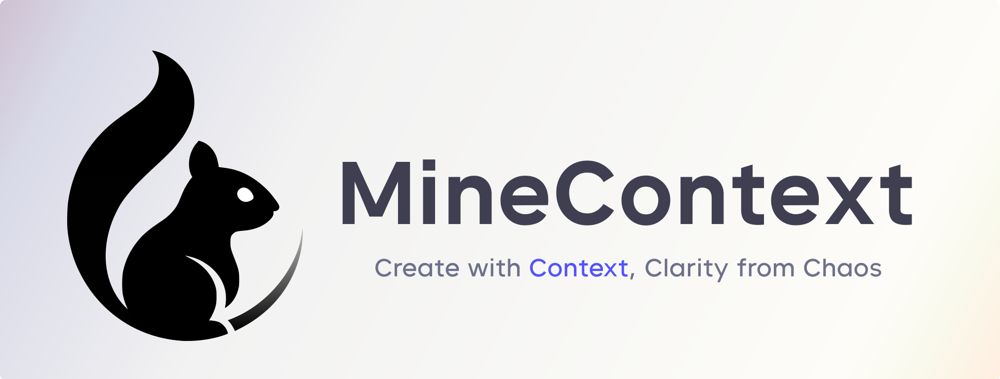
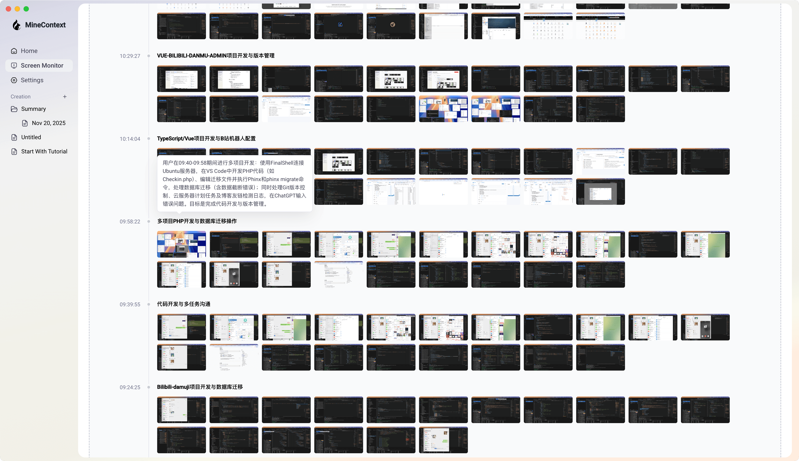
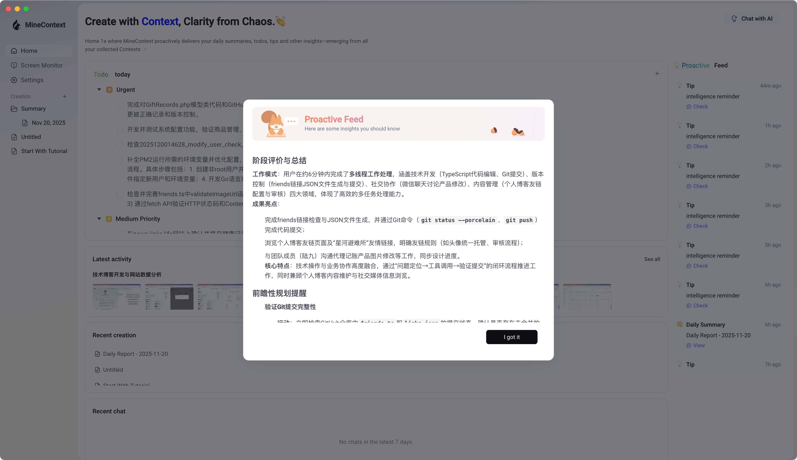
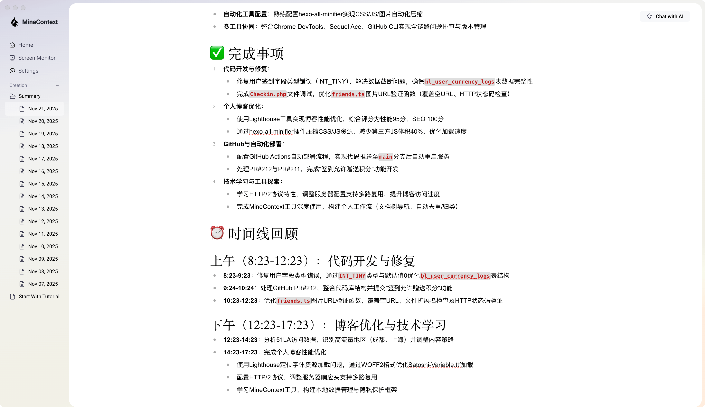

我现在一天基本离不开 AI 了。  
不是那种“把提示词写得像炼丹”式的依赖，而是很平常的那种：

我写代码，它在旁边检查。  
我整理逻辑，它帮我捋一遍。  
我写文档，它补补关键字、给点建议。

整个过程更像是 **我在人前台写，它在后台兜底**。  
它不是替我工作，它是把我的工作做得更圆滑、更完整。

但说实话，我过去对“AI 助理”的期待真的不高。  
因为不管助理多聪明，你不给输入，它就是个哑巴。

它更像一个“贴心的编辑器”，而不是一个“主动的助理”。  
尤其是写日报、周报的时候。

我不说，它啥都不知道。  
输入少，它就笨；输入多，我就累。

所以一般都是：

我亲自写 → AI 润色 → 我审核 → 再调整一下。

直到我遇到了 ​**MineContext**。

---

## 直到我遇到 MineContext

有一天我随便逛 GitHub，看到一个叫 **MineContext** 的东西。  
它确实在某种程度上展示了某种 AI 使用的新方向。

​​

它不是等你给材料，它是：

- 自己看
- 自己分析
- 自己整理
- 自己总结
- 最后把报告端过来

我只是正常用电脑，它就在后台默默观察。

等我晚上坐下来，它就会递给我一份报告，告诉我今天都做了什么。

那份报告甚至比我自己写的更全面、更有逻辑、更有洞察。

对于我这种喜欢把生活“数字化”来管理的人来说，这东西简直是天赐。  
我甚至隐隐觉得，这可能会成为新一代人的工作方式。  
**AI 主动帮你记录、帮你整理，而不是你逼着自己记。**

---

## MineContext 到底在干什么？

用人话讲，它平时就在干这几件事：

### **定时截图你的屏幕**

比如每隔几秒，它截一张当前屏幕。

### **用视觉模型分析你在干嘛**

它能识别页面、文档、代码、聊天窗口、IDE、网页内容……  
然后把这些内容结构化。

比如：

- 你在写 PHP
- 你在查某个 Cloudflare 500 报错
- 你在写博客
- 你在看一个项目的 README
- 你在 debug
- 你在管理数据库
- 在跟桐桐聊天，她说她外公喝的茶 1680 一斤，你下单三斤并约定下周一面交（咳）

### **自动去重、过滤、归类**

把无意义的截图清理掉，把重复信息合并掉，不会让你的数据变垃圾堆。

​​

### **每一小段时间自动做小结**

像一个实时存在的“精简时间线”。

​​

### **生成洞察报告**

每天、每周，它会把你这些碎片化行为整理成一份真正可读的报告。

内容包括：

- 你今天主要在做什么
- 处理了哪些任务
- 花了多少时间
- 今天的重点主题是什么
- 有哪些工作模式、习惯、偏好
- 今天的 highlights / issues
- 有时候甚至会给你建议

读起来真的就像把自己交给了一个观察者，它在旁边默默记录你的一天，晚上把故事整理好给你。

​​

---

## 为什么我说它是 ADHD 神器

我不是专业讲 ADHD 的，就是站在“注意力容易飘”的普通人角度说一下。

很多人应该都有这种感觉：

- 做了很多事，但回头想不起来今天干了啥
- 一天结束的时候没成就感
- 事情都是碎片的，很难拼成完整的故事
- 想写日报时经常“空白”
- 想复盘一下，发现自己根本想不起来

MineContext 的价值就在这里：

**它帮你把碎片变成结构。**

白天你专心干活，无脑沉浸。  
你不需要特地记，也不需要刻意整理。

到了晚上，它已经把你的：

- 工作流
- 切换记录
- 查资料轨迹
- 输入输出
- 项目参与
- 日间行为模式

全部整理得清清楚楚。

它甚至会告诉你：

- 你今天对某个任务持续投入了 2 小时
- 你某段时间反复在查某个问题
- 你的注意力什么时候最集中
- 你什么时候容易走神

这对注意力问题人群来说太有用了。

基本上你只需要“活着”，它帮你记录你的生活

---

## 这东西意味着什么？

我觉得 MineContext 展示了一个**非常新**的方向：

**AI 正在从“你问我答”，变成“我帮你先做”。**

这是一种新工作方式：

- 人类负责体验、创造、执行
- AI 负责记录、整理、总结、复盘

这和我们之前用 AI 的方式完全不一样。

以前是：

> 我要你帮我做点事 → 我提供输入 → 你输出

MineContext 是：

> 我在过我的一天 → 它收集输入 → 它输出给我 → 我再决定怎么用

这带来的变化非常大：

- 你不必靠记忆工作
- 你不会错过工作中的关键行为
- 你能轻松复盘
- 你的大脑不再负责“记”，它只负责“想”

甚至我隐约觉得：

> 将来老板可能会用这种东西来监控员工……

（真的完全不是不可能，毕竟这玩意可以很精确地记录行为模式）

不过目前我并不是很担心这一方面，毕竟它是开源的，控制权在你。

而且数据都是存储在本地，并不会上传云端，每次启动也都需要你自己手动开启才可以。

所以可能老板会更容易从社会学层面入手，比如半夜偷偷溜回公司开你电脑看你一天摸鱼跟朋友八卦的快速总结

---

## 最后的感受

我现在几乎每天晚上都会看它给我生成的日报。  
那种体验很奇妙。

明明是一整天的琐碎行动，它却能被整理成一个“像故事一样”的东西：  
有结构、有因果、有线索、有意义。

它记录的不是任务列表，而是你的节奏、注意力、思考方式、行动轨迹。  
感觉真的像是和另一个自己一起观看生活的回放。

这让我突然意识到：  
AI 不是在帮我工作，而是在帮我“理解我自己”。  
而理解自己，恰恰是现代人最缺的能力。

这几年，AI 热潮来得太快了，快到许多人的态度开始走形。

有人把 AI 神化，觉得它能给人带来超越常识的答案；  
有人带着宗教式的期待，把提示词当作咒语，把模型当成神谕；  
哪怕一次输出不准，也会怪自己“仪式没做对”，再换一次说法，再祈祷一次。

那种感觉有点像对未知祈祷：  
一半期待救赎，一半害怕怪异。  
而在这种矛盾里，人反而越来越看不清自己。

但我越来越觉得，拒绝 AI 和迷信 AI，本质上都是 **放弃了自己的主体性。**

MineContext 的好在于，它的介入方式非常温和。  
它不是来替你做决定的，也不会告诉你应该怎么活。  
它只是默默观察、整理、复盘，把信息用你的方式还给你。

它像一面镜子，但这面镜子比你自己多看到一点点：  
看到你忽略的细节、看到你一天当中的节奏、看到你无意间形成的路径。  
它帮你把混乱变成秩序，把碎片变成轨迹，把流水账变成有意义的叙事。

你还是你，只是更清晰了一点。

在未来这个 AI 会越来越深入环境、工作、家庭，甚至身体的时代里，  
我觉得从这种工具开始，让 AI 以一种不侵入的方式参与生活，是一种很好的提前适应。

你不会迷失自己，也不会落在潮水后面。

如果你也想体验一下，GitHub 下载下来，填上自己的 API Key，就能直接用：**[MineContext](https://github.com/volcengine/MineContext)**
