网上随便一刷，今天 A 模型封神，明天 B 工具屠榜，后天 C 应用卖爆。Cursor、Claude Code、Codex 轮番上场，你方唱罢我登场。卖课的一轮一轮抛出概念，prompt 工程、Agent、workflow、MCP 协议，推攘着圈内人的焦虑，裹挟着大家闷头往前跑。

学完 prompt 学 vibe coding，学完上下文学 Agent。刚喘口气，厂商推出更强算力的模型，卖课的抛出更复杂的概念，大家继续闷头奔向下一个课堂。而圈外一片风平浪静无事发生，偶尔还会有状况外的朋友跑过来问「网上说的那个 vibe coding 是什么软件？怎么我在电脑的应用商店里搜不到？」

十分割裂的情况，圈内人觉得全世界都在用 AI，圈外人连门在哪都找不到。

倒不是说 AI 没有用。我试过之后很确定，这些工具真的能干活，而且干得不错。但问题在于，尝试安利给身边人的时候，海外手机号注册、科学上网、封号风险、20 美元月费，一个接一个的问题直接把人挡在门外。

我想把我踩过的路写出来，给不想折腾这些前置条件的朋友一个可以照着走的办法。

## 这些工具到底厉害在哪

Cursor、Claude Code、Codex，它们调用的模型跟网页端调用的模型是一样的。底层没有区别。

区别在于交互方式。网页端是你问 AI 答，答案显示在网页上，后续怎么处理都只能你自己来，一次能发的消息也有限。而通过 API 调用，借由这些工具，AI 可以直接读取你电脑里的文件，也可以根据返回的内容去操作你电脑里的数据。

比如你跟 AI 说，看看我桌面上的文本文件，把里面的日期格式全部改一下。AI 就能自己去读，自己去改。这只是最基础的使用方式。它可以在你的电脑上写脚本、获取数据、批量处理文件、整理文件夹，能做到的事很大程度上取决于你的想象力，而不仅限于写代码。

Skill 一类的东西能做的事情更多，但那是后话了。

## 三道门槛

使用门槛主要有三个。

**第一道：科学上网。** Claude Code 相关的东西下载需要，注册需要，登录需要，教这东西还违法。

**第二道：账号注册。** 海外手机号验证、封号风险，都不是省心的事。

**第三道：费用。** 一个月 20 美元。说多不多，但百度网盘一个月 25 块人民币的会员都让人交得牙痒痒，20 美元的 AI 工具，只是偶尔用用的话，这个钱花得确实没必要。

好在三道门槛都可以绕过去。

## 怎么绕

DeepSeek 是个好选择。国内模型，不用翻墙。按量付费，不用不花钱。充值直接走支付宝。日常使用足够用了。

更关键的地方在这：DeepSeek 官方文档专门写了 Claude Code 的接入教程。也就是说，你可以用 Claude Code 这个工具，调用 DeepSeek 的模型。

而 Claude Code 的命令行版本（CLI），不需要登录，也不强制绑定账号。

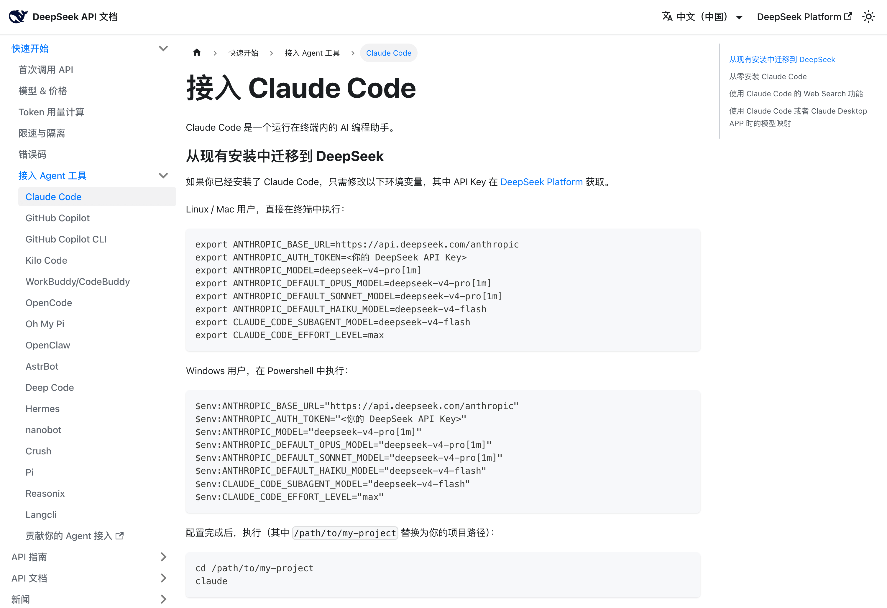

## 安装 Claude Code 的问题

虽然 CLI 不需要登录，但 Claude Code 本身的安装对 Windows 用户比较麻烦，对不熟悉终端的 Mac 用户也不太友好。

这个问题可以用 Visual Studio Code 解决。

VS Code 看起来是个代码编辑器，说是代码编辑器也没错。但你完全可以把它理解成一个可以装扩展的编辑器，写代码只是其中某一类扩展能做的事情，装 Claude Code 插件是另一件事。

关键的三点：

- 下载 VS Code 不需要科学上网
- 在 VS Code 里安装 Claude Code 插件不需要科学上网
- 通过 DeepSeek 的 API 使用 Claude Code 不需要科学上网

没有前置条件，没有中间商赚差价，没有月费绑架。只有使用的时候才产生费用。加上 DeepSeek 的价格，真的只收了个电费。

## 安装步骤

每一步都踩过坑了，照着走就行。

### 1. 下载安装 Visual Studio Code

打开 [https://code.visualstudio.com/Download](https://code.visualstudio.com/Download)，下载对应系统的版本。Windows、Mac、Linux 都支持。下载后正常安装。

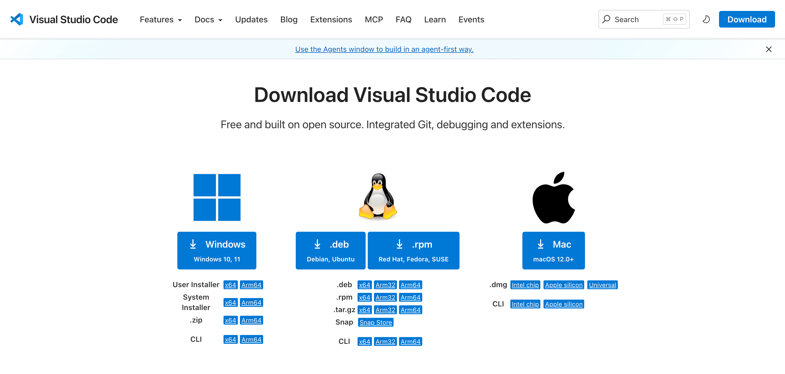

### 2. 下载安装 Node.js

打开 [https://nodejs.org/zh-cn/download](https://nodejs.org/zh-cn/download)，下载对应系统的版本，一路默认安装。这个是 Claude Code 运行需要的环境。

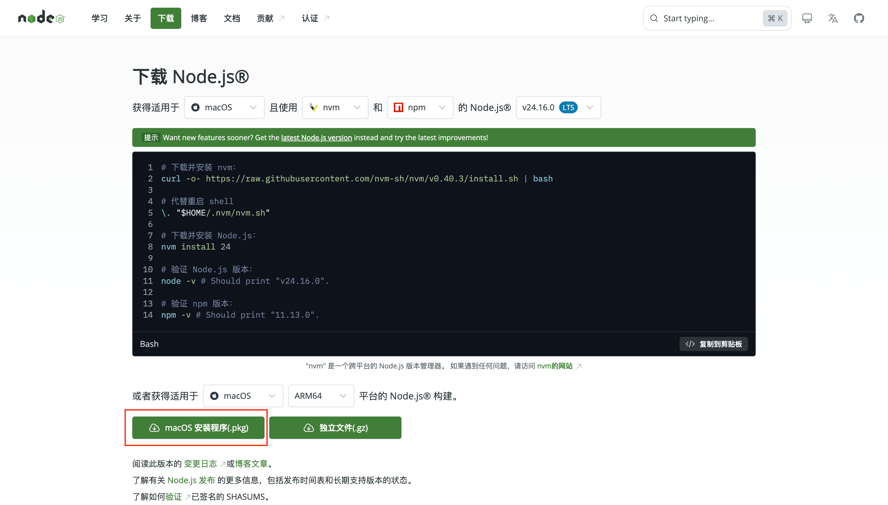

### 3. 设置 VS Code 中文

打开 VS Code，左侧扩展商店搜索"Chinese"，安装微软官方的中文语言包，重启 VS Code。

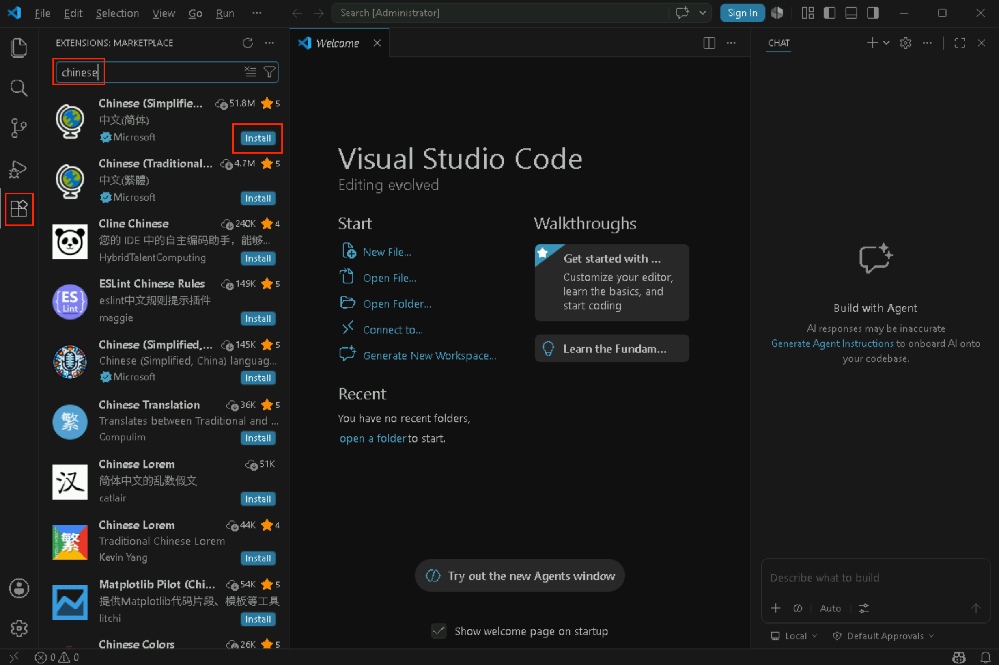

### 4. 配置 npm 镜像

打开 VS Code 的终端（点击左下角即可），输入这行命令后回车：

```
npm config set registry https://registry.npmmirror.com
```

这一步是为了让后续的下载更快更稳。

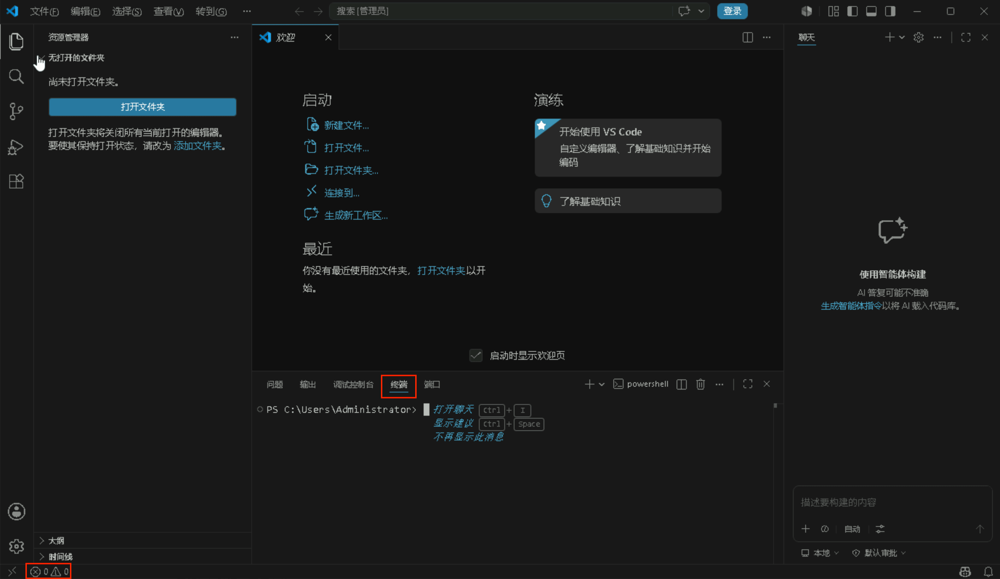

### 5. 安装 Claude Code

同一个终端中，输入：

```
npm install -g @anthropic-ai/claude-code
```

等待安装完成。

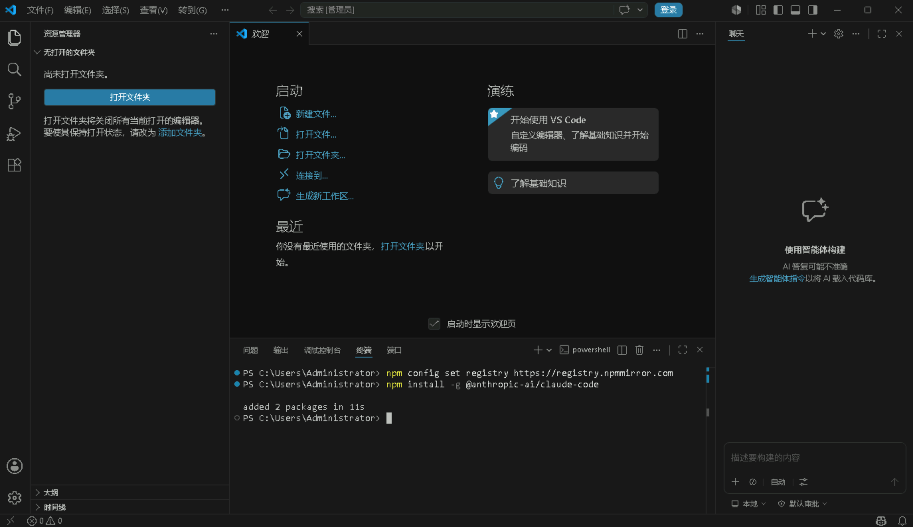

### 6. 安装 Claude Code 插件

VS Code 左侧扩展商店，搜索"Claude Code"，找到对应的插件后安装。

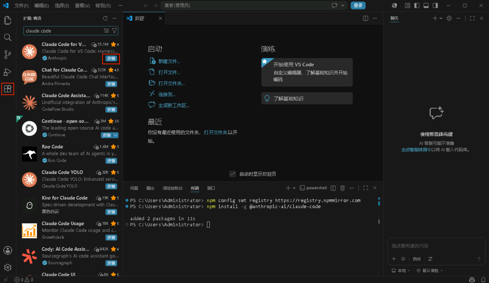

### 7. 接入 DeepSeek

最后一步，做两件小事。

**注册 DeepSeek 并获取 API Key**

打开 [platform.deepseek.com](https://platform.deepseek.com)，手机号注册，跟注册任何一个国内网站一样。注册后在后台找到"API Keys"页面，创建一个新的 API Key，复制保存好。

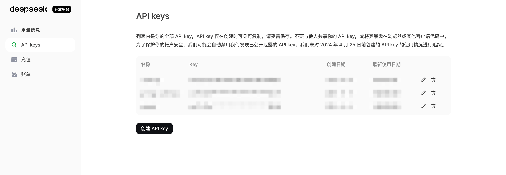

**在 VS Code 中设置环境变量**

在插件中进行设置，搜索 `claude code`，点击齿轮，选择设置，找到环境变量设置。添加两组变量：

需要配置的信息在DeepSeek的官方文档中均已提供：[点击查看](https://api-docs.deepseek.com/zh-cn/quick_start/agent_integrations/claude_code)

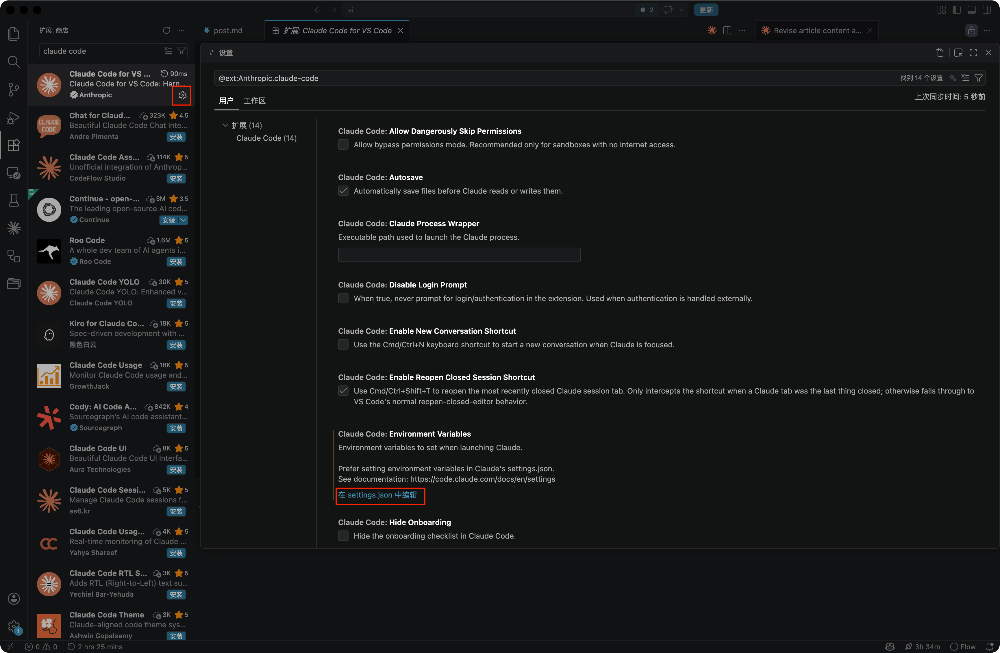

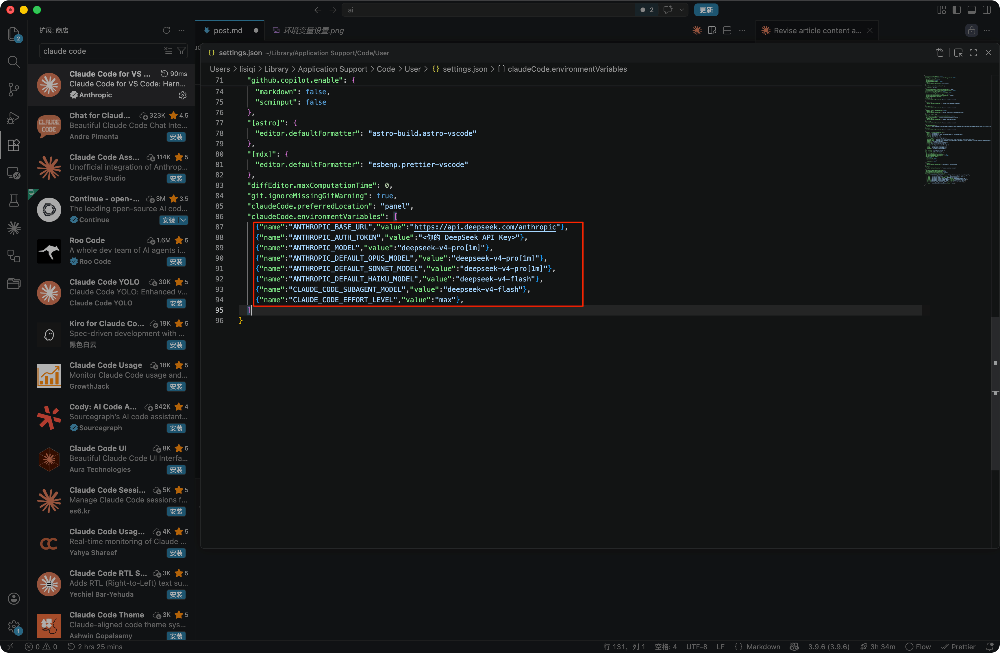

### 8. 开始使用

安装完成后，点击 Claude Code 图标，打开对话面板，就可以跟 AI 对话了。

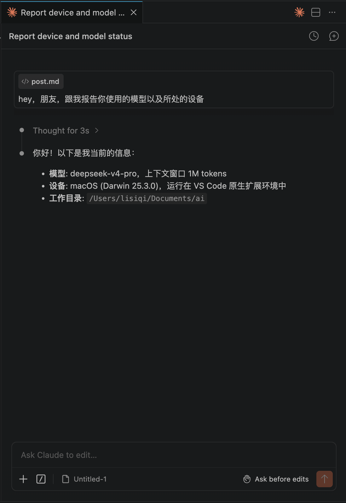

## 装完之后怎么玩

通常用 VS Code 打开一个文件夹作为 AI 的工作目录。文件夹里堆了需要整理的文档，直接跟 AI 说就行。整理文件、修改文本、批量重命名、提取信息，这些事情都可以交给它。

想用更专业的技能，比如 skill 之类的，可以慢慢研究。我一般推荐先用 skill-creator 自己写一个 skill，这是理解 skill 运作方式最快的方法。不过对大部分需求没那么深的朋友来说，没有 skill 也足够用了。等你真的需要 skill 的时候，也就不需要看这种入门指南了。

---

AI 领域的现状挺拧巴的。厂商闷头冲算力，卖课的不停造新词，客观上把门槛越拉越高。

这篇教程想做的事情很简单。让不需要科学上网、不需要海外手机号、不需要 20 美元月费的人，也能把 AI 用起来。试一试，你会发现它能做的事情可能比你想象的多得多。
