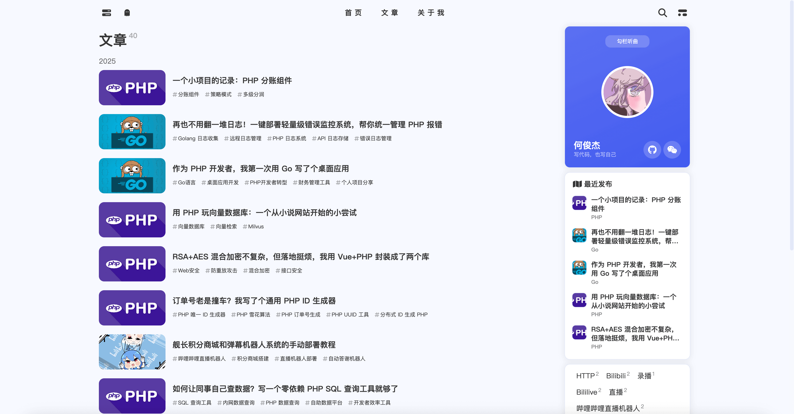
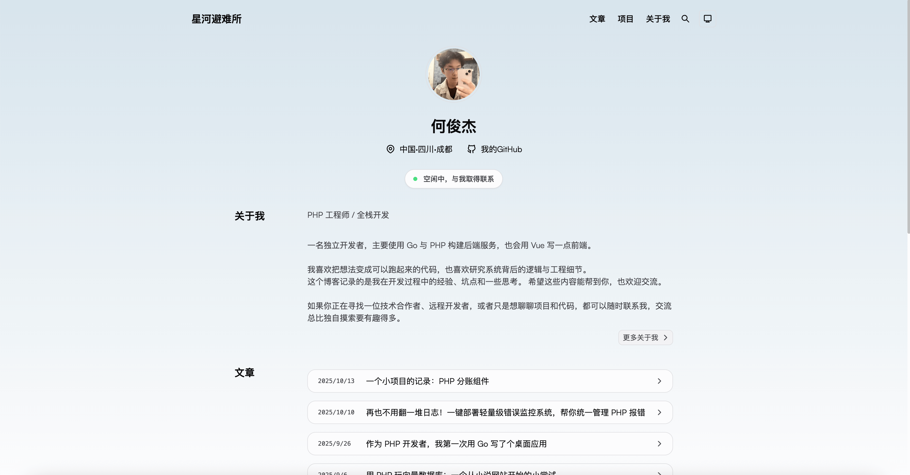
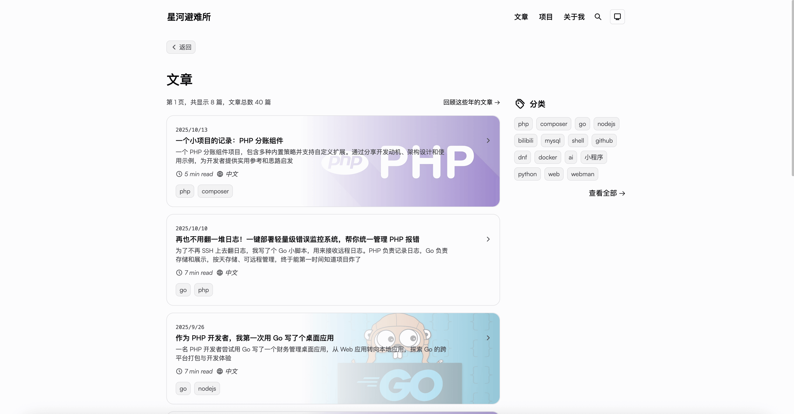
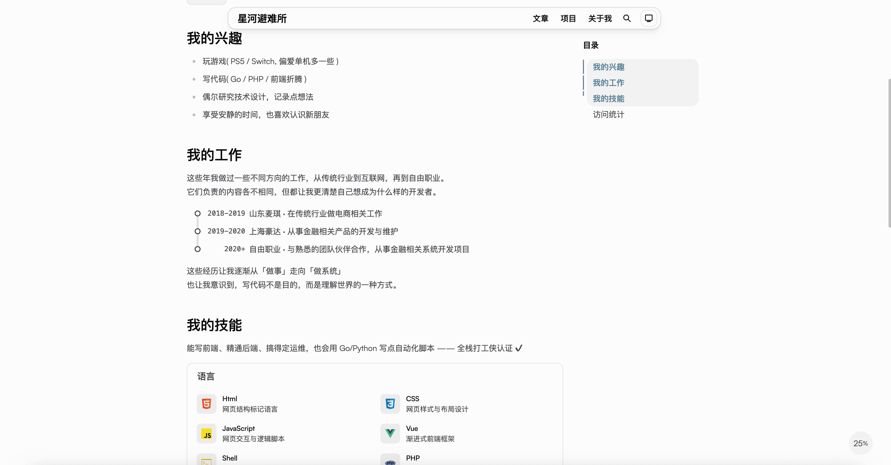
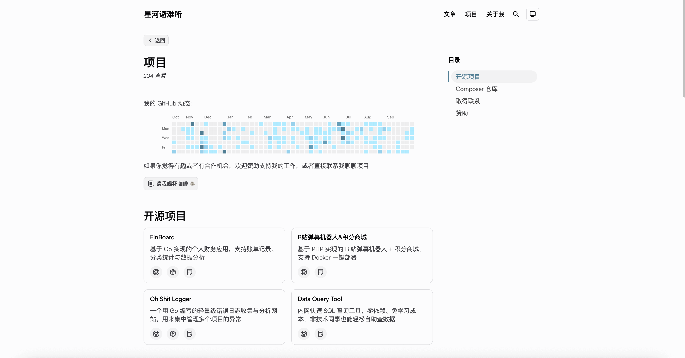
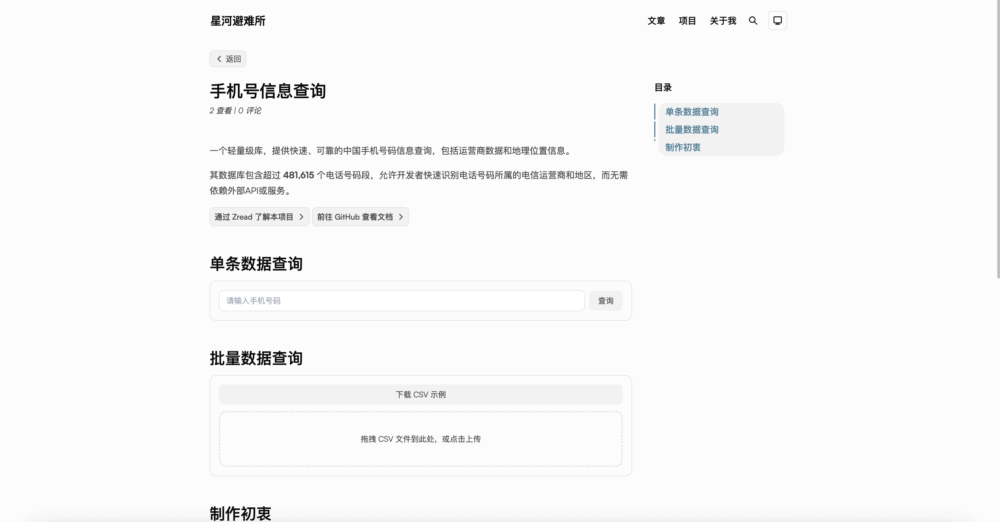

写博客这件事，老实说，现在可能不太流行了，流量也未必多，但对我来说，有没有博客是两回事。

过去几年，我一直用 Hexo 搭建和维护我的博客，主题丰富、社区活跃，用得也很开心。

---

> 老博客：

 
 
 

不过，随着我对博客的需求越来越多，我发现 Hexo 在一些定制化操作上有些局限。于是，我决定尝试用 Astro 来重构我的博客。

---

> 新博客：

 

---

## 关于博客这件事

我其实并不指望有人会主动来看我的博客。现在这个时代，社交平台的信息流太快，主动搜索和阅读博客的人越来越少，自然流量几乎可以忽略不计。  
但我觉得，有没有人看是一回事，**写不写又是另一回事**。

写东西是好的。  
无论是记录生活、整理思路，还是在完成一个项目后做个总结强化记忆，这个过程本身就是一种复盘和沉淀。哪怕只是写在记事本里，都有意义。而当我把这些内容放到自己的博客上，它又变成了另一种存在——像是一张我在网络上的个人名片。

没有这张“名片”，当然也没什么关系；但有这么一个地方，能承载我的想法、积累和小尝试，我会觉得挺开心的。

---

## 为什么想要重构

虽然 Hexo 写博客简单、方便，但有时候我想在页面上增加一些小定制功能或展示自己的项目。Hexo 在这方面略显死板，很难灵活调整。

我希望能实现几个目标：

- 可以继续用 Markdown 写博客，不增加复杂度
- 页面可以随意增加一些互动组件或者项目展示
- 当有小想法时，可以直接用 React/Vue 去实现

总之，我希望博客不仅仅是写文章的地方，还能承载一些创意和技术实践。

---

## Astro 的优势

选择 Astro 的主要原因是它的灵活性：

- **框架自由**：可以在同一个页面混合使用 React、Vue、Svelte 等组件
- **性能优秀**：默认静态生成，访问速度快
- **开发自由度高**：博客可以作为博客，也可以展示项目或其他创意

Astro 给了我一个既能保持写作效率，又能随意定制页面的空间，这正是我想要的。

---

## 使用体验与感受

重构后的博客体验让我很满意：

- 平常写博客依旧简单，Markdown 就够了
- 想改动或加入小功能时，可以直接用组件实现
- 博客不只是博客，也能展示项目、作品或其他想法

虽然我明白现在大家可能已经不太关注博客，也可能没人看，但对我来说，有一个可以自由调整和实践的平台，这种感觉非常爽。

 

 

---

## 总结

总的来说，从 Hexo 到 Astro 是一次让我非常满意的重构，更像是一次“重塑表达方式”的过程。  

它让我能在继续写字的同时，也能把我的代码、项目和想法融在一起。这种感觉挺好。

如果你对博客有定制化需求，或者想尝试更多前端技术，我可以说 Astro 是一个值得尝试的选择。

不过如果你真的对代码没兴趣，也不想去定制什么东西，只是用来写文章放文章的话，那可能 Hexo 还是会方便一些

如果你也想了解 Astro 的使用体验，可以来看看 :)

地址：[hejunjie.life](https://hejunjie.life)

