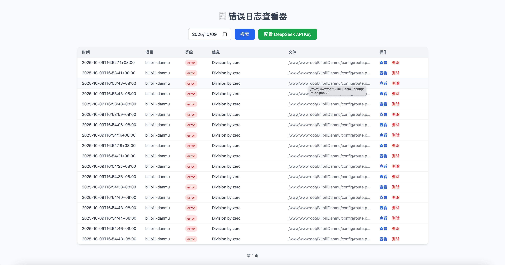
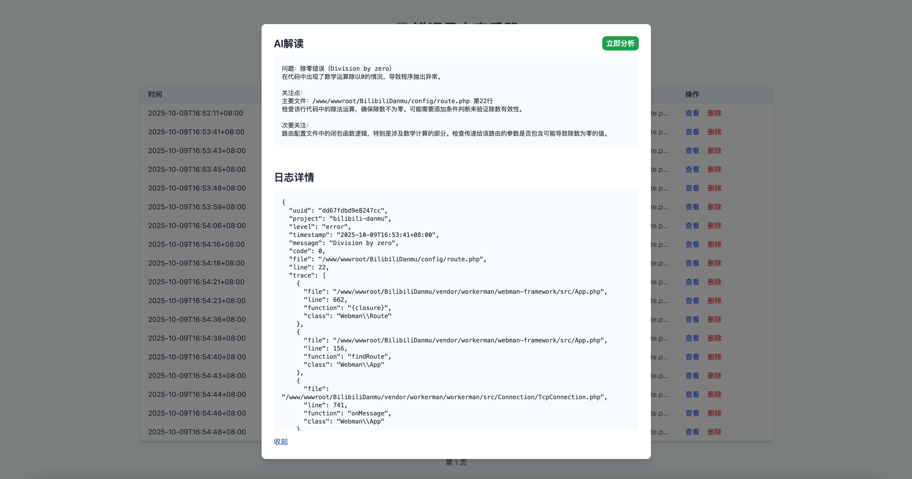

维护多个项目的人，大概都明白那种感觉。  
平时一切都很平静，直到某天，甲方的一句“系统是不是出问题了？”  
这时候才发现，问题早就埋在那里了。

你登录服务器，开始翻日志、看 trace，一边调试一边回想昨天是不是又改了什么。问题最终解决了，但那种被动的感觉始终在心里。

我后来想：  
**这种被动，其实是可以被解决的。**   
有没有可能在客户找上门之前，我就已经知道问题在哪，甚至提前修掉？

---

## 为什么我需要它

我手里有不少 PHP 项目，分散在不同的服务器上。  
每个项目都有自己的错误日志，但它们互相独立，没人能统一看到全局情况。

想主动检查，就得一台一台地上服务器翻日志。  
没出事的时候翻这些日志浪费时间，但不看又怕真的出了问题。

结果就是那种尴尬的状态：  
**平时不想看，有事的时候措手不及。**

我不想再这样。  
我希望有一个地方，能让我一眼看到所有项目的错误，集中展示、集中分析。

---

## 我想要的样子

我设想的工具应该能做到几件事：

1. 接收所有项目上报的错误信息；
2. 按日期分类保存，支持分页浏览；
3. 可以在浏览器中直接看到最近的错误；
4. 最好还能借助 AI 自动分析错误，帮我快速锁定方向。

这就是 **oh-shit-logger** 的雏形。





---

## 为什么用 Go，而不是 PHP

很多人看到这个项目时会问：  
“你不是做 PHP 的？为什么用 Go 写？”

其实原因很简单：我想让它“随拿随用”。

PHP 虽然写起来快，但部署环境太麻烦。
不管再怎么简化，总归还是要安装 PHP 环境
而 Go 编译出来是一个**独立的可执行文件**，  
上传到服务器就能跑，不用依赖环境，也不用额外配置。

这对我来说非常重要。  
我只想有个小程序，能轻轻松松丢到任何服务器上运行，  
收集日志、展示信息，不占资源，也不出幺蛾子。

所以最终我选择了 Go。

---

## 它现在能做什么

oh-shit-logger 可以在几秒钟内启动。

在 [Releases](https://github.com/zxc7563598/oh-shit-logger/releases) 里下载编译好的版本，上传到服务器后执行：

```bash
chmod +x ./app
./app -port=9999 -retain=7 -user=admin -pass=123123
```

然后访问  
​`http://你的服务器IP:端口号/read`  
就能看到所有 PHP 项目的错误日志。

PHP 项目上报也很简单，只需要在异常处理中添加一段上报逻辑：

```php
curl_setopt($ch, CURLOPT_URL, 'http://你的服务器IP:端口号/write');
```

错误信息会被自动收集、格式化、展示，并且可以通过接入的 DeepSeek AI 自动生成分析结果，告诉你错误可能的原因和修复方向。

---

## AI 的部分

我接入 DeepSeek，不是为了给项目贴个“AI标签”。  
关于 AI，网上的讨论很多。
有人相信它能解决一切，甚至不用写一行代码就能做出完整项目；
也有人觉得 AI 看似帮忙，实际上是在暗地里埋雷；
还有人担心长期依赖它，会让个人的思考和判断慢慢退化。

我这种小卡拉米肯定是参与不了这种宏大的争论。
对我来说，AI 的上下文长度就摆在那里，它要是承担太多工作，难免会丢掉一些细节，而且随着任务量的增加记忆只会越丢越多
所以我更愿意把它当成一个“辅助”，就像现在的智能驾驶。
它可以给我建议，帮我节省时间，但不要直接动我的东西，最终的决定权还是在我。

有时候我们看到错误信息，稍微一想就知道大概出了什么问题；
但也总有那么些时刻，比如正在开会、接电话、或者状态不太好时，
AI 能帮我快速过一遍问题，给出大致的方向。
这样我可以少花点心力，留点精力去解决真正麻烦的部分。

---

## 最后的想法

我做这个项目，其实是为了解决自己的一种焦虑。  
那种“系统运行着，但我不知道它哪天会出事”的焦虑。

**oh-shit-logger** 让我重新掌握了节奏。  
现在我不再等客户来告诉我哪里坏了，  
我能提前看到问题、分析它、修掉它。

这就是它存在的意义。

---

## 项目地址

GitHub: [https://github.com/zxc7563598/oh-shit-logger](https://github.com/zxc7563598/oh-shit-logger)

如果这个项目能帮到你，欢迎点个 Star 或提 Issue。  
当然他最好帮不到你，希望你部署之后每天面对的都是一个无数据的空列表 🙏
