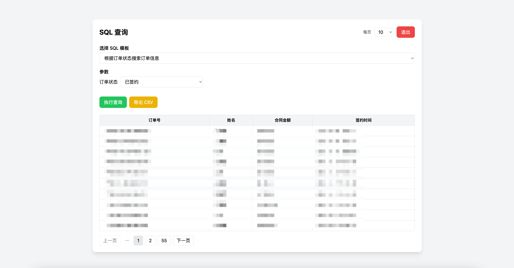

在公司里，运营、老板或者其他同事经常会来找我问数据。很多时候，一个简单的 SQL 就能解决问题，但他们从来不愿意学 SQL，也不想安装任何查询工具。每次被打断写代码，我都非常无奈。

于是，我写了一个小工具——**Data Query Tool**，让同事自己动手查数据，自己专心写代码，同时还能保证简单、快速、安全。

---

## **问题**

- 同事不会 SQL，也不想学。
- 安装数据库客户端工具成本高，不方便在每台电脑上部署，哪怕是 phpMyAdmin 他们都不愿意去了解。
- 每次帮人查数据都很耗时间，打断了开发思路。

我希望的是：**让非技术同事可以在浏览器里直接点击，就得到他们想要的数据，最好还能导出 Excel，省的来找我要数据**。

---

## **解决方案**

我选择了用 PHP 写一个**零依赖、无框架、单文件启动的查询工具**：

- 只要把代码放到服务器上（最好是公司内网），运行：

  ```bash
  php -S 0.0.0.0:8000
  ```

  就可以通过浏览器访问 `http://服务器IP:8000`。

- **常用 SQL 配置成模板**，支持参数化：

  - 文本输入（input）
  - 日期选择（date）
  - 下拉选择（select）

- 同事直接选择 SQL 模板、填入参数，就能查询，不用写 SQL。
- 内网部署安全可靠，零打扰开发流程。

---

## **SQL 配置说明**

工具使用 `config.json` 来管理 SQL 模板，结构示例：

```json
{
  "sql_templates": [
    {
      "name": "查询所有用户",
      "query": "SELECT user_id as '用户ID',phone as '手机号',real_name as '姓名',FROM_UNIXTIME(created_at) as '创建时间' from ch_users where deleted_at is null",
      "query_params": {}
    },
    {
      "name": "根据手机号查询用户",
      "query": "SELECT user_id as '用户ID',phone as '手机号',real_name as '姓名',FROM_UNIXTIME(created_at) as '创建时间' from ch_users where phone = {{phone}} and deleted_at is null",
      "query_params": {
        "phone": {
          "type": "input",
          "description": "手机号"
        }
      }
    },
    {
      "name": "根据注册时间查询用户",
      "query": "SELECT user_id as '用户ID',phone as '手机号',real_name as '姓名',FROM_UNIXTIME(created_at) as '创建时间' from ch_users where created_at >= UNIX_TIMESTAMP({{start_time}}) and created_at <= UNIX_TIMESTAMP({{end_time}}) and deleted_at is null",
      "query_params": {
        "start_time": {
          "type": "date",
          "description": "开始时间"
        },
        "end_time": {
          "type": "date",
          "description": "结束时间"
        }
      }
    },
    {
      "name": "根据订单状态搜索订单信息",
      "query": "SELECT borrow_sn as '订单号',real_name as '姓名',borrow_amount as '合同金额',FROM_UNIXTIME(created_at) as '签约时间' from ch_borrows where `status` = {{status}} and deleted_at is null",
      "query_params": {
        "status": {
          "type": "select",
          "options": [
            { "value": "5", "label": "拒绝签约" },
            { "value": "6", "label": "取消签约" },
            { "value": "9", "label": "签约失败" },
            { "value": "11", "label": "已签约" },
            { "value": "12", "label": "已完成" }
          ],
          "description": "订单状态"
        }
      }
    }
  ]
}
```

> 说明：
>
> - ​`query` 中用 `{{参数名称}}` 占位
> - ​`query_params` 定义参数类型、说明、可选项
> - 支持 input / date / select 三种输入方式
> - 页面会根据参数类型自动生成相应控件，非技术同事也能操作

---

## **使用示例**

1. **将代码放到服务器或电脑**

   ```bash
   git clone https://github.com/zxc7563598/data-query-tool.git
   cd data-query-tool
   ```

2. **启动 PHP 内置服务器**

   ```bash
   php -S 0.0.0.0:8000
   ```

3. **浏览器访问**  
   打开 `http://服务器IP:8000`​

   - 选择 SQL 模板
   - 填写或选择参数
   - 点击查询，即可显示结果

4. **可选：编辑** **​`config.json`​**​

   - 配置 SQL 模板
   - 配置模板参数类型和描述

---

## **效果截图**

​​

​​

​​

---

## 总结

其实也没啥高大上的理由，我写这个工具就是因为——​**老板和同事再也不会天天来烦我查数据了**。

他们想要啥，自己点点就行；我也不用被一行 SQL 打断思路。

说白了，这东西就是 ​**给自己图个清净**。

> 如果你也遇到类似的场景，可以在评论区聊一聊。  
> 说不定我能帮你顺手做个小工具，也算是给我自己省点事 —— 毕竟我一个人可能发现不了那么多“被烦”的场景。
