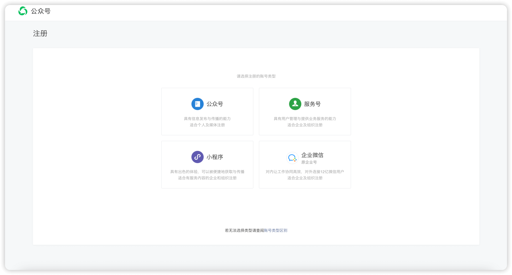
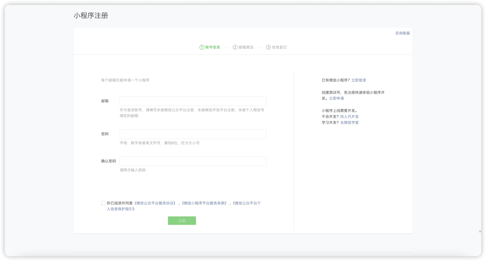
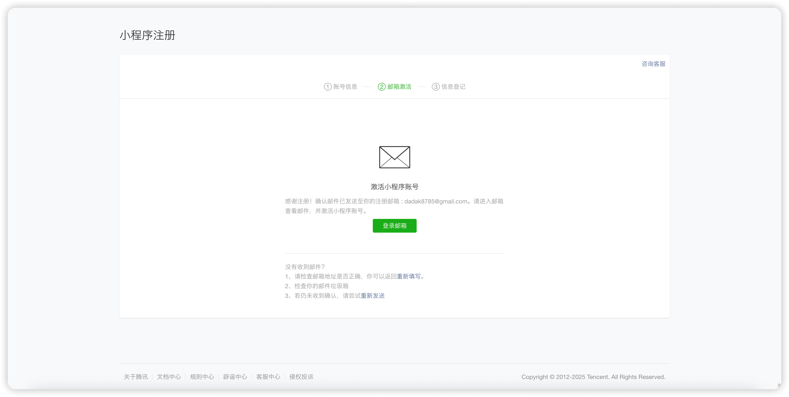
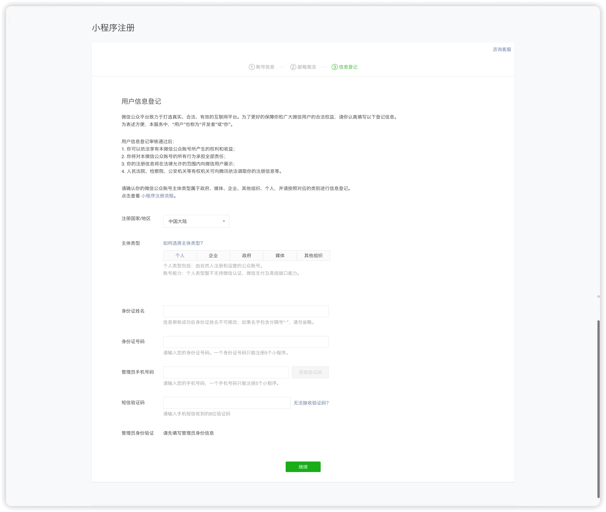
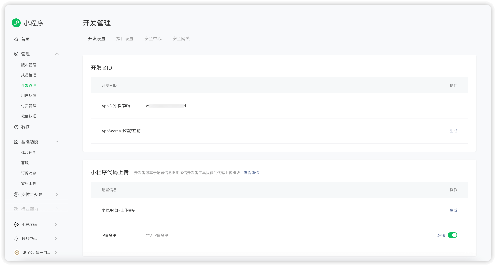
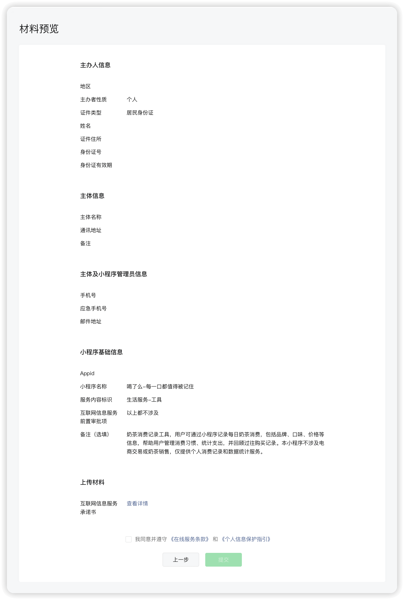

最近在刷小红书时，看到不少人在分享自己的微信小程序如何靠广告月入上万，甚至更多。

这种说法不能说不真实，只能说肯定不是这么简单的事情。毕竟广告收入的多少，归根结底还是取决于用户量，不可能随便做个小程序，就能吸引大量用户来看广告。

不过，完全说不可能也不太准确，毕竟人活着总得有梦想。而且其实做一个简单的小程序成本并不高，尤其得益于云开发。小程序后期没有域名、服务器等额外的软成本，所有内容都可以部署在微信平台上。如果小程序没有火，每个月基本上只需要支付 20 元的基础费用，这几乎就是唯一的支出。所以，如果广告收入能超过 20 元，那就算是赚到了。

正好最近有点空闲时间，我也挺好奇微信小程序的开发流程相比之前有什么变化，索性就研究了一下，并把整个过程记录下来，方便以后参考。于是，就有了这篇文章。

‍

## 开发前准备

### 注册微信公众平台

首先前往 [微信公众平台](https://mp.weixin.qq.com) 并扫码登录。如果是新用户，扫码时会引导你进行网页注册。

注册所需的资料并不复杂，但需要注意微信对不同注册主体的限制。个人主体可以注册小程序，但无法使用支付等涉及资金交易的功能。这也是为什么小红书上的宣传总是强调广告收入。毕竟，除非真有富哥富姐玩真心话大冒险输了私下给你转账，否则广告收入几乎是个人主体小程序唯一的盈利方式。

> 注册链接：https://mp.weixin.qq.com/cgi-bin/registermidpage?action=index&lang=zh_CN

> 链接：https://mp.weixin.qq.com

​​

​​

​​

​​

### 创建微信小程序

一个微信公众平台账号，简单来说就是一个 **开发者账号**，它对应着一个 **AppID（小程序 ID）** 。

微信官方提供了 **微信开发者工具**，用于小程序的开发。

因此，小程序的开发过程可以概括为：

- 注册账号
- 获取 AppID
- 下载并安装微信开发者工具
- 在微信开发者工具中创建项目，绑定 AppID 后开始开发

> 微信开发者工具下载地址：https://developers.weixin.qq.com/miniprogram/dev/devtools/stable.html

​​

### 可选：小程序备案

已经确定小程序内容（名称 / logo）的情况下，可以提前进行小程序备案

详见：[小程序备案](#小程序备案)

‍

## 开始开发

小程序的开发方式与 Vue 类似，但整体上经过了微信的“魔改”。通过类似 HTML 的 WXML 构建页面，类似 CSS 的 WXSS 描述样式，以及通过类似 JavaScript 的 WXJS 渲染页面。

需要注意的是，虽然 WXSS 与 CSS 基本相似，但许多 CSS3 特性并未被继承到 WXSS 中。此外，小程序的渲染方式与传统网页有所不同，因此在开发时需要特别关注页面样式在不同设备上的兼容性和展示效果。

### 整体说明

小程序创建后，会得到这样一个基础目录

```python
your-app/
│
├── assets/            # 存放静态资源文件（如图片、字体等）
│   ├── logo.png
│   └── bg.jpg
│
├── components/            # 自定义组件
│   ├── header/            # 头部组件文件夹
│   │   ├── header.wxml    # 组件的结构文件
│   │   ├── header.wxss    # 组件的样式文件
│   │   ├── header.js      # 组件的逻辑文件
│   │   └── header.json    # 组件的配置文件
│   │
│   └── footer/            # 底部组件文件夹
│       ├── footer.wxml
│       ├── footer.wxss
│       ├── footer.js
│       └── footer.json
│
├── pages/             # 存放小程序页面
│   ├── index/         # 首页页面文件夹
│   │   ├── index.wxml  # 页面结构文件（HTML-like）
│   │   ├── index.wxss  # 页面样式文件（CSS-like）
│   │   ├── index.js    # 页面逻辑文件（JS）
│   │   └── index.json  # 页面配置文件
│   │
│   └── other/         # 其他页面
│       ├── other.wxml
│       ├── other.wxss
│       ├── other.js
│       └── other.json
│
├── utils/             # 存放工具函数等公共代码
│   ├── util.js
│   └── helper.js
│
├── app.js             # 小程序的入口文件
├── app.json           # 小程序全局配置文件
├── app.wxss           # 小程序全局样式文件
└── project.config.json# 小程序项目配置文件（IDE用）

```

‍

### 页面说明

小程序的每个页面或组件通常由同名的 wxml、wxss、js 和 json 四个文件构成，这些文件之间会自动关联，无需额外的引用配置。

#### **​`wxml`​**​ **（微信标记语言，类似 HTML）**

- 负责页面的结构和布局，定义页面中的元素。
- 通过 WXML 来编写页面的视图结构。

```html
<!-- wxml 文件 -->
<view class="container">
  <text>{{title}}</text>
</view>
```

‍

#### `wxss`​（微信样式表，类似 CSS）

- 负责页面的样式设置，定义页面中元素的外观、布局等。
- ​`wxss`​ 是 CSS 的一种扩展，支持大部分标准的 CSS 特性，同时增加了小程序特有的一些功能，如尺寸单位 `rpx`​（响应式像素）。

```css
/* wxss 文件 */
.container {
  width: 100%;
  padding: 20px;
  background-color: #f0f0f0;
}
```

‍

#### ​`js`​（JavaScript）

- 用于页面的逻辑处理，包括数据的处理、事件的绑定、页面生命周期的管理等。
- 通过 `Page()`​ 或 `Component()`​ 定义页面的行为和生命周期方法（如 `onLoad`​、`onShow`​ 等）。

```javascript
// js 文件
Page({
  data: {
    title: 'Hello, 小程序!'
  },
  onLoad: function () {
    console.log('页面加载')
  }
})
```

‍

#### `json`​（配置文件）

- 用于页面的配置，比如页面的导航栏、标题、窗口背景色等。
- 页面和组件的配置也通过 `json`​ 文件来指定，包括页面是否启用分享、是否使用微信的下拉刷新等。

```json
{
  "navigationBarTitleText": "首页",
  "enablePullDownRefresh": true
}
```

‍

#### 组件

组件与页面类似，由同名的 `wxml`​、`wxss`​、`js`​ 和 `json`​ 四个文件组成。

可以简单理解为，组件就是一个“可复用的小页面”或“功能模块”。

组件的意义在于封装可复用的 UI 结构和逻辑。例如，在小程序中，每个页面可能都会包含一个相同的标题栏，如果不使用组件，就需要在每个页面单独编写一遍，而使用组件后，只需封装一个标题栏组件，并在各个页面中引用即可。这样不仅减少了冗余代码，提高了开发效率，还能在需要调整时，只修改组件代码就能同步更新所有页面，避免遗漏或重复修改。

##### 组件的引用

在对应页面的 `json`​ 配置文件（如 `index.json`​）中，使用 `usingComponents`​ 引入组件。例如，假设组件位于 `components/my-component/my-component`​ 目录下：

```json
{
  "usingComponents": {
    "my-component": "/components/my-component/my-component"
  }
}
```

在页面的 `wxml`​ 文件中，像 HTML 标签一样使用组件：

```html
<my-component></my-component>
```

‍

### 生命周期

小程序根据 `js`​ 中的 `Page()`​ 或 `Component()`​ 来区分页面或组件，他们会有各自不同的生命周期

小程序的开发多数都围绕着页面的生命周期进行

#### 页面

页面中的自定义方法如下图表格所示：

> 页面进行到对应节点时便会触发对应的生命周期函数，可以不进行声明，如果不进行声明则不会被触发

| 生命周期函数        | 触发时机                               | 适用场景                           |
| :------------------ | :------------------------------------- | :--------------------------------- |
| onLoad(options)     | 页面 加载 时触发（仅触发一次）         | 获取页面跳转参数、初始化数据       |
| onReady()           | 页面 首次渲染完成 时触发（仅触发一次） | 获取 DOM 节点信息                  |
| onShow()            | 页面 每次显示 时触发                   | 页面进入前台，适合刷新数据         |
| onHide()            | 页面 隐藏 时触发                       | 页面跳转到其他页面                 |
| onUnload()          | 页面 卸载 时触发                       | 适用于释放资源、清除定时器         |
| onPullDownRefresh() | 用户 下拉刷新 时触发                   | 刷新页面数据（需要在 json 里开启） |
| onReachBottom()     | 用户 滚动到底部 时触发                 | 适用于分页加载数据                 |
| onShareAppMessage() | 用户点击 分享按钮 时触发               | 自定义分享内容                     |
| onShareTimeline()   | 用户点击 分享到朋友圈 时触发           | 适用于朋友圈分享                   |
| onPageScroll(event) | 页面 滚动时 触发                       | 监听滚动位置                       |
| onResize(event)     | 页面 尺寸变化 时触发                   | 适用于屏幕旋转等情况               |

注意：小程序的页面管理方式和浏览器的 **单页应用（SPA）** 类似，采用的是 **堆栈管理机制**，即：

1. **页面不会被立即销毁**，而是存储在页面栈中。
2. **新页面入栈**，旧页面仍然保留在内存中，不会触发 `onLoad`​。
3. **返回旧页面时，旧页面不会重新加载**，但会触发 `onShow`​。

| 操作             | onLoad  | onShow  | onHide  | onUnload     |
| :--------------- | :------ | :------ | :------ | :----------- |
| 进入页面 A       | ✅ 触发 | ✅ 触发 | ❌      | ❌           |
| 从 A 跳转到 B    | ❌      | ❌      | ✅ 触发 | ❌           |
| 返回 A（B -> A） | ❌      | ✅ 触发 | ❌      | ❌           |
| A -> B -> 关闭 B | ❌      | ✅ 触发 | ❌      | ✅（B 卸载） |

##### 示例

```javascript
Page({
  /**
   * 页面的初始数据
   *
   * 页面的初始数据是一个对象，可以包含各种属性，这些属性将用于页面渲染
   * 页面的数据会在页面加载时自动传入页面的 wxml
   * 通过 data 设置的数据，可以在 wxml 中进行绑定，从而在页面中渲染
   * 例如下面的数据，可以直接在 wxml 中使用 {{message}} 进行展示
   * data 中的数据可以在页面的 js 中通过 this.data 访问
   * 通过 this.setData 方法修改 data 中的数据，将重新渲染页面
   */
  data: {
    message: 'Hello, 小程序!',
    count: 0
  },

  /**
   * 生命周期函数 - 监听页面加载
   * 只在页面首次加载时触发一次
   * 可用于获取页面参数、初始化数据等
   */
  onLoad(options) {
    console.log('页面加载：onLoad', options)
    // 可以从 options 获取页面跳转时传递的参数
    if (options.id) {
      console.log('页面参数 ID:', options.id)
    }
  },

  /**
   * 生命周期函数 - 监听页面初次渲染完成
   * 页面结构已渲染，但未必可见
   * 适合操作 DOM
   */
  onReady() {
    console.log('页面渲染完成：onReady')
  },

  /**
   * 生命周期函数 - 监听页面显示
   * 每次页面进入前台时触发（包括返回该页面）
   */
  onShow() {
    console.log('页面显示：onShow')
  },

  /**
   * 生命周期函数 - 监听页面隐藏
   * 进入后台或跳转到其他页面时触发
   */
  onHide() {
    console.log('页面隐藏：onHide')
  },

  /**
   * 生命周期函数 - 监听页面卸载
   * 页面被关闭/销毁时触发（如 `wx.navigateBack()` 返回）
   * 适合执行清理操作，如释放定时器
   */
  onUnload() {
    console.log('页面卸载：onUnload')
  },

  /**
   * 监听用户下拉动作（用于刷新页面）
   * 需要在 `page.json` 里开启 `"enablePullDownRefresh": true`
   */
  onPullDownRefresh() {
    console.log('用户触发下拉刷新：onPullDownRefresh')
    // 模拟数据刷新
    setTimeout(() => {
      this.setData({ message: '数据已刷新' })
      wx.stopPullDownRefresh() // 停止刷新动画
    }, 1000)
  },

  /**
   * 页面上拉触底事件（用于加载更多数据）
   * 适用于分页加载数据
   */
  onReachBottom() {
    console.log('页面滚动到底部：onReachBottom')
    this.setData({ count: this.data.count + 1 })
  },

  /**
   * 监听用户点击右上角分享（可自定义分享内容）
   * 仅 `onShareAppMessage` 适用于普通分享
   */
  onShareAppMessage() {
    console.log('用户点击分享：onShareAppMessage')
    return {
      title: '这是一个分享标题',
      path: '/pages/index/index?id=123' // 可以携带参数
    }
  },

  /**
   * 监听用户点击右上角分享到朋友圈
   * 仅 `onShareTimeline` 适用于分享到朋友圈
   */
  onShareTimeline() {
    console.log('用户分享到朋友圈：onShareTimeline')
    return {
      title: '分享到朋友圈的标题'
    }
  },

  /**
   * 页面滚动触发（可用于监听滚动位置）
   */
  onPageScroll(event) {
    console.log('页面滚动：onPageScroll', event.scrollTop)
  },

  /**
   * 页面尺寸变化时触发（通常用于适配屏幕旋转）
   */
  onResize(event) {
    console.log('页面尺寸变化：onResize', event)
  }
})
```

‍

#### 组件

组件的行为与 **页面** 类似。 通常来说 **组件不会自动卸载**，而是 **随页面一起缓存**

组件的生命周期与页面不同，具体生命周期如下：

> 组件进行到对应节点时便会触发对应的生命周期函数，可以不进行声明，如果不进行声明则不会被触发

| 生命周期                   | 作用                                           |
| :------------------------- | :--------------------------------------------- |
| created()                  | 组件实例化时触发，数据未绑定，DOM 结构未生成   |
| attached()                 | 组件挂载到页面节点树时触发，可获取 properties  |
| ready()                    | 组件视图渲染完成，适合操作 DOM                 |
| moved()                    | 组件从一个位置移动到另一个位置（较少使用）     |
| detached()                 | 组件被移除，适合清理资源（如定时器、监听事件） |
| error()                    | 组件内部发生错误时触发                         |
| pageLifetimes.show()       | 组件所在的页面 onShow 时触发                   |
| pageLifetimes.hide()       | 组件所在的页面 onHide 时触发                   |
| pageLifetimes.resize(size) | 组件所在页面尺寸发生变化时触发                 |

注意：小程序的组件的生命周期比页面更精细，具体行为取决于组件的使用方式，有以下几个点需要被注意：

- 组件不会随页面 `onShow()`​ 触发，需要手动更新数据。
- 使用 `wx:if`​ 可以让组件重新创建，从而刷新数据。
- 使用 `hidden`​ 只是隐藏组件，不会销毁。

| 行为              | 页面 onShow() 触发？ | 组件 attached() 触发？ | 组件 detached() 触发？ |
| :---------------- | :------------------- | :--------------------- | :--------------------- |
| wx.navigateTo()   | ✅                   | ❌                     | ❌                     |
| wx.navigateBack() | ✅                   | ❌                     | ❌                     |
| wx.switchTab()    | ✅                   | ❌                     | ❌                     |
| wx:if 控制组件    | -                    | ✅（组件被重新创建）   | ✅（组件被销毁）       |
| hidden 控制组件   | -                    | ❌                     | ❌                     |

##### 示例

```javascript
Component({
  /**
   * 组件的属性列表（外部传入）
   */
  properties: {
    title: {
      type: String,
      value: '默认标题'
    },
    count: {
      type: Number,
      value: 0
    }
  },

  /**
   * 组件的内部数据
   */
  data: {
    innerValue: '内部数据'
  },

  /**
   * 组件的方法列表
   */
  methods: {
    /**
     * 自定义方法 - 增加计数
     */
    increment() {
      this.setData({
        count: this.data.count + 1
      })
      this.triggerEvent('countChanged', { count: this.data.count }) // 触发事件，通知父组件
    },

    /**
     * 自定义方法 - 组件被点击
     */
    handleTap() {
      console.log('组件被点击')
      this.triggerEvent('componentTap', { message: '组件被点击了' })
    }
  },

  /**
   * 组件的生命周期函数
   */
  lifetimes: {
    /**
     * created：组件实例化时触发（在组件未进入页面节点树时）
     */
    created() {
      console.log('组件实例化：created')
    },

    /**
     * attached：组件挂载到页面时触发（类似于页面的 onLoad）
     */
    attached() {
      console.log('组件挂载到页面：attached')
    },

    /**
     * ready：组件视图渲染完成（类似于页面的 onReady）
     */
    ready() {
      console.log('组件视图渲染完成：ready')
    },

    /**
     * moved：组件被移动到其他节点（很少使用）
     */
    moved() {
      console.log('组件被移动：moved')
    },

    /**
     * detached：组件从页面移除时触发（类似于页面的 onUnload）
     */
    detached() {
      console.log('组件被销毁：detached')
    },

    /**
     * error：组件内部发生错误时触发（如 setData 失败）
     */
    error(err) {
      console.error('组件发生错误：', err)
    }
  },

  /**
   * 旧版生命周期（与 lifetimes 功能类似，可兼容旧版小程序）
   */
  pageLifetimes: {
    /**
     * 组件所在的页面显示时触发（类似于 onShow）
     */
    show() {
      console.log('组件所在页面显示：pageLifetimes.show')
    },

    /**
     * 组件所在的页面隐藏时触发（类似于 onHide）
     */
    hide() {
      console.log('组件所在页面隐藏：pageLifetimes.hide')
    },

    /**
     * 组件所在的页面卸载时触发（类似于 onUnload）
     */
    resize(size) {
      console.log('组件所在页面尺寸变化：pageLifetimes.resize', size)
    }
  }
})
```

‍

> 组件的写法与页面近乎无二，通常建议将会重复在页面中出现的部分单独写成组件，这样只要在不同的页面中引用即可，页面与组件之间可以相互传递数据

‍

### 事件绑定

在微信小程序中，事件绑定是页面与用户交互的核心。事件可以绑定到页面元素上，当用户与元素交互时，触发相应的 JavaScript 方法，从而实现预期的操作。

小程序提供了多种事件类型，主要如下：

| 事件类型            | 说明                                   |
| :------------------ | :------------------------------------- |
| tap                 | 轻触事件（点击）                       |
| longpress / longtap | 长按（750ms 以上）                     |
| touchstart          | 手指触摸屏幕                           |
| touchmove           | 手指在屏幕上滑动                       |
| touchend            | 手指离开屏幕                           |
| touchcancel         | 触摸被打断，如来电                     |
| scroll              | 滚动事件                               |
| input               | 输入框内容变化                         |
| blur                | 输入框失去焦点                         |
| focus               | 输入框获得焦点                         |
| change              | 选项改变（picker、checkbox、radio 等） |
| confirm             | 输入框回车事件                         |
| submit              | 表单提交事件                           |
| load                | 图片加载完成                           |
| error               | 组件加载失败                           |

‍

#### 事件的绑定方式

微信小程序中存在多种事件绑定方式，如下：

在 `wxml`​ 中，事件绑定是以 `绑定方式+事件类型="js中的函数名"`​

| 方式          | 说明                           |
| :------------ | :----------------------------- |
| bind          | 事件会冒泡                     |
| catch         | 事件不会冒泡                   |
| capture-bind  | 事件在捕获阶段触发（先父后子） |
| capture-catch | 事件在捕获阶段触发，且不会冒泡 |

#### 事件的冒泡

微信小程序的事件分为**冒泡事件**和**非冒泡事件**

这些事件会从子组件向父组件传递：

- ​`tap`​（点击）
- ​`longpress`​（长按）
- ​`touchstart`​ / `touchmove`​ / `touchend`​（触摸）
- ​`confirm`​（键盘回车）

> 冒泡事件可以理解为，当在 wxml 中，一个视图容器嵌套另一个视图容器的情况下，在点击内部视图容器时，外部容器的对应事件也会被响应，因为本质上内部组件整个本身就是外部组件内部的一部分
>
> 以下文为例：
>
> 🔹 **​`bindtap="childTap"`​** ​ → 事件会冒泡，父组件的 `parentTap()`​ 也会触发  
> 🔹 **​`catchtap="childTap"`​** ​ → 事件不会冒泡，`parentTap()`​ 不会触发

```html
<view bindtap="parentTap">
  <view bindtap="childTap" catchtap="childTap">点击我</view>
</view>
```

```javascript
Page({
  parentTap(event) {
    console.log('父组件被点击')
  },
  childTap(event) {
    console.log('子组件被点击')
  }
})
```

#### 事件对象

所有事件都会带一个 `event`​ 参数：

```javascript
handleTap(event) {
  console.log(event);
  // event.currentTarget // 事件绑定的元素
  // event.target // 实际触发事件的元素
  // event.detail // 事件的详细信息（如 `input` 输入的值）
  // event.touches // 当前触摸点
  // event.timeStamp // 事件时间
}
```

示例：

```html
<view bindtap="handleTap" data-id="123">点击我</view>
```

```javascript
handleTap(event) {
  console.log(event.currentTarget.dataset.id); // 输出 "123"
}
```

> 绑定事件的元素可以通过 `data-`​ 来赋值，在事件方法中可以通过 `event.currentTarget.dataset`​ 来获取
>
> 即为：如果 WXML 中 填写的内容为 `<view bindtap="handleTap" data-demo="123">点击我</view>`​ ，那么在 `handleTap`​ 方法中就可以通过 `event.currentTarget.dataset.demo`​ 来获取值

#### 组件的自定义事件

组件同样支持自定义事件，其事件类型和绑定方式与页面一致。不同之处在于，组件的自定义事件需要在 `methods`​ 对象中定义相应的方法。

组件的自定义事件中，可以通过 `this.triggerEvent`​ 方法向页面传递数据，如下图所示：

- 子组件：

  ```html
  <button bindtap="sendData">点击发送</button>
  ```

  ```javascript
  Component({
    methods: {
      sendData() {
        this.triggerEvent('myEvent', { name: '小程序' })
      }
    }
  })
  ```

- 父组件：

  ```html
  <custom-component bind:myEvent="handleEvent"></custom-component>
  ```

  ```javascript
  Page({
    handleEvent(event) {
      console.log(event.detail.name) // "小程序"
    }
  })
  ```

‍

### 云开发

说实话，云开发这个东西很难说有多好。如果是正儿八经的企业项目，还是建议自备服务器，因为自建服务器能提供更大的后端操作空间，很多逻辑都可以交由后端处理，灵活性更高。

云开发的核心包括 **云函数、云存储** 和 **云数据库**：

- **云函数**：支持远程部署 Node.js 代码，并且可以被微信小程序免鉴权直接调用（类似于内网调用，不需要额外考虑安全验证）。
- **云数据库**：提供类 MongoDB 的 NoSQL 数据库，或支持 MySQL。
- **云存储**：用于存储各类文件资源。

从功能上来看，云开发已经具备了基础的服务器端能力，但其中也存在一些非常诡异的软限制。例如，在使用云数据库时，每次查询最多只能返回 20 条数据，想获取更多数据必须通过分页的方式逐步查询。

不过，整体来看，如果只是一个小微项目，为了一个访问量不高的小程序特意准备一台服务器，确实有些浪费。而云开发采用按量计费模式，最低 20 元的套餐就能满足基本需求，相比自建服务器，成本低了不少。所以是否选择云开发，还是要看具体需求，见仁见智。

**注意：** 使用云开发能力前，需要通过 `wx.cloud.init()`​ 进行初始化，一般建议在根目录 `app.js`​ 中的 `onLaunch`​ 方法中执行一次即可

‍

#### 云存储

##### 上传

在方法中，直接使用 `wx.cloud.uploadFile`​ 方法就可以上传文件

- ​`cloudPath`​：文件存储在云端的路径，可以是任意字符串（建议加文件夹结构）。
- ​`filePath`​：本地文件路径，比如 `wx.chooseImage()`​ 选择的图片路径。
- ​`success`​：上传成功的回调，`res.fileID`​ 是文件的唯一标识，可用于后续访问。

```javascript
wx.cloud.uploadFile({
  cloudPath: 'example-folder/my-image.png', // 存储路径
  filePath: tempFilePath, // 本地文件路径（通过 wx.chooseImage 获取）
  success: (res) => {
    console.log('上传成功，文件ID：', res.fileID)
  },
  fail: (err) => {
    console.error('上传失败', err)
  }
})
```

##### 访问或下载

上传成功后，可以通过 `fileID`​ 获取文件的临时访问 URL

```javascript
wx.cloud.getTempFileURL({
  fileList: ['cloud://your-env-id/example-folder/my-image.png'],
  success: (res) => {
    console.log('文件可访问地址：', res.fileList[0].tempFileURL)
  },
  fail: (err) => {
    console.error('获取文件 URL 失败', err)
  }
})
```

##### 删除文件

如果需要删除云存储中的文件，可以使用 `wx.cloud.deleteFile`​ 方法

```javascript
wx.cloud.deleteFile({
  fileList: ['cloud://your-env-id/example-folder/my-image.png'],
  success: (res) => {
    console.log('删除成功', res.fileList)
  },
  fail: (err) => {
    console.error('删除失败', err)
  }
})
```

‍

#### 云函数

云函数的核心在于“云端函数”本身，而非小程序的功能。简单来说，可以理解为你在微信云平台上部署了一段 Node.js 代码，并为该云函数指定一个名称。之后，你就可以通过 `wx.cloud.callFunction`​ 来调用这个函数了。

大致流程如下：

```javascript
wx.cloud.callFunction({
  name: 'cloud-name', // 云函数名称
  data: {}, // 传递给云函数的数据
  success: (res) => {
    console.log('云函数返回结果：', res)
  },
  fail: (err) => {
    console.error('云函数调用失败', err)
  }
})
```

有些聪明的朋友可能会开始纠结：小程序已经可以直接使用云数据库和云存储了，云函数的意义到底在哪儿呢？

其实，云函数的作用非常明显。如果你需要对用户上传的数据进行清洗、计算、合并等复杂操作，或者需要进行云端的高级数据处理，这时候云函数就显得非常有用。直接在客户端进行这些处理可能会加重小程序的负担，而使用云函数可以将这些逻辑封装到云端，从而减轻客户端的计算压力，并提升性能。

另外，如果你是企业主体，可能需要与第三方服务进行集成，比如支付处理、短信发送、邮件服务或社交登录等。这些外部服务通常需要在后端进行操作，而不适合直接在小程序客户端实现。通过云函数，你可以安全地与外部 API 进行交互，并将结果传递回小程序。

最后，如果你有定时任务（例如定期推送消息、清理数据库、生成报告等），云函数也可以在云端定时执行，而不依赖客户端的操作。

#### 云数据库

首先你需要获取数据库实例，通常是通过 `wx.cloud.database()`​ 获取：

可以在页面使用数据库时声明，也可以在小程序启动时在 `app.js`​ 中注册为全局变量

##### 查询数据

查询数据使用 `get()`​ 方法，它返回的是一个 `Promise`​ 对象，可以通过 `.then()`​ 或 `async/await`​ 来获取数据。

```javascript
const db = wx.cloud.database()
db.collection('users').get({
  success: (res) => {
    console.log('查询结果', res.data) // 返回查询的所有数据
  },
  fail: (err) => {
    console.error('查询失败', err)
  }
})
```

你也可以根据条件查询数据，微信小程序提供了 `db.command`​ 来处理这些操作符，支持如下：

- ​`gt()`​：大于
- ​`lt()`​：小于
- ​`gte()`​：大于等于
- ​`lte()`​：小于等于
- ​`eq()`​：等于
- ​`neq()`​：不等于
- ​`in()`​：在某个数组内
- ​`and()`​：多个条件联合

如果我们想要获取 `users`​ 表中 `city = '成都' and age > 25`​ 的用户

```javascript
db.collection('users')
  .where({
    age: db.command.gt(25),
    city: '成都'
  })
  .get({
    success: (res) => {
      console.log('查询结果', res.data)
    },
    fail: (err) => {
      console.error('查询失败', err)
    }
  })
```

‍

##### 新增数据

在云数据库中插入数据使用 `add()`​ 方法。你可以将数据以对象的形式传入，并且云数据库会自动生成 `_id`​, `_openid`​。

```javascript
const db = wx.cloud.database()
db.collection('users').add({
  data: {
    name: '张三',
    age: 25,
    city: '成都'
  },
  success: (res) => {
    console.log('数据插入成功', res)
  },
  fail: (err) => {
    console.error('数据插入失败', err)
  }
})
```

‍

##### 更新数据

更新数据使用 `update()`​ 方法，可以根据 `_id`​ 来指定要更新的文档并修改某些字段的值。

```javascript
const db = wx.cloud.database()
db.collection('users')
  .doc('文档ID')
  .update({
    data: {
      age: 26
    },
    success: (res) => {
      console.log('数据更新成功', res)
    },
    fail: (err) => {
      console.error('数据更新失败', err)
    }
  })
```

‍

##### 删除数据

删除数据使用 `remove()`​ 方法，删除指定 `_id`​ 的数据。

```javascript
const db = wx.cloud.database()
db.collection('users')
  .doc('文档ID')
  .remove({
    success: (res) => {
      console.log('数据删除成功', res)
    },
    fail: (err) => {
      console.error('数据删除失败', err)
    }
  })
```

‍

##### 一些小坑

云数据库更多操作可以查看[官方文档](https://developers.weixin.qq.com/miniprogram/dev/wxcloudservice/wxcloud/guide/database/init.html)

云数据库看似很爽，但存在一些很隐蔽的坑，大概如下：

- 微信云数据库的查询操作默认每次最多返回 **20 条数据**。如果你想查询更多数据，必须进行分页查询，使用 **​`skip()`​** ​ 和 **​`limit()`​** ​ 进行分页操作。你需要自己控制分页逻辑，每次获取一页数据，直到没有更多数据为止。
- 云数据库支持的查询条件比较简单，适用于大部分常见的需求，但也有一些限制。比如不支持正则查询，所有的查询都需要通过明确的字段条件进行。无法直接执行 OR 查询，只能通过多个条件查询。复杂的逻辑需要通过多个 where 调用或者在查询后手动合并结果。
- 云数据库不支持真正的批量写入操作，如批量更新、批量删除等。如果需要进行大量数据的批量处理，可能需要循环处理每一条记录，且会有一定的性能开销。
- 云数据库采用的是强一致性模型，意味着每次写操作（如 `add`​、`update`​）会确保数据在全局范围内同步一致。如果你需要对数据进行并发写操作（如多人同时修改数据），需要特别注意数据冲突的问题。如果多个用户同时修改同一条数据，可能会出现冲突，云数据库本身不提供冲突解决机制，需要你自己处理相关的业务逻辑。

‍

## 完成开发后

### 备案与认证

在微信小程序正式上线前，需要完成 **备案** 和 **认证** 两个重要步骤。

#### **小程序备案**

备案流程共分为三步：

1. **补充小程序基本信息**：包括名称、图标、描述等。
2. **设置主营类目**：选择小程序所属的业务类别，确保符合微信的运营规范。
3. **提交审核**：首先由腾讯进行审核，审核通过后提交至管局进行最终备案。

备案通过后，小程序才具备发布正式版本的资格，否则无法正常对外运营。内容不复杂，个人主体提供下身份证，个人信息，邮箱那些基本就可以了

当天或者第二天腾讯就会打电话过来，不会有太多问题，主要就是核对下个人信息是否准确，询问你姓名，身份证后六位，要审核的小程序名字，他的功能那些

中间突然问了个生肖，估计是为了防止第三方备案

**备案主要卡在管局那边，通常需要三五天到一星期，不会对小程序的内容进行审查，因此也可以在开发前进行备案，可以有效节省时间**

​​

#### **小程序认证**

认证是为了确保小程序主体的合法性和运营合规性。微信会委托 **第三方审核机构** 对以下内容进行审核：

- **主体真实性**：核验个人或企业的身份信息。
- **行业资质有效性**：检查小程序从事的业务是否符合相关行业要求。
- **命名合规性**：确保小程序名称符合微信命名规则。
- **线上服务可用性**：测试小程序功能是否能正常使用。

个人认证的费用为 **30 元**，企业认证的费用为 **300 元/年**。只有通过认证后，小程序才允许被 **分享** 和 **搜索**，否则仅能通过扫码或直接访问进行使用。

## 最后

在微信开发者工具中，开发者可以直接 **上传** 代码。上传后，代码会出现在 **版本管理 → 开发管理** 页面，确认无误后即可提交审核。

在提交审核之前，务必 **充分测试** 小程序的功能和稳定性。因为 **一旦审核通过，代码就可以正式发布**（前提是已完成备案/认证）。如果提交了尚未经过完整测试的版本，可能会影响用户体验，甚至导致线上 bug。

审核过程通常较快，一般 **1 个工作日内** 即可完成。不过需要注意的是，**小程序发布后如果在 90 天内未完成备案，将无法继续使用**。因此，建议 **等备案完成后** 再进行正式发布，以免因备案问题影响小程序的正常运营。

​​

至此，从 **注册** 微信小程序，到 **开发**、**调试**，再到 **备案与认证**，整个流程基本走完了。如果你是第一次开发小程序，可能会觉得过程繁琐，但实际上，微信提供的云开发、开发者工具等已经大大降低了开发门槛，~~虽然微信的文档依然依托答辩~~

当然，技术只是基础，**小程序最终能否成功，还是要看产品的价值和用户体验**。如果只是想尝试一下小程序开发，那云开发是个不错的选择，能省去服务器的成本和后端开发的麻烦。但如果希望深入发展，还是建议结合自己的需求，考虑是否需要自建后端，或者使用更灵活的技术方案。
