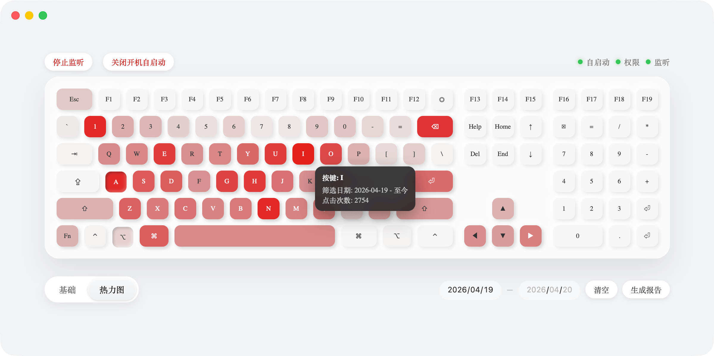

有一天在打字的时候，我突然想到一件很小的事情：

我每天敲这么多键盘，那我到底更常用的是哪些键？

这个问题本身其实没什么用，但它有一点点“可能和直觉不一样”的感觉。

比如我一直觉得自己主要在用字母区，但如果真的统计出来，会不会空格才是第一？或者回车？

这种事情，如果只是靠感觉，其实永远不会有答案。

但一旦把它变成数据，就完全是另一种东西了。

想着想着，就干脆把这件事做出来了。

代码跟软件都已经开源了，地址放在最后，感兴趣可以去看看

---

## 它一开始其实只是个脚本

最初的想法很简单：

监听键盘 → 做计数 → 输出结果。

按这个思路，一个脚本就能搞定，甚至都不需要什么界面。

但写到一半就发现，这种形态不太成立。

因为它太容易“断掉”了。

只要我关了终端，或者哪天忘记开，它那一段时间的数据就直接没了。而键盘使用这种行为，本来就不是你会刻意去“开始”和“结束”的东西。

如果记录本身需要你去记得，它就有点违背这个事情的初衷。

后来就慢慢变成另一种方向了：让它自己待着，一直在那儿，不需要你管。

于是最后的形态就是一个托盘应用。

---

## 为什么会走到客户端这一步

其实我一开始是想避免写客户端的。

不是功能做不到，而是开发体验的问题。传统 GUI 那一套我不太熟，也不太想花时间在那上面。

但“监听键盘”这件事本身就决定了，它不可能是一个网页。

由于边界问题，浏览器拿不到这些数据，所以要么放弃，要么就认真做一个本地应用。

后来是因为看到 Wails V3，才觉得这件事变得顺手了不少。

之前用过 Wails V2，它更像是一个“把网站封装成桌面应用”的壳。

单窗口、靠前端路由模拟多页面、菜单和托盘能力很弱。

而 V3 原生支持了多窗口、系统菜单、托盘、Dock & Taskbar 交互之后，整个应用终于有了“骨架”，从“套壳网页”真正变成了一款原生应用。

完美的符合了我的需求。

---

## 真正麻烦的不是展示，而是“你按了什么键”

一开始我以为，最麻烦的会是热力图这种展示层的东西。

结果完全相反。

最绕的地方其实是：怎么知道用户按了哪个键。

监听事件我选择了 [robotn/gohook](https://github.com/robotn/gohook)，他本身不提供“监听能力”，它只是把各平台的系统级输入监听 API 做了一层统一封装。

在 Windows 中他封装的是 SetWindowsHookEx

在 Mac 中封装的是 Quartz Event Tap

因此它可以在系统层面上监听原始输入事件，比应用级监听更底层，得到按压情况与虚拟键码。

问题在于，这个“原始事件”不是你直觉里的 A、B、C，而是一串虚拟键码。

虚拟键码就是操作系统为了方便程序开发，给键盘上每个“功能”分配的一个固定的数字编号。它像是按键的身份证号，而不是座位号。

以 Windows 为例：当我们按下键盘上 A 键的那一刻，键盘电路只知道按下去的是物理位置第 0x1E 号的键，它会把 0x1E 这个扫描码发给电脑。

操作系统收到 0x1E 后，会根据当前激活的键盘布局（比如美式键盘）来查表（比如查询到这个物理位置对应的是字母 A）。

于是，它把这个位置信号转换成虚拟键码 0x41（即 VK_A）。

基于这套机制，我们开发者完全不用关心用户用的是哪种键盘硬件、按键的物理位置在哪。只要在程序里看到 0x41，就可以确信：用户按下的是 A 键。

但问题同样也出现在这里，键盘的位置信号传递给系统，而系统把他们转换成虚拟码，这个过程是系统进行的，因此 Windows 跟 Mac 之间并不统一，需要额外进行处理。

微软官网中有针对 Windows 虚拟键码的说明：[Virtual-Key Codes](https://learn.microsoft.com/en-us/windows/win32/inputdev/virtual-key-codes)

而 Mac 则来自 Carbon.framework 中的 Events.h，记录在《Inside Mac Volume V》第 V-191 页

这件事没有什么优雅解法，只能分开处理。

最后就是用 Go 的 `//go:build` 把不同平台的映射拆开，各自维护。

逻辑上统一，但实现上不强行合并。

---

## 数据怎么存，反而是一个需要控制的点

监听拿到了，接下来就是存。

一想到这个脑子里的第一反应肯定是：按一次，写一次数据库。

但稍微再一琢磨就会明显感觉到问题。

键盘输入是一个非常高频的行为，如果每次都落盘，SQLite 的压力会有点大，而且写入冲突也比较频繁。

后来就换成了一种更“松一点”的方式：

先放在内存里攒着，到一定数量，或者过一段时间，再统一写进去。

严格来说，这会有一点点数据丢失的可能（比如程序突然退出），但换来的是整体的稳定性和更低的开销。

对这种工具来说，我更倾向于后者。

---

## 热力图反而没那么复杂

真正开始做展示的时候，反而是最顺的一段。

键盘布局其实是有现成逻辑的，用机械键盘里常说的 Unit（u）就能很好地描述：

普通按键是 1u，空格是 6.25u，一些功能键是 2u、2.75u 这种。

把它当成一个网格去排，然后再把每个键的使用次数映射成颜色深浅，一张热力图就自然出来了。

没有太多技巧，更多是一个“把东西摆对”的过程。

---

## 后来补了一点“实时感”

最早版本其实只是统计 + 展示。

但用的时候会觉得，它有点“太安静了”。

所以后面加了一点很轻的反馈，比如按键的时候会有一点变化。

实现上也不复杂，用 Wails 自带的事件机制，把后端的事件往前端推，Vue 那边监听一下就可以了。

这一块写起来反而最像在写前端项目。

---

## 写到这里，反而会有点疑问：这东西到底有什么用

项目做完之后，我其实想过这个问题。

它不会帮你提高效率，也不会改变你怎么打字。

你大概率也不会因为某个键用得特别多，就去刻意优化它。

但它提供了一种很微妙的东西：

你可以“看到”自己平时完全不会注意到的行为。

有些结果是符合预期的，有些会有一点点偏差。

这种偏差不大，但挺有意思的。

更像是一种观察，而不是一个工具。

---

## Key Heat

最后把这个东西整理了一下，做成了一个完整的应用，叫 ​**Key Heat**。

它会一直待在托盘里，做的事情其实很克制：

- 只统计每个键被按了多少次
- 不记录具体输入内容
- 没有网络请求

数据只在本地。

如果你也对这种东西有点好奇，可以自己跑一下看看：

- 文档：[点击查看](https://zread.ai/zxc7563598/key-heat)
- GitHub：[点击查看](https://github.com/zxc7563598/key-heat)
