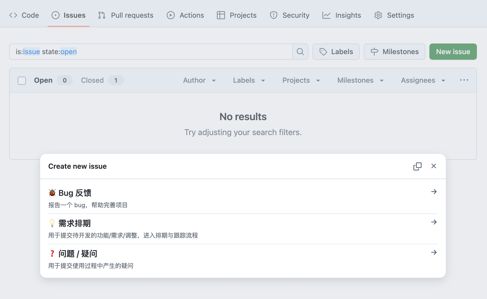
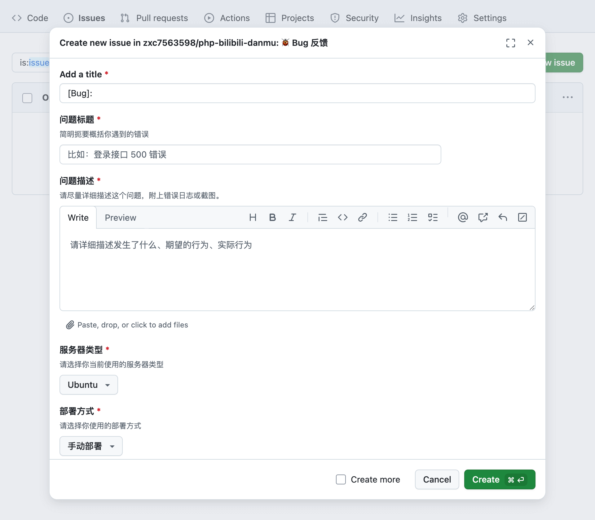
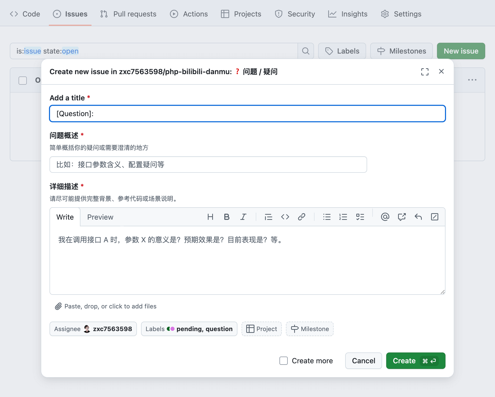
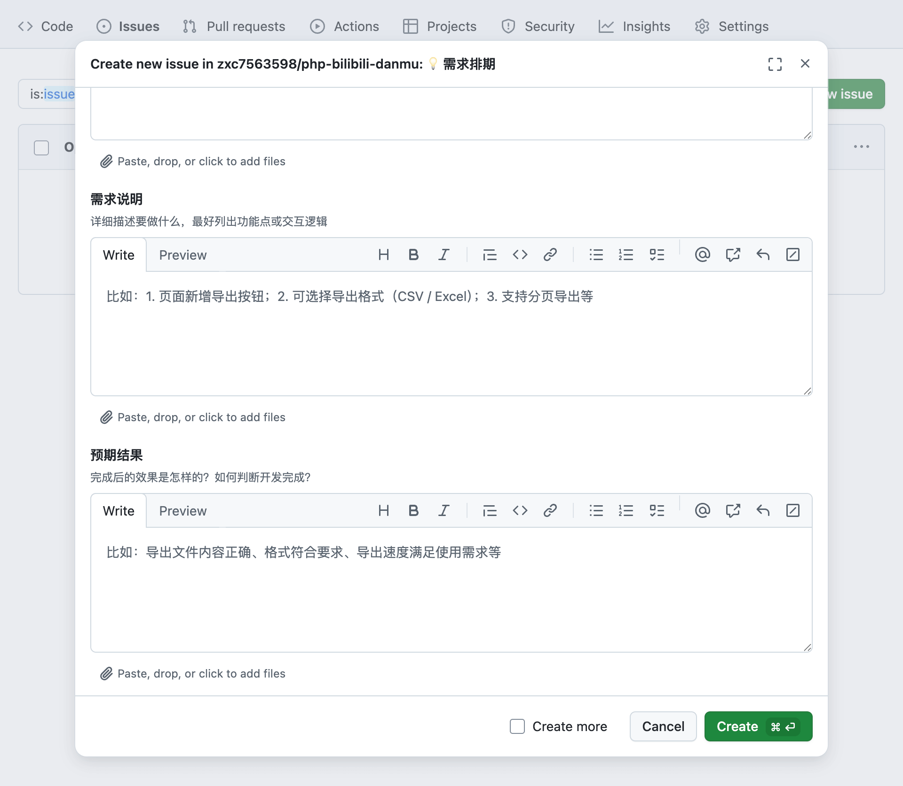

说实话，我平时也是一个人写代码，每次开完会整理任务最麻烦：

一堆事项堆在聊天里、文档里，或者散落在邮件里……

为了理清这些，我通常会做一份 List，标好优先级，再安排到每日的工作里

虽然这个办法能解决大部分问题

但说实在的：

一是**整理 List 本身就需要时间**

二是每完成一件事，还得**回到 List 去勾掉已完成的任务**
让人感觉并没有那么顺手、痛快

于是，我也一直在想：
**有没有更好的办法，更自然地安排和管理任务呢？**

---

## 我是怎么想到用 Issue 模板的

其实 GitHub Issues 我们都见过，也都用过。  
但默认的 Issues 创建体验其实比较简单，也没什么结构化管理。

后来看了一些大项目，发现他们都有自己的 **Issue 模板**，让提交 Issue 的人： 

✅ 按结构化字段提供信息  
✅ 自动附加 Labels  
✅ 简单一看就明白这个 Issue 是干什么的

我就想：「那我自己的小仓库，能不能也搞一套？就算是一个人的项目，也能更有秩序。」  
结果发现，还真很好用！

---

## 用途示例：Issue 模板让事务更有结构

现在，我是这么做的：

- 用 Issue 模板管理自己的任务。
- 把 Issue 当成小型看板。
- 用 Labels 标记状态（pending、in progress、review、done）。
- 完成代码后，在 PR 描述里写 `fixes #xxx`​，合并后 Issue 就自动关闭。

这个简单的小改造，让我：  
✅ 没有因为漏掉任务而后悔过  
✅ 完成和提交之间有记录和参考  
✅ 即使过很久，也能快速回顾历史

更好的是，因为可以分配负责人`Assignee`，因此在团队协作中，通过这种方案，可以非常便捷的**将各个需要处理的任务拆分之后分配给不同的成员负责**

成员可以直接根据 Issue 来工作，完成工作后提交即可，在审计通过后任务则会自动关闭 Issue ，整个流程非常丝滑









---

## 怎么配置 Issue 模板

其实配置 Issue 模板没有什么复杂，就是在 `仓库根目录/.github/ISSUE_TEMPLATE` 文件夹中创建 `.yml`​ 文件。

> 目录不存在可以自行创建

> 对于 `.yml` 文件的命名没有要求，GitHub会解析 `config.yml` 作为配置文件，其余所有 `.yml` 文件均视作 Issue 模板

### config.yml 配置说明
```yaml
blank_issues_enabled: false
contact_links:
  - name: 📌 功能建议提交说明
    url: https://example.com/docs/issues
    about: 在提交 Issue 之前，请先阅读提交流程说明。
  - name: ❓ 问答社区
    url: https://example.com/discussions
    about: 有疑问？先来社区讨论。
```

|字段|用途|
| ------| -------------------------------------|
|**blank_issues_enabled**|是否允许提交非模板的 Issue|
|**contact_links**|为提交 Issue 的页面提供额外链接|


### Issue 模板配置文件简单示例：

```yaml
name: 🐞 Bug 报告
description: 用于提交 bug 报告
title: "[Bug]: "
labels: ["bug", "pending"]

body:
  - type: input
    id: title
    attributes:
      label: 问题标题
      placeholder: 简单概括问题
    validations:
      required: true
  - type: textarea
    id: details
    attributes:
      label: 问题描述
      description: 请附上堆栈、截图或参考代码片段
    validations:
      required: true
```

### Issue 模板 YML 可用字段一览

|字段|用途|示例|
| ------| -------------------------------------| ------------|
|**name**|模板显示的名字|​`name: 🐞 Bug 报告`​|
|**description**|模板显示的描述|​`description: 用于提交 bug 报告`​|
|**title**|创建 Issue 时自动填充的标题|​`title: "[Bug]: "`​|
|**labels**|创建 Issue 自动附加的 Label 列表|​`labels: ["bug", "pending"]`​|
|**assignees**|创建 Issue 自动指定的负责人|​`assignees: ["user1", "user2"]`​|
|**body**|模板主体区域，里面是字段配置数组|见下文示例|
|**body.type**|字段类型：`input`​、`textarea`​、`dropdown`​、`checkboxes`​、`markdown`​|​`type: input`​|
|**body.id**|唯一标识字段 ID，用于引用值|​`id: description`​|
|**body.attributes.label**|在 Issue 创建页面显示的字段标题|​`label: 问题描述`​|
|**body.attributes.description**|在 Issue 创建页面显示的字段说明|​`description: 请详细描述...`​|
|**body.attributes.placeholder**|在 Issue 创建页面显示的默认值或示例|​`placeholder: 在这里写错误日志...`​|
|**body.attributes.options**|可选项列表，仅对`dropdown`​、`checkboxes`​类型有效|​`options: ["选项1", "选项2"]`​|
|**body.validations.required**|是否为必填字段 (`true`​/`false`​)|​`required: true`​|

### 可用的字段类型

|类型|用途|
| ------| --------------------------------------------------------|
|​**​markdown​**​|只展示一段 Markdown 内容，不可编辑，适合作为提示、说明|
|​**​input**​|单行文本字段，适合填写标题、URL、单行参数等|
|​**​textarea**​|多行文本字段，适合错误日志、堆栈、代码片段|
|​**​dropdown**​|可选下拉框，适合确定性选项（如操作系统类型、环境类型）|
|​**​checkboxes​**​|多选框，适合提供多个选项让提交者勾选|

---

## 我自己的配置示例

我也整理了一套自己的 Issue 模板，用于：

- ✅ 问题提问
- ✅ 合作／雇佣邀请
- ✅ bug 报告
- ✅ 需求排期

👉 我放在自己的个人仓库里，大家感兴趣可以参考：[点击查看](https://github.com/zxc7563598/zxc7563598)​

---

## 简而言之

说实话，GitHub Issues 模板对我这种个人开发者，也能带来很大好处：

- 更清晰的任务结构。
- 完成和提交之间有标准化记录。
- 即使过很久，也能快速回顾。

如果你也是一个平时单兵作战、但想让自己的工作更有结构的人，建议你也可以尝试配置一套 Issue 模板。  
它不会让你额外麻烦，反而让后续一切更简单。
