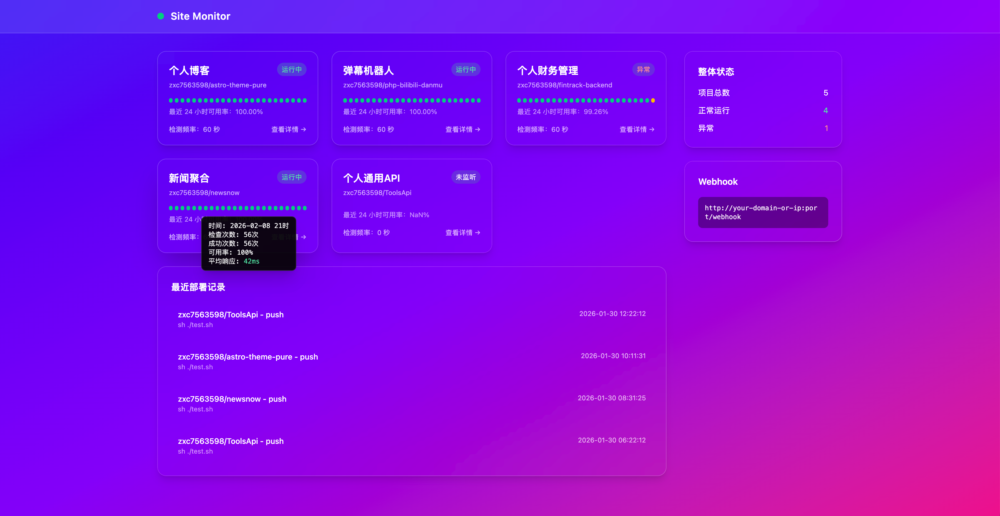
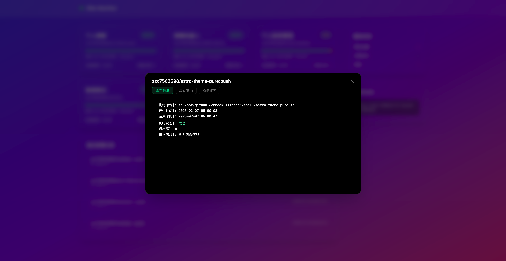
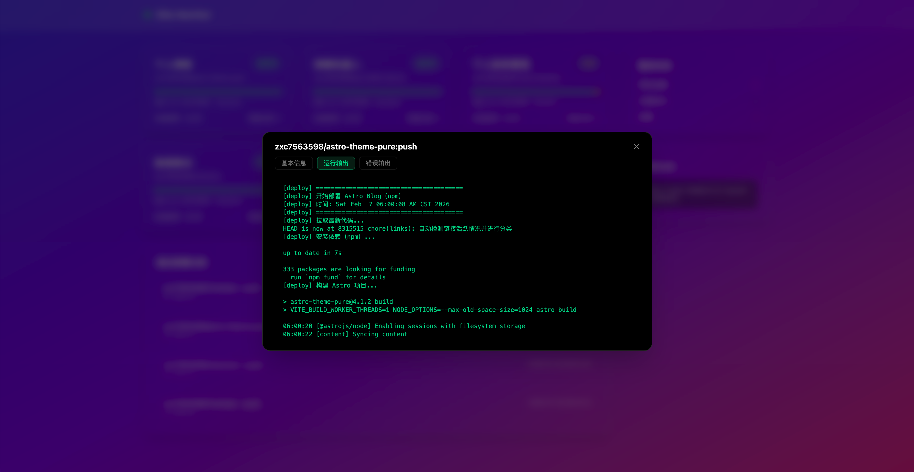

前段时间我写过一篇文章，[记录自己作为一名 PHP 开发者自学 Go 的过程](https://hejunjie.life/blog/aodj2421)

那篇更多是学习阶段的整理。这次则是一次完整实践的复盘。

单点知识和系统能力之间始终存在差距。

理解一个概念并不难，但要把多个能力组合起来，形成一个可以长期运行的系统，往往需要真实项目去反复打磨。很多看似基础的东西，只有亲手做过，理解才会真正扎实。

最近我完成了一个小工具：**github-webhook-listener**

一个用 Go 实现的 GitHub Webhook 接收服务，可以根据规则执行 Shell 命令，并内置一个简单的 Vue 面板，用于查看运行状态和执行记录。

功能本身并不复杂，AI 也完全可以在较短时间内生成类似的实现。但在实际开发过程中，我更在意的并不是功能本身，而是一些基础层面的设计问题：项目结构如何划分，依赖如何组织，边界如何定义，以及构建与部署如何简化。

这些内容未必新鲜，但当它们被组合到一个完整系统中时，体会是不同的。

项目地址我放在文章末尾，感兴趣可以自行查看下载使用。







下面我会从结构设计、并发模型以及构建方式三个方面，做一次相对完整的技术复盘。

---

## 项目结构与职责划分

项目核心代码放在 `internal` 目录：

```
internal/
├── bootstrap
├── handler
├── service
├── repository
├── model
├── dto
```

这种结构并不追求“标准答案”，重点在于依赖方向清晰。

### repository

- 只负责数据库操作
- 不包含业务判断
- 不依赖 HTTP

### service

- 负责业务逻辑
- 调用 repository
- 不处理 HTTP 细节

### handler

- 只做参数解析与响应封装
- 调用 service
- 不包含核心逻辑

在功能简单时，这种分层似乎有些“多余”。

但当涉及到任务调度、执行记录、重试机制时，结构边界开始体现价值。

边界明确之后，功能扩展基本是“局部修改”，而不是结构性调整。

---

## 在 bootstrap 中组织依赖关系

所有初始化逻辑集中在 `bootstrap` 包中完成：

1. 初始化数据库
2. 创建 repository
3. 注入到 service
4. 注入到 handler
5. 注册路由

依赖关系在入口处完全展开，而不是在各个文件中隐式创建。

这种方式带来的最大好处是：

- 对象生命周期清晰
- 依赖方向可控
- 替换实现时改动集中

在没有使用任何 DI 框架的情况下，通过显式构造函数完成依赖注入，本身就是对依赖关系的一种约束。

当项目规模不大时，这种方式反而比自动注入更透明。

---

## 双队列 Worker Pool 的并发调度模型

这个项目的核心之一，是执行 Shell 命令并控制并发数量。

我实现的是一个“双队列 Worker Pool”结构，主要包含三个核心组件：

1. **任务生产者（Producer）**
2. **集中式调度器 + Worker Goroutine**
3. **结果处理器（Result Processor）**

### 第一层：任务生产者

当 Webhook 触发或 Web 面板手动触发任务时，任务被封装为一个结构体，发送到调度队列。

这一层只负责“生成任务”，不关心执行细节。

---

### 第二层：集中式调度器 + Worker Pool

调度器内部维护：

- 一个任务输入队列
- 一个固定数量的 worker goroutine

调度流程：

- 调度器从任务队列中取出任务
- 分发给空闲 worker
- worker 执行 Shell 命令
- 将执行结果发送到结果队列

worker 数量可控，因此系统并发是有上限的。

这种结构的优点：

- 并发可控
- 不会因为 Webhook 高频触发而无限创建 goroutine
- 任务调度逻辑集中管理

相比“每来一个请求直接开 goroutine 执行”的写法，这种结构在可控性和可扩展性上更好。

---

### 第三层：结果处理器

worker 不直接写数据库，而是把结果推送到结果队列。

结果处理器负责：

- 更新执行记录
- 写入数据库
- 处理重试逻辑（如果有）

这样做的目的，是进一步解耦：

- 执行逻辑专注执行
- 持久化逻辑专注记录

这就是“双队列”的意义：

- 队列一：任务调度
- 队列二：结果处理

这种分离在系统规模变大时尤为重要，因为执行耗时和持久化耗时是两个不同维度的问题。

---

## Makefile 作为构建入口

项目使用 Makefile 统一管理：

- 后端构建
- 前端构建
- 交叉编译
- 发布打包

Makefile 在这里的意义并不是“少打几行命令”，而是：

- 所有构建流程被显式记录
- 新环境下可直接复现
- 发布步骤标准化

当一个项目开始涉及前后端协作、交叉编译和发布时，构建流程本身就成为项目的一部分。

---

## 使用 embed 将前端资源打包进二进制

这是我在这个项目中感受最明显的“Go 工程优势”。

前端使用 Vue 构建完成后，静态资源通过 `embed` 打包进 Go 二进制中。

然后通过：

```go
http.FileServer(http.FS(...))
```

直接提供访问。

最终效果是：

- 只有一个可执行文件
- 不需要 Node 环境
- 不需要单独部署前端
- 不依赖外部静态文件目录

从架构上看，它仍然是前后端分离：

- 前端独立开发
- 后端提供 API

但从交付形态看，它又像是传统单体应用：

- 单文件分发
- 直接运行

这种组合非常适合工具型项目和内部服务。

Go 在这一点上确实有明显优势：编译后就是完整产物，不需要运行时环境，不依赖包管理器，不依赖额外解释器。

分发成本几乎为零。

---

## 写在最后

这个项目没有刻意追求复杂设计，也没有引入额外框架。

它更像是一次完整的工程实践：把分层、依赖组织、并发控制、构建管理这些已经学过的能力组合在一起，形成一个可长期运行的系统。

我自己已经在实际环境中持续使用它，用来自动化部署和执行脚本，稳定性和可维护性都符合预期。对我来说，它已经从“练手项目”变成了日常工具。

如果你刚好也需要一个简单的 GitHub Webhook 执行工具，可以直接拿去用；

如果你正在学习 Go，想找一个结构完整、但复杂度可控的小项目作为参考，也可以看看实现细节。

GitHub 仓库地址：[点击查看](https://github.com/zxc7563598/github-webhook-listener)

有问题或者想法，也欢迎直接在 GitHub 上交流。
