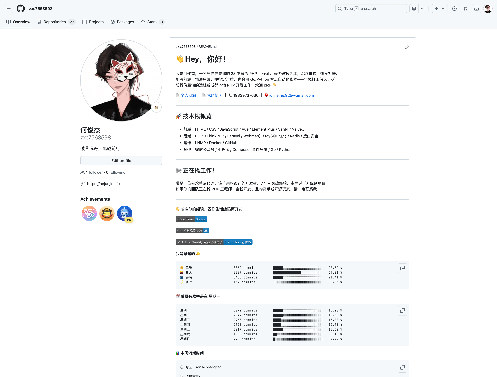

在技术人眼里，GitHub 不只是代码仓库，它也是你的**技术简历、作品展厅**，甚至是你在互联网上的“第二张名片”。

而今天，我们就来聊聊：**如何从零开始，打造一个自动更新、内容丰富、有个性、还能展示技术实力的 GitHub 主页。**

先贴一张我的 GitHub 个人页面，你也可以直接打开我的 GitHub 主页查看：[点击查看](http://github.com/zxc7563598)



## 🏠 从一个特殊的仓库开始：GitHub 主页原理

GitHub 提供了一个非常简洁的展示方式：
只要你创建一个和自己用户名相同的仓库，README 就会展示在你个人主页顶部。

比如我叫 `zxc7563598`，那我就新建一个仓库叫：

```bash
zxc7563598/zxc7563598
```

这个仓库的 `README.md`，就是你在 GitHub 首页展示的内容。你可以在里面写个人介绍、技能栈、项目链接，甚至放个代码统计图表。

> 技术人自己的「About Me」，从这里开始。

## ⌛ 加一点数据味道：使用 WakaTime 统计代码时间

如果你希望展示的不只是“看起来厉害”，而是“我真的在持续写代码”，那么推荐你使用 WakaTime ——一个开发者专用的时间追踪工具。

它支持 VSCode / JetBrains / Vim / 甚至 Eclipse，安装插件、填入 API Key 后，它就能悄悄记录你每天写了哪些语言、用了多长时间。

你得到的是一份“编程时间日报”，而不是模糊的「我最近在忙项目」。

为了使用它，你需要完成下面这些事情：

1. 前往 [wakatime.com](https://wakatime.com) 并创建一个帐户。
2. 从 WakaTime 中的帐户设置中获取 WakaTime API 密钥。
3. 在您最喜欢的编辑器/IDE 中安装 WakaTime 插件。官网都有非常完善的教程。
4. 粘贴您的 API 密钥以开始分析。

## 🔁 自动更新：用 GitHub Actions 每天写入统计数据

有了 WakaTime 数据，还得展示在主页上。

我们可以借助开源项目 [athul/waka-readme](https://github.com/anmol098/waka-readme-stats)，通过 GitHub Actions 每天自动将你最新的 WakaTime 统计写入 README.md。

具体操作方法如下：

1. 创建一个 `GitHub Token`，并授予 `repo` 权限。
   > 如果你不知道从哪里设置 `GitHub Token` 可以直接从这个链接进入并进行设置 [点击查看](https://github.com/settings/tokens/new)
2. 在你的仓库中创建一个名为 `.github/workflows/waka.yml` 的文件，并添加以下内容：

   ```yml
    name: Waka Readme

    on:
    schedule:
        - cron: '0 16 * * *'
    workflow_dispatch:
    jobs:
    update-readme:
        name: Update Readme with Metrics
        runs-on: ubuntu-latest
        steps:
        - uses: anmol098/waka-readme-stats@master
            with:
            WAKATIME_API_KEY: ${{ secrets.WAKATIME_API_KEY }}
            GH_TOKEN: ${{ secrets.GH_TOKEN }}
            LOCALE: zh
   ```

3. 设置 `WAKATIME_API_KEY` 和 `GH_TOKEN`
   在仓库的 `Settings` -> `Secrets and variables` -> `Actions` -> `New repository secret` 中添加 `WAKATIME_API_KEY` 和 `GH_TOKEN` 两个密钥。
   > 这里的 `WAKATIME_API_KEY` 就是你之前获取的 WakaTime API 密钥，`GH_TOKEN` 就是你之前创建的 `GitHub Token`。
4. 在 README.md 中你想要添加统计的位置添加以下代码：
   ```markdown
    <!--START_SECTION:waka-->
    <!--END_SECTION:waka-->
   ```
   至此，所有的配置就都已经完成了，GitHub Actions 会在北京时间 00:00 自动执行，并将该段代码替换为 WakaTime 的统计数据

> 你也可以手动执行，在仓库的 Actions 中点击 `Waka Readme`，然后点击 `Run workflow` 按钮即可立即手动执行

## 🎁 最后：别让主页变成“Hello World”

很多开发者注册 GitHub 后就再也没碰过个人主页，但其实这里是你展现专业度与热情的一个绝佳窗口。

不管你是找工作、做开源、还是纯粹想留下点印记，都值得花一两个小时，搭建一个属于你的主页。

> 项目代码会说话，你的主页也一样。
